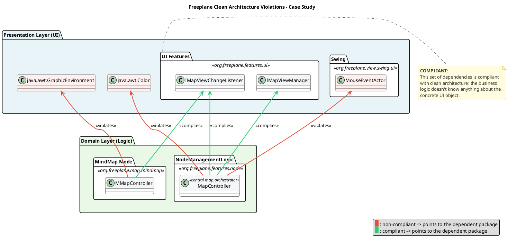
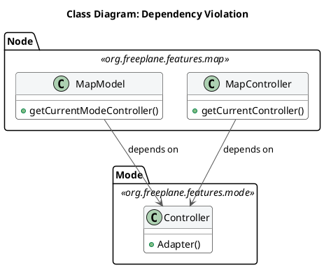
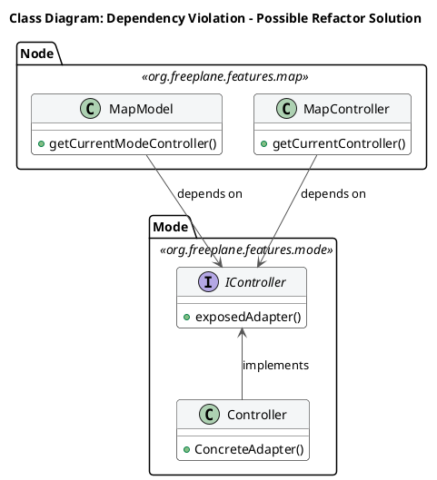
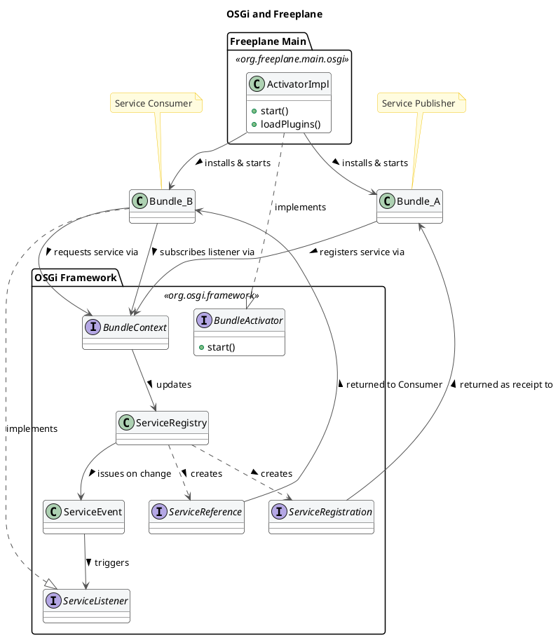

# Architectural Analysis of Freeplane – Reverse Engineering and Evaluation

## 1. Introduction and Analysis Methodology

This report presents an architectural analysis of Freeplane with the objective of identifying its main structural characteristics, architectural style, and design principles. The analysis aims to reconstruct the system architecture and understand how its components are organized and interact.

The reverse engineering process was conducted using static code analysis, documentation review and statistics gathered directly from the official Freeplane repository. The codebase was examined to identify packages, modules, and dependencies, while repository documentation was used to support architectural interpretation. C4 diagrams were produced using **PlantUML** with the C4-PlantUML extension library. Coupling metrics were derived from `git log` clusterization.

The system can be described as an **imperfect micro-kernel (plug-in) monolith**; extensible objects are linked to the core system with the OSGi framework, an industry-standard solution for blending separate components in a single entry point from the user standpoint. However, the core module is not just a shell: it implements core business logic and the frontend. Plugins represent extensions — they do not make the software, but they extend it with advanced features. This pattern breaks some of the micro-kernel architectural style principles, thus the _imperfect_ definition. The codebase separates `core` (infrastructure), `features` (business logic), and `view` (UI rendering).

---

## 2. The System in its Ecosystem: C4 Context Model


The context diagram illustrates how Freeplane operates within its external environment. Two main user roles are identified: **Users** interact with the system to create and manage mind maps using basic functionality, while **Advanced Users** extend the system through scripting and plugins, enabling automation and customization.

Freeplane interacts with the **File System** for storing and retrieving mind map data in XML-based `.mm` formats, with **Export Services** (PDF, HTML) for document conversion, and with the **Operating System** for runtime resources. The system also integrates with external services such as LLM-based tools for intelligent processing, and a **Plugin Repository** for downloadable extensions. The **Scripting Engine** enables Groovy-based automation.

Overall, the context model highlights Freeplane as a standalone desktop application that integrates with a variety of external systems while preserving a clear system boundary. It does not rely on cloud-based services for core functionality.

---

## 3. Decomposition and Runtime: C4 Container Model


Freeplane is deployed as a single unit but is internally modular. Its containers are:

- **Core Engine (Java, Swing):** Contains the domain model, business logic, MVC infrastructure, and GUI rendering.
- **Persistence Layer:** `MapReader` and `MapWriter` handle XML serialization of `.mm` files.
- **Plugin System (OSGi / Knopflerfish):** The OSGi framework structures the runtime into three layers: a **Module Layer** (`org.freeplane.core` defines bundle identity and static dependencies), an **Activator** (`ActivatorImpl` in `org.freeplane.main.osgi` loads plugins at startup), and a **Service Layer** (bundles publish and consume services via the OSGi Service Registry). The 10 official plugins — AI, bug reporting, code explorer, formula, syntax highlighting (JSyntaxPane), LaTeX, markdown, OpenMaps, scripting, and SVG export — are independent bundles with no shared code.
- **Scripting Engine:** Manages the Groovy scripting engine for user-defined automation.

All containers run within the same JVM process and communicate through direct in-memory calls. Cross-bundle interactions are mediated by the OSGi Service Registry, which decouples publishers from consumers at runtime.

---

## 4. Mapping to Clean Architecture: Theory vs. Reality

This section aims to clarify the architectural choices made to build the software, and to define if Clean Architecture principles are respected.
The first step is to define _entities_, _use cases_ and _external layers_, and where to find them. The package `org.freeplane.features.map` is the best candidate: its classes define core software logic, such as how nodes are defined and organized within the map.

To double check, data from the official repository was analyzed. Particularly, package stability was estimated from the number of commits directly involving the package. The result seemed to contradict the thesis: `org.freeplane.features.map` is a very unstable package, with hundreds of commits during the software lifecycle.
This can be explained by the high coupling between the package and UI components. A deeper analysis reveals that almost 43% of commits share changes with Freeplane UI components, and this number grows to 61% in subpackages such as `filemode` and `clipboard`. This data suggests that Clean Architecture patterns are not well-respected: core business logic should have almost no co-change with UI and graphical features.

Code analysis reveals a mixed approach: in many cases classes import interfaces from `org.freeplane.features.ui` (such as `IMapViewChangeListener`, `IMapViewManager`), which represent proper abstractions for UI management. However, standard Java UI classes are directly imported, violating the same principles developers tried to respect with custom packages. For instance, `MapController` depends on `java.awt.Color`, and `MMapController` depends on `java.awt.GraphicEnvironment`. This mixed approach results in high coupling between the business logic and external layers, making the architecture less isolated and harder to test.



A static analysis across the entire `features` layer quantifies the scale of this violation: **over half of all source files directly import `java.awt.*`**, and **roughly a third import `javax.swing.*`**. The business logic layer is deeply entangled with GUI frameworks.

There are other crucial violations: there is no clear definition of _entities_, _use cases_ and other layers. Some classes may look similar to one of these concepts: `MapModel` could be classified as an _entity_, `MapController` as a _use case_, `Controller` from `org.freeplane.features.mode` as an _adapter_. The most critical violation is found in the dependencies among these three classes: both `MapModel` and `MapController` depend on the concrete `Controller` class. The flow of dependencies is broken and therefore inner business logic cannot be tested in isolation.



A possible refactoring solution would introduce an `IController` interface to restore the dependency flow:



The `org.freeplane.features.filter` package suffers from the same problems: its `FilterController` has the same mixed approach at UI import dependencies, mixing business logic, application logic, and frontend concerns in a single class. That is why architectural flaws from `org.freeplane.features.map` can be fairly extended to the whole software structure.

Compliance with Clean Architecture can be found in the _persistence layer_: classes such as `MapReader` and `MapWriter` are at the outer layer of the architecture, and there are no dependency violations.

These violations have an explanation: as reported in the Official Documentation, core classes were designed to follow the **Extension-Object Design Pattern** defined by Erich Gamma (1998). This architectural choice aims at building extensions to well-defined objects. Lack of compliance to Clean Architecture can be explained by the need of having both _entities_ and _use cases_ in the same set of classes to make them easily extensible.

---

## 5. Zooming into the Engine: C4 Component Model of the Core

*(Level 3 Diagram — To be added)*

We focus the component analysis on the **Core Engine**, discarding Persistence (standard XML I/O) and Plugin bundles (isolated OSGi black-boxes whose internal structures do not dictate core behavior).

The Core Engine combines an MVC-like structure with the **Extension Object Pattern**:

- **Model:** `MapModel` (the whole map: root node, node registry) and `NodeModel` (individual nodes: parent/child hierarchy, folding state, text). `SharedNodeData` encapsulates data shared between clones.
- **Controller:** `MapController` orchestrates selection, navigation, folding, listener coordination, and delegates I/O to `MapReader`/`MapWriter`. `MMapController` extends it with CRUD, clipboard, and UI editing.
- **Extensions:** Features attach dynamically to nodes — e.g., `EncryptionModel` for cryptography, `SummaryNode` for grouping — without bloating the base model.
- **Events:** Model changes propagate via listeners (`IMapChangeListener`, `INodeChangeListener`, `IMapLifeCycleListener`), decoupling the model from its observers.

### Boundaries: Core-Plugin Interaction

The OSGi bundles are built to be independent from one another: there is no shared knowledge, code or data, and all references to classes or methods in other plugins throw OSGi errors. Plugins and Core have strict boundaries, that can be crossed by pointing to published services only.

At the Module Layer, circular dependencies can lead to deadlock: when two bundles each require a service from the other at startup, the application locks permanently. Freeplane resolves this by providing a single Activator responsible for building the application and attaching plugins in a controlled order.

On the Service Layer, a clear dependency tree cannot be drawn — bundles can both publish and consume services. Dependencies are resolved at run-time, which makes debugging more difficult because it is hard to track the flow of information across bundles.



This structure provides both freedom and constraints: new features can be added by creating a dedicated plugin, and since bundles are independent, deployment and maintenance does not affect the overall system. Source code analysis confirms this isolation: only 1 inter-plugin dependency exists in the entire codebase (`formula → script`). All other 9 plugins are completely independent of each other.

### SOLID Analysis

The analysis starts from `org.freeplane.features.map` and is broadened to the entire `features` layer to verify whether violations are systemic.

**Single Responsibility Principle (SRP):**
Controllers are God Objects. `MapController` aggregates IO setup, action registration, navigation, folding, and event orchestration:

```java
public MapController(ModeController modeController) {
    mapWriter = new MapWriter(this);
    mapReader = new MapReader(readManager);
    createActions(modeController);
}
```

`FilterController` (1,179 lines) similarly aggregates filter logic, toolbar construction, and XML persistence. `ModeController` (491 lines) handles 10+ distinct responsibilities. This pattern repeats across the codebase.

**Open/Closed Principle (OCP):**
`NodeLevelConditionController.createASelectableCondition()` uses `if`-chains — adding a new condition type requires modifying existing code:

```java
if (simpleCondition.objectEquals(ConditionFactory.FILTER_IS_EQUAL_TO))
    return new NodeLevelCompareCondition(...);
if (simpleCondition.objectEquals(FILTER_LEAF))
    return new LeafCondition();
```

However, the `filter.condition` subpackage shows OCP **compliance** through a Strategy/Decorator pattern (`ASelectableCondition`, `DecoratedCondition`).

**Liskov Substitution Principle (LSP):**
`SingleCopySource` extends `NodeModel` but breaks the base class contract:

```java
class SingleCopySource extends NodeModel {
    @Override
    public void acceptViewVisitor(INodeViewVisitor visitor) {
       throw new RuntimeException("method not supported");
    }
    @Override
    public IExtension putExtension(IExtension extension) {
       throw new RuntimeException("method not supported");
    }
}
```

**Interface Segregation Principle (ISP):**
`IMapSelection` bundles selection, navigation, scrolling, filtering, and visibility into one fat interface. In contrast, `INodeChangeListener` (single method: `nodeChanged`) is a clean, minimal interface.

**Dependency Inversion Principle (DIP):**
This is the most pervasive violation. `Controller.getCurrentController()` — a concrete global singleton — is called **hundreds of times** across the `features` layer:

```java
Filter filter = Controller.getCurrentController().getSelection().getFilter();
```

`MapWriter` directly instantiates concrete dependencies rather than receiving abstractions:

```java
TreeXmlWriter createTreeWriter(final Writer writer) {
    return new TreeXmlWriter(writeManager, writer,
        ResourceController.getResourceController().getBooleanProperty("useAsciiCharset"));
}
```

**Conclusion:** The violations found in `features.map` are not isolated — they are **systemic architectural patterns** that repeat across the entire core.

---

## 6. Architectural Evaluation and Conclusions

| Quality | Rating | Evidence |
|---|---|---|
| **Extensibility** | Strong | Two-level: OSGi plugin isolation (macro) + Extension Object Pattern on nodes (micro). 10 official plugins developed independently. |
| **Maintainability** | Weak | God Object controllers with too many responsibilities. Pervasive global singleton calls create invisible state dependencies. |
| **Modularity** | Mixed | Strong between plugins (OSGi, no cross-bundle change correlation). Weak within core: nearly half of core commits co-change with UI components. |
| **Testability** | Weak | No dependency injection. Over half the domain layer depends on GUI frameworks. Global singletons cannot be replaced with test doubles. |

### Coupling and Cohesion Metrics

Derived from `git log` clusterization (threshold: 10 shared commits):

- **Low entity coupling (positive):** `MapModel` and `NodeModel` never co-change — well-separated domain classes.
- **High domain-UI coupling (negative):** `MapController` frequently co-changes with Swing components.
- **Strong plugin isolation (positive):** OSGi bundles show no cross-bundle change correlation.

### Conclusion

Freeplane balances extensibility and legacy constraints. Its OSGi plugin system and Extension Object Pattern provide robust, two-level extensibility. However, the core suffers from systemic architectural debt: God Object controllers, pervasive singleton dependencies, and over half the business logic layer coupled to AWT/Swing. These issues, rooted in the software's 2009 origins, make the core untestable in isolation and resistant to UI migration.

If an architectural refactoring were to be proposed based on Clean Architecture principles, the priority would be introducing abstraction interfaces for GUI dependencies (`Color`, `Font`, `Component`) in the domain layer, enabling independent testability without breaking existing functionality.
