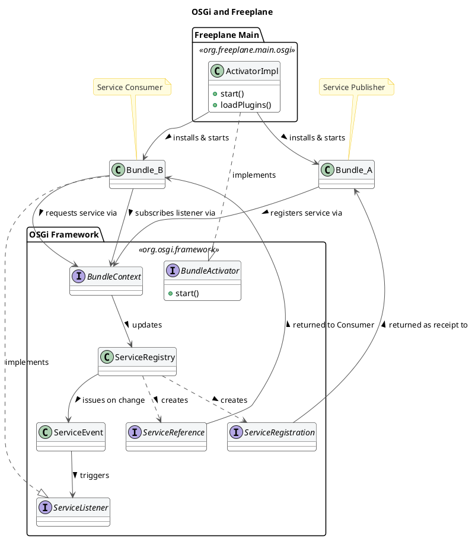

### Boundaries: Core-Plugin interaction and Internal Business Logic Boundaries analysis
#### Core-Plugin Interaction
Freeplane is built on top of the OSGi framework, in the Knopflerfish implementation. This technology stack allowed developers to build a modular software, where different plugins can be attached to the core easily. The framework generates a three-layer hierarchy:
1. Module Layer: it is the declarative layer: it defines bundles identity and static dependencies. In Freeplane, the `org.freeplane.core` package plays this role. This piece of information can be easily undestood by reading its `MANIFEST.MF` file when compiled: it stores all settings and dependencies for building the application.
2. Activator: it is responsible for building the infrastructure to make plugins communicate. In Freeplane, it is the ActivatorImpl class in `org.freeplane.main.osgi`. It can be identified since it implements the `org.osgi.framework.BundleActivator` class.
3. Service Layer: bundles provide services, that are registered within the Framework exploiting mechanisms that are built in OSGi environment. Such services can be published or unpublished at anytime. They look like plain Java Objects.  

The OSGi bundles are built to be independent from one another: there is no shared knowledge, code or data, and all references to classes or methods in other plugins throw OSGi errors. Plugins and Core have therefore strict boundaries, that can be crossed by pointing to published services only.  
At the Module Layer, circular dependencies are critical and they can lead to deadlock: it can happen when thread 1 starts Bundle 1 which requires a Service from Bundle 2, and it stops until it is published. Thread 2 starts Bundle 2 which requires a service from Bundle 1. It stops. The application is now locked permanently. This can be solved by implementing additional features provided by the framework.  
Freeplane resolves these dependencies at runtime, since it provides a single Activator that is responsible of building the application attaching different plugins.
On the other hand, on the Service Layer, a clear dependency tree cannot be drawn. That is because Bundles can both publish and exploit services published by other Bundles, that will likely require Service published by plugins that exploit their services. Dependencies are therefore resolved at run-time: bundles may or may not publish or request services. This pattern makes debugging more difficult, because sometimes it is difficult to track flow of information across bundles in Freeplane.

This structure provides both freedom and constraints to developers: new features can be added by creating a new dedicated plugin. Moreover, since bundles are independent and well separated, deployment and maintenance does not affect the overall system. Caveats of this architectural choice are the programming language and the complete compliance to the framework: developers must write all plugins in Java (the OSGi framework doesn't support other programming languages), and they must write plugins that implement the logic described above.

#### Code Analysis: Boundaries in Freeplane Core
The object of this short analysis is to understand how boundaries are respected at the core level. The analysis is carried on the `org.freeplane.features.map` package. The analysis has been carried on through analysis of `git log` and clusterization of classes that change together frequently. The minumun threshold is 10 shared commits. 
The package is affected by some Common Closure Principle violations. Most of them are related to changes that affect the `MapController` class and many visual components that are related to `Swing` library.   
Within the package, classes that host the most important business logic features do not change together: for instance, `MapModel` and `NodeModel` never change in the same commit. That is good news for developers and maintainers, since it suggests low coupling between core business logic features, that are well-separated. Even though in clear violation of Clean Architecture principle, a lower, looser level of component separation has been put in place.