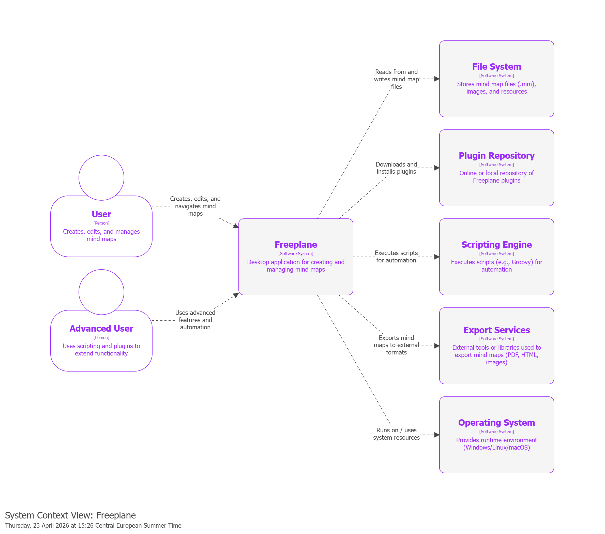
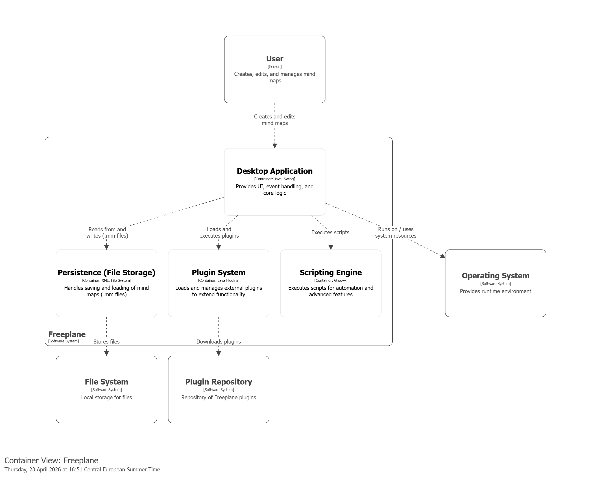

# Software Architecture Report – Freeplane

## 1. Introduction

This report documents the architecture of Freeplane, an open-source desktop mind mapping application (version 1.13.3), using the C4 model (Levels 1–3). It evaluates the system's relationship with Clean Architecture, identifies SOLID violations, and assesses key architectural qualities.

The analysis was conducted through static code analysis, dependency inspection, and commit history review. C4 diagrams were produced using **PlantUML** with the C4-PlantUML library. Coupling metrics were derived from `git log` clusterization.

Freeplane is a **modular monolith with a micro-kernel (plug-in) pattern**: a central core extended through independently developed OSGi bundles. The codebase separates `core` (infrastructure), `features` (business logic), and `view` (UI rendering).

---

## 2. Context Level

### Diagram

### Explanation

Freeplane is a standalone desktop application. **Users** create and manage mind maps via a graphical interface; **Advanced Users** extend behavior through scripting and plugins. The system interacts with the **File System** (XML-based `.mm` persistence), **Export Services** (PDF, HTML), the **Operating System** (runtime resources), a **Plugin Repository**, and a **Scripting Engine**. It does not rely on cloud services.

---

## 3. Container Level and Clean Architecture

### Diagram

### Explanation

Freeplane is deployed as a single unit but is internally modular. Its containers are:

- **Core Engine (Java, Swing):** Contains the domain model, business logic, MVC infrastructure, and GUI rendering.
- **Persistence Layer:** `MapReader` and `MapWriter` handle XML serialization of `.mm` files.
- **Plugin System (OSGi / Knopflerfish):** The OSGi framework structures the runtime into three layers: a **Module Layer** (`org.freeplane.core` defines bundle identity and static dependencies), an **Activator** (`ActivatorImpl` loads plugins at startup), and a **Service Layer** (bundles publish and consume services via the OSGi Service Registry). The 10 official plugins — AI, bug reporting, code explorer, formula, syntax highlighting (JSyntaxPane), LaTeX, markdown, OpenMaps, scripting, and SVG export — are independent bundles with no shared code.
- **Scripting Engine:** Executes Groovy-based automation scripts.

All containers run within the same JVM process and communicate through direct in-memory calls. Cross-bundle interactions are mediated by the OSGi Service Registry, which decouples publishers from consumers at runtime.

### Clean Architecture Mapping

**Where Freeplane complies:** The persistence layer is correctly isolated — `MapReader`/`MapWriter` reside in outer layers with no inward dependency violations. Custom UI interactions use interfaces (`IMapViewChangeListener`, `IMapViewManager`), respecting the dependency rule.

**Where Freeplane violates:** A static analysis of the 849 Java files in the `features` layer reveals that **52% (440 files) directly import `java.awt.*`** and **31% (265 files) import `javax.swing.*`**. This means over half of the business logic layer is tightly coupled to GUI frameworks. Furthermore, both `MapModel` (Entity) and `MapController` (Use Case) depend on the `Controller` class in `features.mode` (an Adapter), breaking Clean Architecture's inward-only dependency rule.

The OSGi framework enforces strict boundaries between plugins, but within the core, domain logic and visual components are deeply entangled.

---

## 4. Component Level and SOLID Principles

### Diagram(s)
*(To be added)*

### Explanation

We focus the component analysis on the **Core Engine**, discarding Persistence (standard XML I/O) and Plugin bundles (isolated OSGi black-boxes).

The Core Engine combines an MVC-like structure with the **Extension Object Pattern** (Gamma, 1998):

- **Model:** `MapModel` (the whole map: root node, node registry) and `NodeModel` (individual nodes: parent/child hierarchy, folding state, text). `SharedNodeData` encapsulates data shared between clones.
- **Controller:** `MapController` orchestrates selection, navigation, folding, listener coordination, and delegates I/O to `MapReader`/`MapWriter`. `MMapController` extends it with CRUD, clipboard, and UI editing.
- **Extensions:** Features attach dynamically to nodes — e.g., `EncryptionModel` for cryptography, `SummaryNode` for grouping.
- **Events:** Model changes propagate via listeners (`IMapChangeListener`, `INodeChangeListener`, `IMapLifeCycleListener`), decoupling the model from its observers.

### SOLID Analysis

The analysis starts from the `org.freeplane.features.map` package and is then broadened to the entire `features` layer (849 source files) to verify whether violations are systemic.

**Single Responsibility Principle (SRP):**
Controllers are God Objects. `MapController` handles IO setup, action registration, navigation, folding, and event orchestration. `FilterController` (1,179 lines) similarly aggregates filter logic, toolbar construction, and XML persistence into one class. This pattern repeats across the codebase.

**Open/Closed Principle (OCP):**
`NodeLevelConditionController.createASelectableCondition()` uses `if`-chains to select condition types — adding a new type requires modifying existing code. Similarly, `MMapController.createActions()` must be edited to register new actions. However, the `filter.condition` subpackage shows OCP compliance through a Strategy pattern (`ASelectableCondition`, `DecoratedCondition`).

**Liskov Substitution Principle (LSP):**
`SingleCopySource` extends `NodeModel` but throws `RuntimeException("method not supported")` for inherited methods like `acceptViewVisitor` and `putExtension`, breaking the base class contract. `MapController.getMap(URL)` similarly throws "Method not implemented" in the base class.

**Interface Segregation Principle (ISP):**
`IMapSelection` bundles selection, navigation, scrolling, filtering, and visibility into one fat interface. In contrast, `INodeChangeListener` (single method: `nodeChanged`) is a clean, minimal interface.

**Dependency Inversion Principle (DIP):**
This is the most pervasive violation. `Controller.getCurrentController()` — a concrete global singleton — is called **454 times** across the `features` layer. `ModeController` itself directly imports `java.awt.Color`, `Component`, `Container`, and `Font`. `MapWriter` directly instantiates `TreeXmlWriter`, `LinkBuilder`, and `NodeWriter` rather than receiving abstractions.

**Conclusion:** The violations found in `features.map` are not isolated — they are **systemic architectural patterns** that repeat across the entire core.

---

## 5. Architectural Characteristics

| Quality | Rating | Evidence |
|---|---|---|
| **Extensibility** | Strong | Two-level: OSGi plugin isolation (macro) + Extension Object Pattern on nodes (micro). 10 official plugins developed independently. |
| **Maintainability** | Weak | God Objects (`MapController`, `FilterController` at 1,179 lines, `ModeController` with 10+ responsibilities). 454 global singleton calls create invisible state dependencies. |
| **Modularity** | Mixed | Strong between plugins (OSGi enforces strict boundaries, no cross-bundle change correlation). Weak within core: 43% of `features.map` commits co-change with UI, rising to 61% in `filemode`/`clipboard`. |
| **Testability** | Weak | No dependency injection. Domain layer imports `java.awt.*` in 52% of files. `Controller.getCurrentController()` cannot be replaced with a test double. |

### Coupling and Cohesion Metrics

Derived from `git log` clusterization (threshold: 10 shared commits):

- **Low entity coupling (positive):** `MapModel` and `NodeModel` never co-change, indicating well-separated domain classes.
- **High domain-UI coupling (negative):** `MapController` frequently co-changes with Swing components, confirmed by the 52% AWT import rate.
- **Strong plugin isolation (positive):** OSGi bundles show no cross-bundle change correlation.

---

## 6. Conclusion

Freeplane balances extensibility and legacy constraints. Its OSGi plugin system and Extension Object Pattern provide robust, two-level extensibility. However, the core suffers from systemic architectural debt: God Object controllers, 454 singleton dependencies, and over half the business logic layer coupled to AWT/Swing. These issues, rooted in the software's 2009 origins, make the core untestable in isolation and resistant to UI migration.

A priority refactoring would be introducing abstraction interfaces for GUI dependencies (`Color`, `Font`, `Component`) in the domain layer, enabling independent testability without breaking existing functionality.
