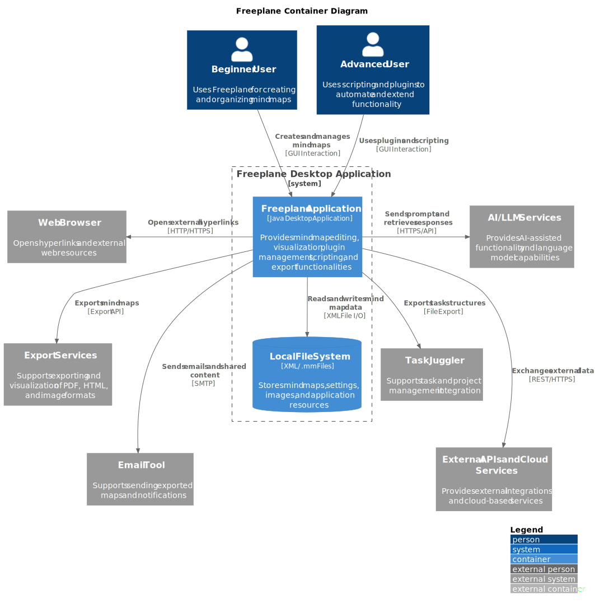
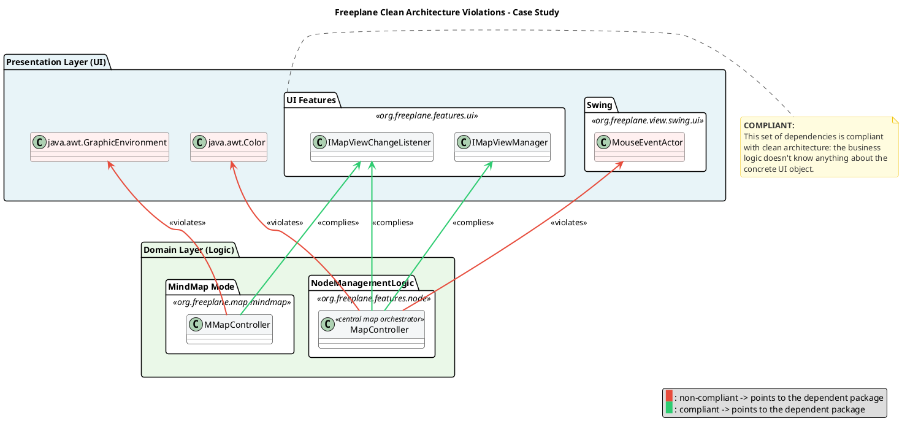
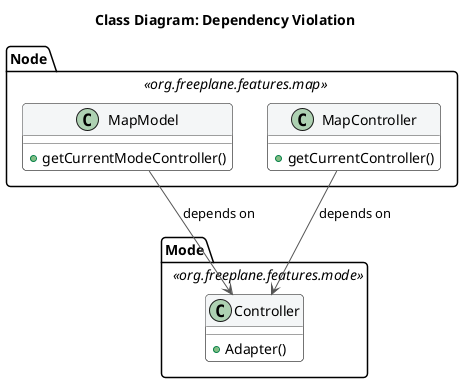
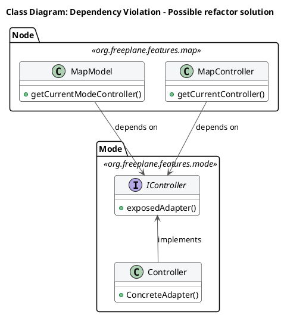
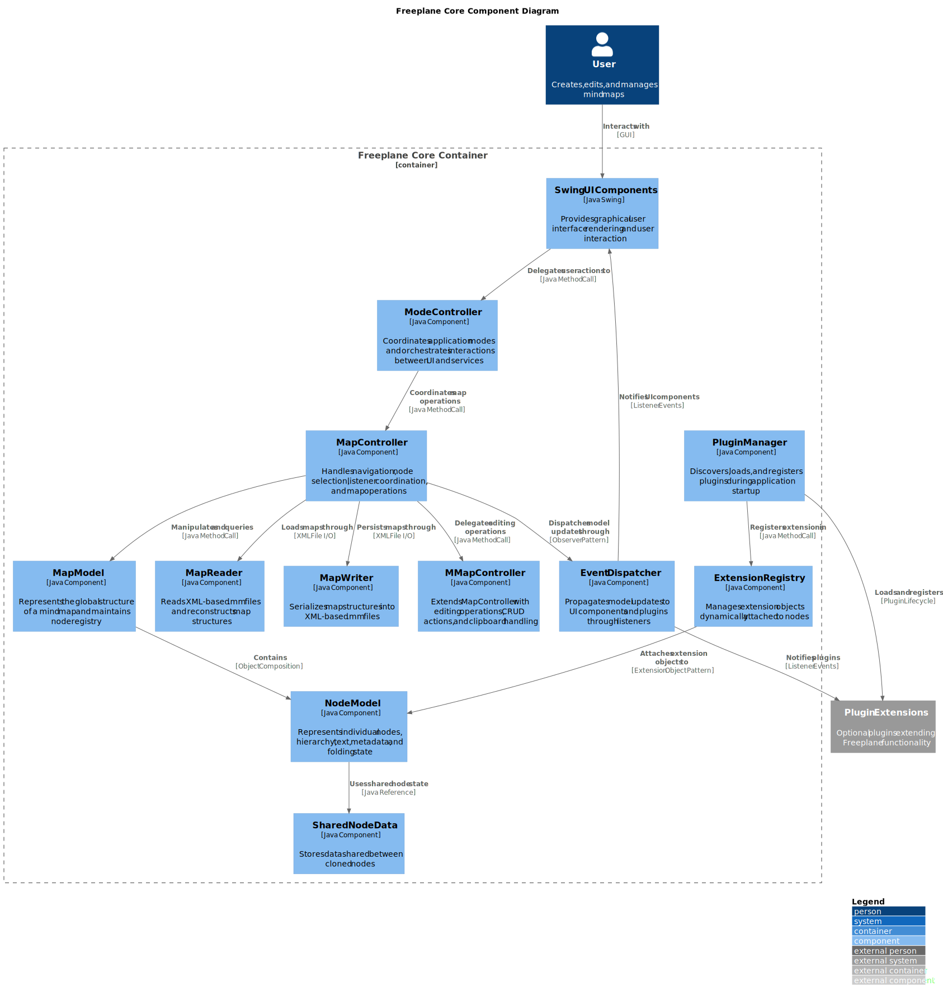
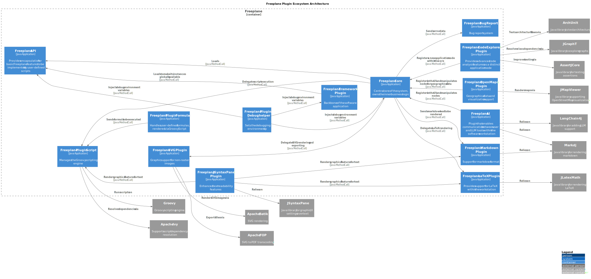
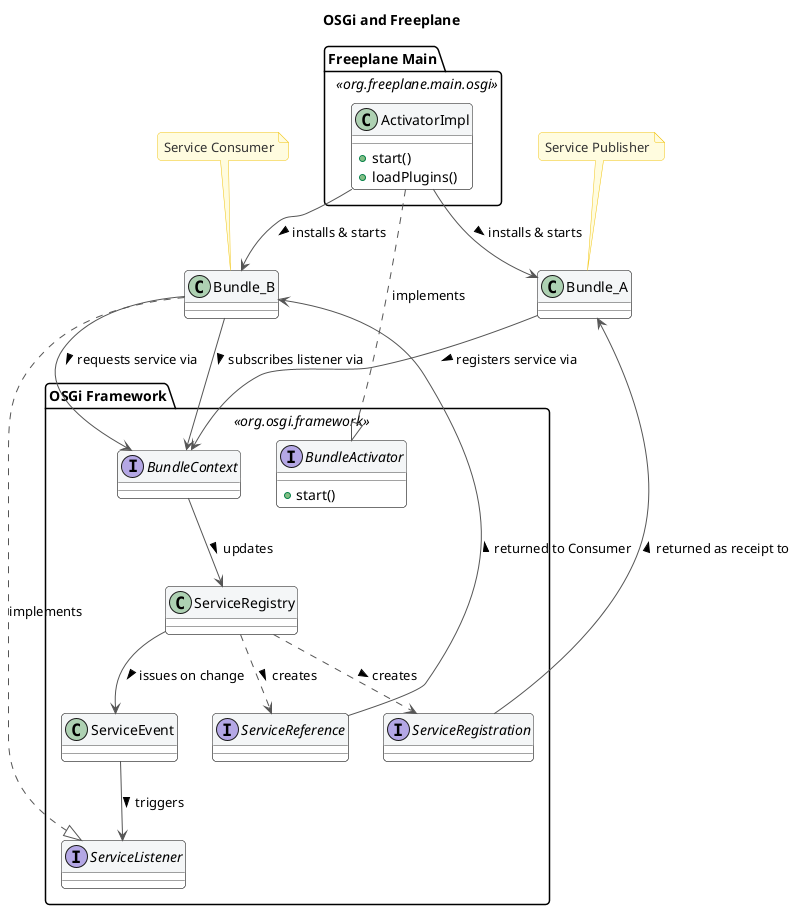

# Architectural Analysis of Freeplane – Reverse Engineering and Evaluation

### 1. Introduction and Analysis Methodology
This report presents an architectural analysis of Freeplane with the objective of identifying its main structural characteristics, architectural style, and design principles. The analysis aims to reconstruct the system architecture and understand how its components are organized and interact.

The reverse engineering process was conducted using static code analysis, documentation review and statistics gathered directly from the official Freeplane repository. The codebase was examined to identify packages, modules, and dependencies, while repository documentation was used to support architectural interpretation.

The system primarily follows a micro-kernel (plug-in) architecture, where extensible components are connected to the core system through a modular plugin framework. The architecture is centered around a core platform that provides essential services, user interface management, and application coordination, while plugins extend the system with additional functionalities such as scripting, AI integration, LaTeX rendering, markdown processing, and export capabilities. Unlike a pure micro-kernel architecture, the core is not limited to a minimal coordination layer, since it also contains significant business logic and frontend functionality. Nevertheless, extensibility remains the dominant architectural concern, making the micro-kernel pattern the most representative interpretation of the system architecture.

### 2. The System in its Ecosystem: C4 Context Model 
The context diagram illustrates how Freeplane operates within its external environment and interacts with both users and supporting systems. Two main user roles are identified. Beginner users interact with the system to create and manage mind maps using basic functionality, while advanced users extend the system through scripting and plugins, enabling automation and customization.

Freeplane interacts with several external systems that support its core functionality. The most fundamental is the file system, which is responsible for storing and retrieving mind map data in XML-based formats, as well as associated resources such as images. This interaction reflects the system’s reliance on local persistence rather than external databases.

In addition, Freeplane communicates with external tools to enhance usability and interoperability. External document visualizers are used to export and display mind maps in formats such as PDF or HTML, while web browsers are invoked to open hyperlinks embedded within maps. The system also integrates with external services such as email tools, cloud APIs, and task management tools, enabling users to share, synchronize, or repurpose their data in different contexts. Furthermore, advanced integrations such as LLM-based tools support extended functionality for automation and intelligent processing.

From an architectural perspective, these interactions are mediated by the Freeplane application as a central component that encapsulates core logic and coordinates external communication. User inputs are handled through the user interface layer and translated into operations on the internal data model. These operations are then persisted via the file system using XML-based storage, or transformed into external representations through export services. Interactions with external tools and services, such as browsers, email systems, or external APIs, are triggered through defined integration points, ensuring that communication remains controlled within a clear system boundary.

Overall, the context model highlights Freeplane as a standalone desktop application that integrates with a variety of external systems to provide flexibility and extended capabilities while preserving a clear system boundary.

### 3. Decomposition and Runtime: C4 Container Model
The container diagram illustrates the main executable and deployable units that compose the runtime architecture of Freeplane. Although Freeplane is distributed as a standalone desktop application, internally the system is structured around a plugin-oriented runtime environment where a central host coordinates multiple extensible modules and supporting services.

At the center of the architecture is the main Freeplane Application container, implemented as a Java desktop application. This container acts as the runtime host of the system and is responsible for user interface management, event coordination, persistence handling, plugin loading, and execution of the core application logic. Users interact directly with this container to create, edit, and manage mind maps, while advanced users additionally exploit scripting and plugin capabilities to customize workflows and extend functionality.

The runtime structure follows a micro-kernel approach in which the core application provides stable foundational services while optional features are delegated to plugins and external integrations. The unalterable core includes responsibilities such as map editing, node management, rendering coordination, event handling, persistence management, and plugin orchestration. Additional capabilities such as AI-assisted operations, export functionalities, scripting, task integration, and external communication are connected through extensible modules and integration points.

Persistence is handled through the Local File System container, where Freeplane stores XML-based .mm files, configuration settings, images, and additional resources. This lightweight persistence approach reflects the desktop-oriented nature of the application and avoids dependency on centralized database infrastructure.

Several external systems interact with the application container at runtime. Web browsers are invoked to open external hyperlinks, export services are used to generate formats such as PDF and HTML, and AI/LLM services are accessed through HTTPS-based APIs to provide intelligent assistance features. Additional integrations include email systems communicating through SMTP and cloud-based APIs supporting interoperability and external data exchange.

Communication between these containers occurs primarily through direct in-memory calls within the Java runtime environment, while external integrations rely on protocols such as HTTP/HTTPS, SMTP, file I/O, and export APIs. The plugin-oriented organization also enables logical separation between the core system and optional extensions, improving extensibility and maintainability.

### 4. Mapping to Clean Architecture: Theory vs. Reality
This section aims to clarify the architectural choices made to build the software, and to define if Clean Architecture principles are respected. 
The first step is to define _entities_, _use cases_ and _external layers_, and where to find them. The package `org.freeplane.features.map` is the perfect candidate: its classes define core software logic, such as how nodes are defined and organized within the map.  

To double check, data from the official repository was analyzed. Particularly, we tried to estimate package stability from the number of commits directly involving the package. The first result seemed to contradict the thesis: `org.freeplane.features.map` is a very unstable package, with hundreds of commits during the software lifecycle.
This can be explained by the high coupling between the package and UI components. A deeper analysis reveals that almost 43% of commits share changes with freeplane UI components, and this number grows if we look at subpackages such as `org.freeplane.features.map.filemode` or `org.freeplane.features.map.clipboard` (both at almost 61% of shared commit number with ui components). This data suggests that the Clean Architecture patterns are not well-respected in the software: core business logic should have almost no co-change with UI and graphical features.  

Code analysis reveals that most classes in the package have dependencies on the frontend, involving both custom Freeplane UI classes and standard Java AWT ones. There is a mixed approach: in many cases classes import Interfaces from the `org.freeplane.features.ui` package, that represent the abstraction for the User Interface management. However, sometimes there is direct interaction with frontend classes: for instance, class `MapController` manages map view through the `IMapViewManager` interface, but it implements a concrete method for managing an external peripheral (the mouse, through `MouseEventActor`). Many concrete standard Java UI classes are imported as well. This mixed approach results in high-coupling between the business logic and external layers in the architecture, making it less isolated and more difficult to be tested and extended or modified.

There are other crucial violations of the Clean Architecture pattern: there is no clear definition of _entities_, _use cases_ and other layers. Some classes may look similar to one of these concepts: `MapModel` could be classified as an _entity_, `MapController` as a _use case_, `Controller` from `org.freeplane.features.mode` as an _adapter_. Most critical violations of the Clean Architecture pattern can be found in the dependency among these three classes: `MapModel` and `MapController` depend on the `Controller`; the flow of dependencies is broken and therefore inner business logic cannot be tested in isolation. 

Compliance with the principles from the Clean Architecture pattern can be found in the _persistence layer_: classes such as `MapReader` and `MapWriter` are at the outer layer of the architecture, and there are no dependency violations. They perform operations to save or read data from the mindmap directly in the `.mm` file. 
The `org.freeplane.features.filter` package suffers from the same set of problems: its `FilterController` has the same mixed approach at User Interface import dependencies, and it mixes business logic, application logic, and frontend concerns in the same class.. That's why architectural flaws from `org.freeplane.features.map` package can be fairly extended to the whole software structure.

To sum up, the software does not fully comply to Clean Architecture principles. There are many violations that concern boundaries mainly: the most serious violation is the lack of clear division between _entities_ and _use cases_, and the broken dependency flow. Dependency on concrete User Inteface methods make the software more difficult to be tested in isolation.
These violations have an explanation: as reported in the Official Documentation, core classes were designed to be extensible, and to follow the Extension-Object Design Pattern defined by Erich Gamma. This architectural choice aims at building extension to well-defined objects. Lack of compliance to the Clean Architecture can be explained by the need of having both _entities_ and _use cases_ in the same set of classes to make them easily extensible.

### 5. Component Diagrams
#### 5.1 Core Internal Structure (Target: ~600 words) ->336 words
The component diagram focuses on the internal structure of the Freeplane Core container and highlights how the application coordinates user interaction, data management, extensibility, and event propagation. The architecture follows a partially MVC-inspired organization combined with an Extension Object Pattern that supports the micro-kernel architecture identified previously.

The graphical user interface is implemented through Swing UI Components, which represent the presentation layer of the application. User actions are delegated to the ModeController, which coordinates application modes and orchestrates interactions between the user interface and core services. The MapController manages navigation, node selection, and map-level operations, while MMapController extends these responsibilities with editing functionality such as CRUD operations and clipboard management.

The model layer is centered around MapModel and NodeModel. MapModel represents the global structure of a mind map and maintains the node registry, while NodeModel encapsulates individual node information including hierarchy, text, metadata, and folding state. SharedNodeData stores information shared between cloned nodes, reducing duplication and supporting internal consistency.

Persistence responsibilities are handled by MapReader and MapWriter, which respectively deserialize and serialize XML-based .mm files. Rather than embedding persistence directly into the model classes, the controllers delegate these responsibilities to specialized components, improving separation of concerns.

A key architectural aspect is the extensibility mechanism implemented through the PluginManager and ExtensionRegistry. The PluginManager is responsible for discovering, loading, and registering plugins during application startup, while the ExtensionRegistry dynamically attaches extension objects to nodes using the Extension Object Pattern. This mechanism enables plugins to enrich node behavior without modifying the core data structures, which is consistent with the micro-kernel architectural style.

Event propagation is managed through the Event Dispatcher, which implements an observer-based communication model. Model updates are propagated to both UI components and plugins using listener mechanisms such as map and node change listeners. This decouples components from direct dependencies and allows plugins to react to internal state changes without tightly coupling to the core implementation.

Overall, the component diagram demonstrates how Freeplane combines MVC-inspired coordination, event-driven communication, and plugin-based extensibility within a centralized desktop application core.

#### 5.2 Plugin Ecosystem and Runtime Extensions

The plugin ecosystem architecture illustrates how Freeplane extends its functionality through independently developed plugin modules integrated within a shared runtime environment. The system follows a micro-kernel-inspired architecture in which the Freeplane Core provides stable foundational services while plugins extend the application with optional features and specialized capabilities. The plugin ecosystem diagram highlights the relationships between the framework, core runtime, plugins, scripting infrastructure, and supporting external libraries.

At the foundation of the runtime environment is the Freeplane Framework Plugin, which acts as the backbone of the application and exposes globally available services. The Freeplane API container defines extension interfaces and encapsulates core services used by plugins and scripting components. This architecture enables plugins to interact with the system through defined interfaces without directly modifying the core implementation.

Several plugins extend the system with specialized functionality. The AI Plugin integrates LLM-based capabilities through LangChain4j, while the OpenMaps Plugin provides geographical visualization support through JMapViewer. Markdown and LaTeX plugins enable advanced text rendering features, supported respectively by MarkDJ and JLatexMath. The SVG Plugin handles vector graphics rendering and export operations through Apache Batik and Apache FOP. In addition, the CodeExplorer Plugin introduces architectural analysis capabilities using libraries such as ArchUnit and JGraphT.

The scripting subsystem is centered around the Script Plugin, which integrates the Groovy scripting engine and resolves external dependencies through Apache Ivy. Additional extensions such as the Formula Plugin build on top of this scripting infrastructure to provide user-defined computations and automation capabilities. Plugins communicate with the core primarily through direct in-memory Java method calls and API registrations. Some plugins register additional user interface components or application modes within the core runtime, while others provide delegated rendering or export services.

Overall, the plugin ecosystem demonstrates how Freeplane achieves extensibility while preserving a centralized runtime architecture. The separation between the framework, core services, extension APIs, and independent plugins strongly reinforces the micro-kernel characteristics identified throughout the architectural analysis.

### 6. Boundaries: Core-Plugin interaction and Internal Business Logic Boundaries analysis
#### 6.1. Core-Plugin Interaction
Freeplane is built on top of the OSGi framework, in the Knopflerfish implementation. This technology stack allowed developers to build a modular software, where different plugins can be attached to the core easily. The framework generates a three-layer hierarchy:
1. Module Layer: it is the declarative layer: it defines bundles identity and static dependencies. In Freeplane, the `org.freeplane.core` package plays this role. This piece of information can be easily undestood by reading its `MANIFEST.MF` file when compiled: it stores all settings and dependencies for building the application.
2. Activator: it is responsible for building the infrastructure to make plugins communicate. In Freeplane, it is the ActivatorImpl class in `org.freeplane.main.osgi`. It can be identified since it implements the `org.osgi.framework.BundleActivator` class.
3. Service Layer: bundles provide services, that are registered within the Framework exploiting mechanisms that are built in OSGi environment. Such services can be published or unpublished at anytime. They look like plain Java Objects.  

The OSGi bundles are built to be independent from one another: there is no shared knowledge, code or data, and all references to classes or methods in other plugins throw OSGi errors. Plugins and Core have therefore strict boundaries, that can be crossed by pointing to published services only.  
At the Module Layer, circular dependencies are critical and they can lead to deadlock: it can happen when thread 1 starts Bundle 1 which requires a Service from Bundle 2, and it stops until it is published. Thread 2 starts Bundle 2 which requires a service from Bundle 1. It stops. The application is now locked permanently. This can be solved by implementing additional features provided by the framework.  
Freeplane resolves these dependencies at runtime, since it provides a single Activator that is responsible of building the application attaching different plugins.
On the other hand, on the Service Layer, a clear dependency tree cannot be drawn. That is because Bundles can both publish and exploit services published by other Bundles, that will likely require Service published by plugins that exploit their services. Dependencies are therefore resolved at run-time: bundles may or may not publish or request services. This pattern makes debugging more difficult, because sometimes it is difficult to track flow of information across bundles in Freeplane.

This structure provides both freedom and constraints to developers: new features can be added by creating a new dedicated plugin. Moreover, since bundles are independent and well separated, deployment and maintenance does not affect the overall system. Caveats of this architectural choice are the programming language and the complete compliance to the framework: developers must write all plugins in Java (the OSGi framework doesn't support other programming languages), and they must write plugins that implement the logic described above.

#### 6.2. Code Analysis: Boundaries in Freeplane Core
The object of this short analysis is to understand how boundaries are respected at the core level. The analysis is carried on the `org.freeplane.features.map` package. This package is representative of the overall architecture, since it includes classes that manage core software logic, such as Nodes and MindMap models. 
Data was extracted from the main repository, exploiting `git log`, and analysis is carried out through the logical coupling analysis method, where groups that change together frequently have been put in the same cluster. The co-change threshold (minimun number of git commits classes must share to be included in the analysis) is 10.  
Many Common Closure Principle violations can be found: it means that classes often change together, even if they shouldn't. Most of them are related to changes that affect the `MapController` class and many visual components that are related to `Swing` library. This data suggest loose boundaries, at least between entities and UI features.
Within the package, classes that host the most important business logic features rarely change together: for instance, `MapModel` and `NodeModel` never change in the same commit. They do not have static dependencies on each other either. That is proof that at business level core components are well separated. That is good news for developers and maintainers, since it suggests low coupling between core business logic feature.  
Even though in clear violation of Clean Architecture principle, a lower, looser level of component separation has been put in place.

### 7. Architectural Evaluation and Conclusions 

| Quality | Rating | Evidence |
|---|---|---|
| **Extensibility** | Strong | Two-level: OSGi plugin isolation (macro) + Extension Object Pattern on nodes (micro). 10 official plugins developed independently. |
| **Maintainability** | Weak | God Object controllers with too many responsibilities. Pervasive global singleton calls create invisible state dependencies. |
| **Modularity** | Mixed | Strong between plugins (OSGi, no cross-bundle change correlation). Weak within core: nearly half of core commits co-change with UI components. |
| **Testability** | Weak | No dependency injection. Over half the domain layer depends on GUI frameworks. Global singletons cannot be replaced with test doubles. |

### Coupling and Cohesion Metrics

Derived from `git log` clusterization (threshold: 10 shared commits):

- **Low entity coupling (positive):** `MapModel` and `NodeModel` never co-change — well-separated domain classes.
- **High domain-UI coupling (negative):** `MapController` frequently co-changes with Swing components.
- **Strong plugin isolation (positive):** OSGi bundles show no cross-bundle change correlation.

### Conclusion

Freeplane balances extensibility and legacy constraints. Its OSGi plugin system and Extension Object Pattern provide robust, two-level extensibility. However, the core suffers from systemic architectural debt: God Object controllers, pervasive singleton dependencies, and over half the business logic layer coupled to AWT/Swing. These issues, rooted in the software's 2009 origins, make the core untestable in isolation and resistant to UI migration.

If an architectural refactoring were to be proposed based on Clean Architecture principles, the priority would be introducing abstraction interfaces for GUI dependencies (`Color`, `Font`, `Component`) in the domain layer, enabling independent testability without breaking existing functionality.
