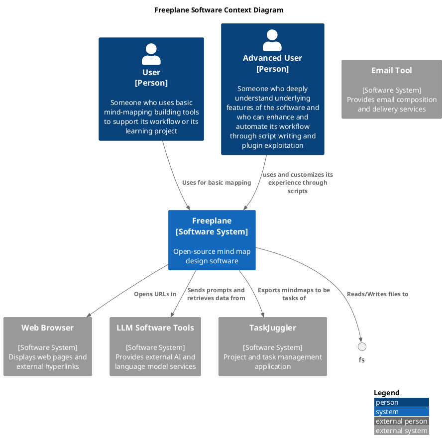
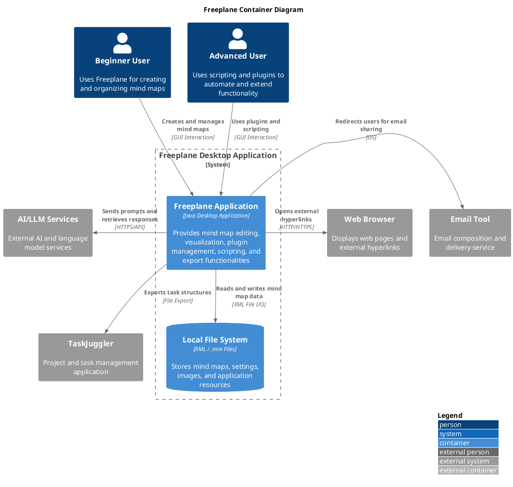
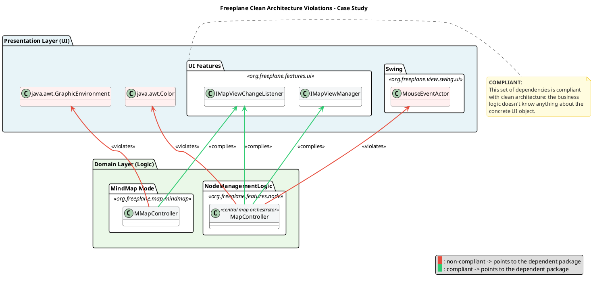
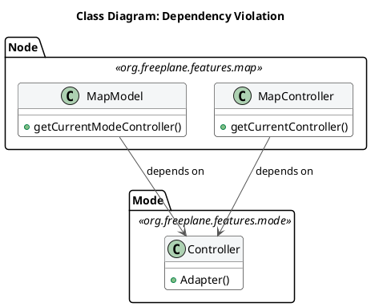
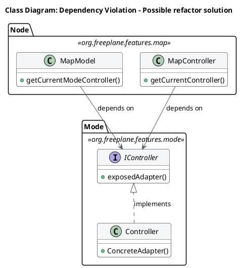
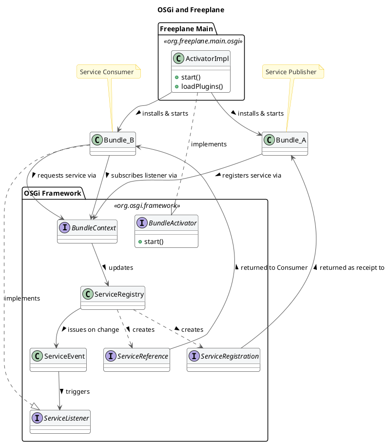

# Architectural Analysis of Freeplane – Reverse Engineering and Evaluation

#### 1. Introduction and Analysis Methodology
This report presents an architectural analysis of Freeplane with the objective of identifying its main structural characteristics, architectural style, and design principles. The analysis aims to reconstruct the system architecture and understand how its components are organized and interact.
The reverse engineering process was conducted using static code analysis, documentation review and statistics gathered directly from the official Freeplane repository. The codebase was examined to identify packages, modules, and dependencies, while repository documentation was used to support architectural interpretation.

The system can be described as an **imperfect micro-kernel (plug-in) monolith**; where extensible components are connected to the core system through the OSGi plugin framework an industry-standard solution for blending separate components in a single entry point from the user standpoint. However, the core module is not just a shell, and it provides essential services, user interface management, and application coordination, while plugins extend the system with additional functionalities.
Plugins represent extensions: they do not make the software, but they extend it with advanced features. This pattern breaks some of the micro-kernel architectural style principles, thus the _imperfect_ definition.

This report will delve into architectural details, showing developers' choices, their compliance to modern architectural styles and design patterns: the SOLID principles and the Clean Architecture theory will be benchmarks to assess overall Freeplane's architecture health. 
The C4 notation will help in detailing better software functionalities and how they interact in its environment. C4 diagrams have been written in PlantUML and graphically formatted with the help of an LLM.

#### 2. The System in its Ecosystem: C4 Context Model 

Freeplane was born as a fork of the well-known Freemind software. The official documentation reports that the decision was taken to improve software's design and to speed up its development and maintenance cycles. 



The context diagram illustrates how Freeplane operates within its external environment and interacts with both users and supporting systems. Two main user roles are identified. Beginner users interact with the system to create and manage mind maps using basic functionality, while advanced users extend the system through scripting and plugins, enabling automation and customization.

The software presents itself as a mind-mapping tool, and it features a proprietary file format `.mm`. The software stores such files in the computer File System, in a user-defined directory. The file system, and more generally the OS, represent the software's persistence layer. 
UI personalization, such as themes, font, are saved in a dedicated repository within the computer filesystem. This interaction reflects the system’s reliance on local persistence rather than external databases. *motivate why it is internal*

To enhance its mind-mapping toolset, web browsers are invoked to open hyperlinks embedded within maps. Users can add them to nodes. When clicked, a browser instance is opened to show the webpage the URL points to. This can be mostly useful to include sources or images directly from the internet in the mind-map. 

Freeplane grew to become a more and more comprehensive tool, to help students, professors, and professionals from various fields requiring productivity tools: to do so, Freeplane supports built-in Email support; with a single click users can be directly redirected to their main Email provider. It also provides native support for TaskJuggler, a project-management tool: mindmaps can be transformed in tasks within the external software; this features enhance productivity for busy professionals such as Project Managers. Whereas the interaction with the email system is just a redirect, the software actively transfer data to TaskJuggler, making the transition to the new software smooth and fast.
Freeplane supports built-in LLM interaction. Through a dedicated plugin, users can link the software to their favorite LLM system. The software allows AI tools to directly interact with mindmaps. 

All these features show how the software is more than just a mind-mapping tool, but it can described as a productivity software: mindmaps can be useful for a large variety of users, and productivity features make the software more appealing to highly professional users looking for ways to speed up their workflow.


#### 3. Decomposition and Runtime: C4 Container Model 

The Container Model aims at showing how the software is built, from a lower, more detailed standpoint. 




Freeplane is represented as a single Container software. This choice can be explained by the nature of its technology stack. Freeplane has multiple plugins, that are connected to the core through the OSGi framework. This implementation ensures separation among plugins, making them independent from one another; theoretically, Freeplane plugins can be autonomously developed, tested and integrated in the environment. Moreover, they do not extend core software functionalities: plugins bring advanced features, both graphical and functional. The core software alone would work well without plugins.  
However, the software has been represented as a single Component unit because OSGi bundles have not independent life. Even though they are developed externally, they require the OSGi engine to be executed. Plugins such as `freeplane script` or `freeplane latex` cannot exist outside the Freeplane environment. That is because all plugins plugins are designed to extend features in the core Freeplane application. 
Furthermore, they cannot be even run outside the launcher defined in the core `freeplane` package: the OSGi implementation require the framework to start plugins with a sequential process, managed by a kernel that is instantiated in the launcher implemented in the core package.
These consideration have led the analysis to consider the software as composed of a single container. In this situation, independent deployability cannot justify the definition of plugins as independent units.

The persistence layer is managed by the Operating System. Freeplane stores information related to the single mind-map in a proprietary file format, that is the `.mm`. This is an XML-derived format that fits the definition of mindmaps as nested blocks of nodes. Users can independentely decide which area of their File System save data to. 


#### 4. Mapping to Clean Architecture: Theory vs. Reality (Target: ~500 words)
This section aims to clarify the architectural choices made to build the software, and to define if Clean Architecture principles are respected. 
The first step is to define _entities_, _use cases_ and _external layers_, and where to find them. The package `org.freeplane.features.map` is the perfect candidate: its classes define core software logic, such as how nodes are defined and organized within the map.  

To double check, data from the official repository was analyzed. Particularly, we tried to estimate package stability from the number of commits directly involving the package. The first result seemed to contradict the thesis: `org.freeplane.features.map` is a very unstable package, with hundreds of commits during the software lifecycle.
This can be explained by the high coupling between the package and UI components. A deeper analysis reveals that almost 43% of commits share changes with freeplane UI components, and this number grows if we look at subpackages such as `org.freeplane.features.map.filemode` or `org.freeplane.features.map.clipboard` (both at almost 61% of shared commit number with ui components). This data suggests that the Clean Architecture patterns are not well-respected in the software: core business logic should have almost no co-change with UI and graphical features.  

Code analysis reveals that most classes in the package have dependencies on the frontend, involving both custom Freeplane UI classes and standard Java AWT ones. There is a mixed approach: in many cases classes import Interfaces from the `org.freeplane.features.ui` package, that represent the abstraction for the User Interface management. However, sometimes there is direct interaction with frontend classes: for instance, class `MapController` manages map view through the `IMapViewManager` interface, but it implements a concrete method for managing an external peripheral (the mouse, through `MouseEventActor`). Many concrete standard Java UI classes are imported as well. This mixed approach results in high-coupling between the business logic and external layers in the architecture, making it less isolated and more difficult to be tested and extended or modified.




There are other crucial violations of the Clean Architecture pattern: there is no clear definition of _entities_, _use cases_ and other layers. Some classes may look similar to one of these concepts: `MapModel` could be classified as an _entity_, `MapController` as a _use case_, `Controller` from `org.freeplane.features.mode` as an _adapter_. Most critical violations of the Clean Architecture pattern can be found in the dependency among these three classes: `MapModel` and `MapController` depend on the `Controller`; the flow of dependencies is broken and therefore inner business logic cannot be tested in isolation. 





This situation leverages the Dependency Inversion Principle to decouple the three classes, and it introduces a Boundary Interface that exposes signatures which outer components must adhere to. This way, the set of involved classes is compliant with the Clean Architecture pattern.

Compliance with the principles from the Clean Architecture pattern can be found in the _persistence layer_: classes such as `MapReader` and `MapWriter` are at the outer layer of the architecture, and there are no dependency violations. They perform operations to save or read data from the mindmap directly in the `.mm` file. 
The `org.freeplane.features.filter` package suffers from the same set of problems: its `FilterController` has the same mixed approach at User Interface import dependencies, and it mixes business logic, application logic, and frontend concerns in the same class.. That's why architectural flaws from `org.freeplane.features.map` package can be fairly extended to the whole software structure.

To sum up, the software does not fully comply with Clean Architecture principles. There are many violations that mainly concern architectural boundaries: the most serious violation is the lack of clear division between entities and use cases, and the broken dependency flow. Dependency on concrete User Interface methods makes the software more difficult to be tested in isolation.
These violations have an explanation: as reported in the Official Documentation, core classes were designed to be extensible, and to follow the Extension-Object Design Pattern defined by Erich Gamma. This architectural choice aims at building extensions to well-defined objects. The lack of compliance with the Clean Architecture can be explained by the need to have both entities and use cases in the same set of classes to make them easily extensible.
However, Extensible Object theory does not justify the direct implementation of UI elements in core entities. This remains a pure violation of the Separation of Concerns at an architectural level.

#### 5. Zooming into the Engine: C4 Component Model of the Core (Target: ~600 words)

The Component Model offers the deepest view of Freeplane's internal structure, detailing how the single container introduced in Section 3 decomposes into individually deployable OSGi bundles and the external libraries they depend upon.

```plantuml
@startuml Freeplane_C4_Container_Diagram
!include https://raw.githubusercontent.com/plantuml-stdlib/C4-PlantUML/master/C4_Container.puml

title Freeplane Software Container Diagram

LAYOUT_TOP_DOWN()
LAYOUT_WITH_LEGEND()

skinparam wrapWidth 200
skinparam maxMessageSize 200

Container_Boundary(freeplane_app, "Freeplane") {

    ' === Tier 1: Framework ===
    Container(framework,   "Freeplane Framework Plugin", "Java Application", "Backbone of the software application")

    ' === Tier 2: Core ===
    Container(freeplane,   "Freeplane Core",             "Java Application", "Central core of the system, owns the inner business logic")

    ' === Tier 3: API + lateral plugins ===
    Container(api,         "Freeplane API",              "Java Application", "Provides encapsulation for basic Freeplane features to be implemented by user-defined scripts")
    Container(ai,          "Freeplane AI",               "Java Application", "Plugin that enables communication between user and LLM tools within the software workstation")
    Container(openmaps,    "Freeplane OpenMaps Plugin",  "Java Application", "Geographical data and visualization support")
    Container(bug,         "Freeplane Bug Report",       "Java Application", "Bug report system")
    Container(codeexplorer,"Freeplane CodeExplorer Plugin","Java Application","Provides advanced code analysis features as a distinct application mode")

    ' === Tier 4: Script engine ===
    Container(script,      "Freeplane Plugin Script",   "Java Application", "Manages the Groovy scripting engine")

    ' === Tier 5: Script-dependent plugins ===
    Container(formula,     "Freeplane Plugin Formula",  "Java Application", "Handles user-defined formulas, rendered via Groovy Script")
    Container(markdown,    "Freeplane Markdown Plugin", "Java Application", "Support for markdown format")
    Container(latex,       "Freeplane LaTeX Plugin",    "Java Application", "Provides support for LaTeX within the workstation")
    Container(syntax,      "Freeplane JSyntaxPane Plugin","Java Application","Enhanced text readability features")

    ' === Tier 6: SVG ===
    Container(svg,         "Freeplane SVG Plugin",      "Java Application", "Graphic support for non-raster images")

    ' === Bottom: Debug helper ===
    Container(debughelper, "Freeplane Plugin Debughelper","Java Application","Sets the debugging environment up")
}

' === External systems ===
System_Ext(markdj,      "Markdj",       "Java library for rendering markdown")
System_Ext(jsyntaxpane, "JSyntaxPane",  "Java library for graphic UI settings over text")
System_Ext(latexmath,   "JLatexMath",   "Java library for rendering LaTeX")
System_Ext(llm,         "LangChain4j",  "Java library for adding LLM support")
System_Ext(groovy,      "Groovy",       "Groovy scripting engine")
System_Ext(ivy,         "Apache Ivy",   "Supports script dependency resolution")
System_Ext(batik,       "Apache Batik", "SVG rendering")
System_Ext(fop,         "Apache FOP",   "SVG to PDF transcoding")
System_Ext(mapviewer,   "JMapViewer",   "Java library supporting OpenStreetMap visualization")
System_Ext(archunit,    "ArchUnit",     "Java library to test architecture")
System_Ext(jgrapht,     "JGraphT",      "Java library to explore graphs")
System_Ext(assertjcore, "AssertJCore",  "Java library for testing assertions")

' === Vertical layout hints (top-down tiers) ===
Lay_D(framework,   freeplane)
Lay_D(freeplane,   api)
Lay_D(api,         script)
Lay_D(script,      svg)
Lay_D(svg,         debughelper)

' === Horizontal layout hints ===
Lay_R(api,    ai)
Lay_R(api,    codeexplorer)
Lay_R(api,    openmaps)
Lay_R(api,    bug)
Lay_R(script, formula)
Lay_R(script, markdown)
Lay_R(script, latex)
Lay_R(script, syntax)

' === Framework → API ===
Rel_D(framework, api,       "Loads to make its instances globally available", "Java Method Call")

' === Core → API ===
Rel_D(freeplane, api,       "Loads", "Java Method Call")

' === Core → Plugins ===
Rel_D(freeplane, script,    "Delegates script execution",                       "Java Method Call")
Rel_D(freeplane, markdown,  "Sends markdown text to be rendered",               "Java Method Call")
Rel_D(freeplane, latex,     "Delegates LaTeX rendering",                        "Java Method Call")
Rel_D(freeplane, svg,       "Delegates SVG rendering and exporting",            "Java Method Call")
Rel_D(freeplane, bug,       "Sends error data",                                 "Java Method Call")

' === Plugins → Core (UI registration) ===
Rel_U(ai,          freeplane, "Registers in the UI and manipulates nodes",                           "Java Method Call")
Rel_U(openmaps,    freeplane, "Registers in the UI and manipulates nodes for geographical data",     "Java Method Call")
Rel_U(codeexplorer,freeplane, "Registers a new application mode within the core",                   "Java Method Call")

' === Scripting ===
Rel_D(formula, script,   "Sends formula to be executed",         "Java Method Call")

' === Syntax → rendering ===
Rel(syntax, script,   "Renders graphical features for text", "Java Method Call")
Rel(syntax, markdown, "Renders graphical features for text", "Java Method Call")
Rel(syntax, latex,    "Renders graphical features for text", "Java Method Call")

' === External dependencies ===
Rel_D(markdown,    markdj,      "Relies on")
Rel_D(ai,          markdj,      "Relies on")
Rel_D(ai,          llm,         "Relies on")
Rel_D(syntax,      jsyntaxpane, "Relies on")
Rel_D(latex,       latexmath,   "Relies on")
Rel_D(script,      groovy,      "Runs scripts on")
Rel_D(script,      ivy,         "Resolves dependencies via")
Rel_D(svg,         batik,       "Renders SVG images via")
Rel_D(svg,         fop,         "Exports files via")
Rel_D(openmaps,    mapviewer,   "Renders maps via")
Rel_D(codeexplorer,archunit,    "Tests architectural flaws via")
Rel_D(codeexplorer,jgrapht,     "Resolves class dependencies via")
Rel_D(codeexplorer,assertjcore, "Improves testing via")

' === Debug Helper → all components ===
Rel(debughelper, framework,  "Injects debug environment variables", "Java Method Call")
Rel(debughelper, freeplane,  "Injects debug environment variables", "Java Method Call")
Rel(debughelper, api,        "Injects debug environment variables", "Java Method Call")
Rel(debughelper, ai,         "Injects debug environment variables", "Java Method Call")
Rel(debughelper, script,     "Injects debug environment variables", "Java Method Call")
Rel(debughelper, formula,    "Injects debug environment variables", "Java Method Call")
Rel(debughelper, syntax,     "Injects debug environment variables", "Java Method Call")
Rel(debughelper, markdown,   "Injects debug environment variables", "Java Method Call")
Rel(debughelper, svg,        "Injects debug environment variables", "Java Method Call")
Rel(debughelper, latex,      "Injects debug environment variables", "Java Method Call")
Rel(debughelper, openmaps,   "Injects debug environment variables", "Java Method Call")

@enduml
```

The diagram reveals a layered hierarchy that governs how the system bootstraps and how data flows between components.

**Framework Plugin.**
The Freeplane Framework Plugin sits at the top of the dependency tree. It initializes the OSGi runtime environment and loads the API plugin, making its instances globally available to every downstream bundle. It acts as the entry point through which the entire component graph is wired together.

**Freeplane Core.**
Directly below the framework resides the Freeplane Core, the central component that owns the inner business logic: map models, node structures, mode controllers, and event dispatching. The Core loads the API and delegates specialist work downward — script execution, markdown and LaTeX rendering, SVG export, and error reporting — to the appropriate plugins via standard Java method calls.

This is where the MVC triad lives: `MapModel` and `NodeModel` define the domain entities, while `MapController` and `ModeController` orchestrate user actions and propagate model changes to the UI.

However, as discussed in Section 4, this orchestration layer suffers from significant design flaws. Controllers such as `MapController` are _God Objects_ that aggregate I/O setup, action registration, navigation, folding, and event orchestration in a single class — a systemic **Single Responsibility Principle (SRP)** violation.


The same pattern recurs in `FilterController` (1,179 lines) and `ModeController` (491 lines, 10+ distinct responsibilities).

Furthermore, the pervasive use of `Controller.getCurrentController()` — a concrete global singleton called hundreds of times across the `features` layer — constitutes the most widespread **Dependency Inversion Principle (DIP)** violation in the codebase.

`MapWriter` similarly instantiates concrete dependencies rather than receiving abstractions.

These patterns couple nearly every component to concrete implementations rather than abstractions.

**API and Lateral Plugins.**
The Freeplane API provides an encapsulation layer that exposes core features for user-defined Groovy scripts, shielding script authors from internal implementation details. Sitting alongside the API are four lateral plugins: the AI plugin (LLM integration via LangChain4j), OpenMaps (geographical visualization via JMapViewer), CodeExplorer (architectural analysis via ArchUnit and JGraphT), and the Bug Report module.

An important architectural observation emerges here: while the Core pushes data downward to these plugins, three of them — AI, OpenMaps, and CodeExplorer — also call _upward_ into the Core to register UI elements and manipulate nodes. This bidirectional dependency is managed at runtime through the OSGi service layer, but it reveals tension in the component hierarchy.

Notably, `NodeLevelConditionController.createASelectableCondition()` uses `if`-chains to select condition types — adding a new condition requires modifying existing code, which violates the **Open/Closed Principle (OCP)**.


In contrast, the `filter.condition` subpackage demonstrates OCP _compliance_ through a Strategy/Decorator pattern (`ASelectableCondition`, `DecoratedCondition`), showing that developers have applied the principle inconsistently.

**Script Engine.**
The Plugin Script component manages the Groovy scripting engine and resolves script dependencies via Apache Ivy. It serves as the execution substrate for the script-dependent plugins described below.

**Script-Dependent Plugins.**
Formula, Markdown, LaTeX, and JSyntaxPane all require the scripting infrastructure. Formula sends expressions to the script engine for evaluation; Markdown and LaTeX delegate to external rendering libraries (Markdj and JLatexMath respectively); JSyntaxPane enhances text readability and cross-cuts across Script, Markdown, and LaTeX components.

A **Liskov Substitution Principle (LSP)** concern surfaces at this level: `SingleCopySource` extends `NodeModel` but throws `RuntimeException` for inherited methods, breaking the substitutability contract.

Similarly, `IMapSelection` bundles selection, navigation, scrolling, filtering, and visibility into a single fat interface — an **Interface Segregation Principle (ISP)** violation — whereas `INodeChangeListener`, with its single `nodeChanged` method, represents a clean, minimal counterexample.

**SVG Plugin.**
The SVG component handles non-raster image rendering via Apache Batik and PDF transcoding via Apache FOP.

**Cross-Cutting: Debug Helper.**
The Debug Helper plugin stands apart from the main hierarchy: it injects debug environment variables into every other component, from the Framework down to OpenMaps. This cross-cutting nature means it touches all layers without belonging to any single one.

The SOLID violations catalogued above are not isolated incidents confined to `org.freeplane.features.map`. They are **systemic architectural patterns** that repeat across the entire Core, reinforcing the assessment from Section 4 that business logic, application logic, and UI concerns are insufficiently separated throughout the codebase.

### Boundaries: Core-Plugin interaction and Internal Business Logic Boundaries analysis
#### Core-Plugin Interaction
Freeplane is built on top of the OSGi framework, in the Knopflerfish implementation. This technology stack allowed developers to build a modular software, where different plugins can be attached to the core easily. The framework generates a three-layer hierarchy:
1. Module Layer: it is the declarative layer: it defines bundles identity and static dependencies. In Freeplane, the `org.freeplane.core` package plays this role. This piece of information can be easily undestood by reading its `MANIFEST.MF` file when compiled: it stores all settings and dependencies for building the application.
2. Activator: it is responsible for building the infrastructure to make plugins communicate. In Freeplane, it is the ActivatorImpl class in `org.freeplane.main.osgi`. It can be identified since it implements the `org.osgi.framework.BundleActivator` class.
3. Service Layer: bundles provide services, that are registered within the Framework exploiting mechanisms that are built in OSGi environment. Such services can be published or unpublished at anytime. They look like plain Java Objects.  

The OSGi bundles are built to be independent from one another: there is no shared knowledge, code or data, and all references to classes or methods in other plugins throw OSGi errors. Plugins and Core have therefore strict boundaries, that can be crossed by pointing to published services only.  
At the Module Layer, circular dependencies are critical and they can lead to deadlock: it can happen when thread 1 starts Bundle 1 which requires a Service from Bundle 2, and it stops until it is published. Thread 2 starts Bundle 2 which requires a service from Bundle 1. It stops. The application is locked permanently. This can be solved by implementing additional features provided by the framework.  
Freeplane resolves these dependencies at runtime, since it provides a single Activator that is responsible of building the application attaching different plugins.
On the other hand, on the Service Layer, a clear dependency tree cannot be drawn. That is because Bundles can both publish and exploit services published by other Bundles, that will likely require Service published by plugins that exploit their services. Dependencies are therefore resolved at run-time: bundles may or may not publish or request services. This pattern makes debugging more difficult, because sometimes it is difficult to track flow of information across bundles in Freeplane.


This structure provides both freedom and constraints to developers: new features can be added by creating a new dedicated plugin. Moreover, since bundles are independent and well separated, deployment and maintenance does not affect the overall system. Caveats of this architectural choice are the programming language and the complete compliance to the framework: developers must write all plugins in Java (the OSGi framework doesn't support other programming languages), and they must write plugins that implement the logic described above.

#### Code Analysis: Boundaries in Freeplane Core

The object of this short analysis is to understand how boundaries are respected at the core level. The analysis is carried on the `org.freeplane.features.map` package. This package is representative of the overall architecture, since it includes classes that manage core software logic, such as Nodes and MindMap models. 
Data was extracted from the main repository, exploiting `git log`, and analysis is carried out through the logical coupling analysis method, where groups that change together frequently have been put in the same cluster. The co-change threshold (minimun number of git commits classes must share to be included in the analysis) is 10.  
Many Common Closure Principle violations can be found: it means that classes often change together, even if they shouldn't. Most of them are related to changes that affect the `MapController` class and many visual components that are related to `Swing` library. This data suggest loose boundaries, at least between entities and UI features.
Within the package, classes that host the most important business logic features rarely change together: for instance, `MapModel` and `NodeModel` never change in the same commit. They do not have static dependencies on each other either. That is proof that at business level core components are well separated. That is evidence that the `freeplane.org.features.map` acts as a generic container, where different logic coexists. This is an architectural flaw that can reduce testability and isolation.
Even though in clear violation of Clean Architecture principle, a lower, looser level of component separation has been put in place.


#### 7. Architectural Characteristics and Conclusions

 **Extensibility**  (Strong)  Two-level: OSGi plugin isolation (macro) + Extension Object Pattern on nodes (micro). 10 official plugins developed independently. 
 **Maintainability**  (Weak)  God Object controllers with too many responsibilities. Pervasive global singleton calls create invisible state dependencies.    
 **Modularity**  (Mixed)  Strong between plugins (OSGi, no cross-bundle change correlation). Weak within core: nearly half of core commits co-change with UI components. 
 **Testability**  (Weak)  No dependency injection. Over half the domain layer depends on GUI frameworks. Global singletons cannot be replaced with test doubles. 

### Coupling and Cohesion Metrics

Derived from `git log` clusterization (threshold: 10 shared commits):

- **Low entity coupling (positive):** `MapModel` and `NodeModel` never co-change — well-separated domain classes.
- **High domain-UI coupling (negative):** `MapController` frequently co-changes with Swing components.
- **Strong plugin isolation (positive):** OSGi bundles show no cross-bundle change correlation.

### Conclusion

Freeplane balances extensibility and legacy constraints. Its OSGi plugin system and Extension Object Pattern provide robust, two-level extensibility. However, the core suffers from systemic architectural debt: God Object controllers, pervasive singleton dependencies, and over half the business logic layer coupled to AWT/Swing. These issues, rooted in the software's 2009 origins, make the core untestable in isolation and resistant to UI migration.

If an architectural refactoring were to be proposed based on Clean Architecture principles, the priority would be introducing abstraction interfaces for GUI dependencies (`Color`, `Font`, `Component`) in the domain layer, enabling independent testability without breaking existing functionality.


