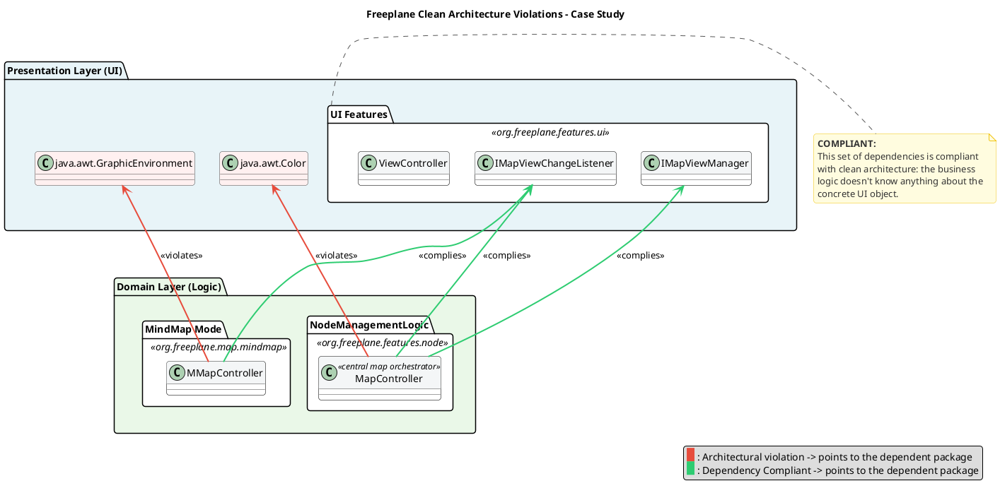
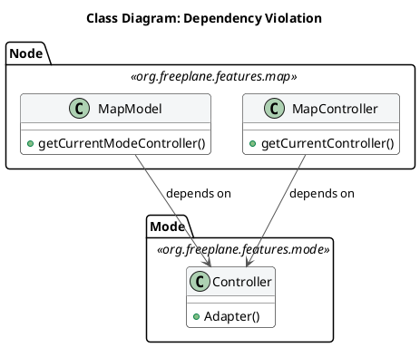
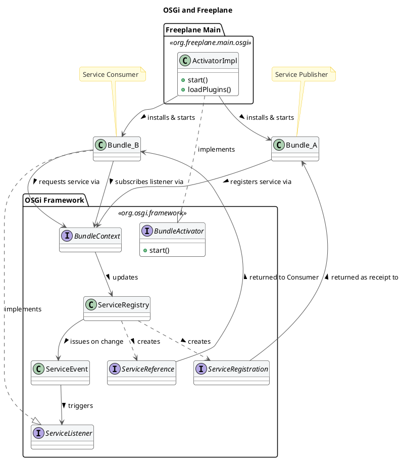

# Architectural Analysis of Freeplane – Reverse Engineering and Evaluation

#### 1. Introduction and Analysis Methodology (Target: ~200 words) -> 208 words
This report presents an architectural analysis of Freeplane with the objective of identifying its main structural characteristics, architectural style, and design principles. The analysis aims to reconstruct the system architecture and understand how its components are organized and interact.

The reverse engineering process was conducted using static code analysis and documentation review. The codebase was examined to identify packages, modules, and dependencies, while repository documentation was used to support architectural interpretation.

The system can be described as a **modular monolith enhanced with a micro-kernel (plug-in) pattern**, where a central core is extended through independently developed components. The codebase is organized into packages such as core, features, and view, which separate fundamental logic, functional behavior, and user interface concerns. This reflects a modular structure within a single deployable application. In addition, extensible elements within the features package indicate a micro-kernel (plug-in) pattern, allowing new functionality to be introduced without modifying the core. The presence of multiple modules and a large number of packages further confirms a structured and layered organization.

This architectural combination is well suited to mind-mapping software. The modular monolith ensures simplicity, consistency, and ease of deployment, while the micro-kernel pattern enables extensibility to support diverse user needs. Together, these approaches support maintainability, adaptability, and long-term evolution.

#### 2. The System in its Ecosystem: C4 Context Model (Target: ~300 words) - 314 words
The context diagram illustrates how Freeplane operates within its external environment and interacts with both users and supporting systems. Two main user roles are identified. Beginner users interact with the system to create and manage mind maps using basic functionality, while advanced users extend the system through scripting and plugins, enabling automation and customization.

Freeplane interacts with several external systems that support its core functionality. The most fundamental is the file system, which is responsible for storing and retrieving mind map data in XML-based formats, as well as associated resources such as images. This interaction reflects the system’s reliance on local persistence rather than external databases.

In addition, Freeplane communicates with external tools to enhance usability and interoperability. External document visualizers are used to export and display mind maps in formats such as PDF or HTML, while web browsers are invoked to open hyperlinks embedded within maps. The system also integrates with external services such as email tools, cloud APIs, and task management tools, enabling users to share, synchronize, or repurpose their data in different contexts. Furthermore, advanced integrations such as LLM-based tools support extended functionality for automation and intelligent processing.

From an architectural perspective, these interactions are mediated by the Freeplane application as a central component that encapsulates core logic and coordinates external communication. User inputs are handled through the user interface layer and translated into operations on the internal data model. These operations are then persisted via the file system using XML-based storage, or transformed into external representations through export services. Interactions with external tools and services, such as browsers, email systems, or external APIs, are triggered through defined integration points, ensuring that communication remains controlled within a clear system boundary.

Overall, the context model highlights Freeplane as a standalone desktop application that integrates with a variety of external systems to provide flexibility and extended capabilities while preserving a clear system boundary.
*   **Action:** *[Insert C4 Level 1 Diagram: Context]*

#### 3. Decomposition and Runtime: C4 Container Model (Target: ~400 words)
*   **Objective:** Show the deployable/executable units. For a desktop app like Freeplane, the "containers" are typically the base framework, the Core Engine, and the bundles/plugins.
*   **Action:** *[Insert C4 Level 2 Diagram: Container]*
*   **Questions to answer:**
    *   How is the runtime structured? What is the role of the plugin framework (e.g., OSGi / Equinox) that acts as the host?
    *   Which logical/physical modules make up the unalterable "Core," and which are identified as external "Plugins" (e.g., PDF export plugin, scripting plugin, LaTeX plugin)?
    *   How do these containers communicate at runtime (e.g., separate classloading, direct in-memory calls)?

#### 4. Mapping to Clean Architecture: Theory vs. Reality (Target: ~500 words)
This section aims to clarify the architectural choices made to build the software. The official documentation describes Freeplane as an Extension-object-driven application: objects are built to be extensible from the outside while remaining independent from their extensions.  
The Extension-Object pattern is a Design Pattern defined by Erich Gamma in 1998. However, it provides a useful starting point to better understand how it fits in the broader architectural environment.  
The first step was to define _entities_, _use cases_ and _external layers_. To figure out a starting point, Freeplane developers were contacted, and they provided an AI tool, deepwiki.com, to ask questions to gather information about the codebase. The chatbot gave us a hint: entities could be found in many packages. `org.freeplane.features.map` was among them. This package is responsible for the definition of basic business rules for managing nodes and maps.  
To double check, a statistical analysis was carried out: data from commits throughout the software's lifecycle was extracted, and metrics were calculated: a stability measure was computed, considering average time between commits, number of commits and package age. This first analysis returned unexpected results: `org.freeplane.features.map` is a very unstable component, with a commit every 3 days on average.  
This can be explained by the high coupling between the package and UI components. A deeper analysis reveals that almost 43% of commits share changes with freeplane UI components, and this number grows if we look at subpackages such as `org.freeplane.features.map.filemode` or `org.freeplane.features.map.clipboard` (both at almost 61% of shared commit number with ui components).  
Code analysis reveals that most classes in the package have dependencies on visual interface, both on custom Freeplane UI classes and standard Java AWT ones. The approach is different: while dependencies towards `org.freeplane.ui` packages respect Clean Architecture rules, such as dependencies ruled by Interfaces, java UI standard classes are directly imported, thus violating the same principles developers tried to respect with custom packages.  

There are other crucial violations of the Clean Architecture pattern: there is no clear definition of _entities_, _use cases_ and other layers. Some classes may look similar to one of these concepts: `MapModel` could be classified as an _entity_, `MapController` as a _use case_, `Controller` from `org.freeplane.features.mode` as an _adapter_. Most critical violations of the Clean Architecture pattern can be found in the dependency among these three classes: `MapModel` and `MapController` depend on the `Controller`; the flow of dependencies is broken and therefore inner business logic cannot be tested in isolation. 

Compliance with the principles from the Clean Architecture pattern can be found in the _persistence layer_: classes such as `MapReader` and `MapWriter` are at the outer layer of the architecture, and there are no dependency violations.
These architectural flaws can be extended to the application as a whole: the analysis of the `org.freeplane.features.map` package is a case study which can fairly represent the overall structure of the software. Freeplane does not comply with modern architectural patterns and particularly with the Clean Architecture one, and it can be explained by the age of the software, whose development started in 2009.

#### 5. Zooming into the Engine: C4 Component Model of the Core (Target: ~600 words)
*   **Objective:** Detail the internal design of the Core and showcase the extension points.
*   **Action:** *[Insert C4 Level 3 Diagram: Component for the main Controller and Plugin Management]*
*   **Questions to answer:**
    *   How is the typical MVC (Model-View-Controller) pattern of Freeplane (e.g., `MapModel`, `NodeModel`, `ModeController`) structured at the component level?
    *   What is the anatomy of the internal Plugin Manager? How does it discover, load, and register a plugin within the application's lifecycle?
    *   Which architectural components are responsible for event dispatching (e.g., model changes that need to update the UI and notify plugins)?

### Boundaries: Core-Plugin interaction and Internal Business Logic Boundaries analysis
#### Core-Plugin Interaction
Freeplane is built on top of the OSGi framework, in the Knopflerfish implementation. This technology stack allowed developers to build a modular software, where different plugins can be attached to the core easily. The framework generates a three-layer hierarchy:
1. Module Layer: it is the declarative layer: it defines bundles identity and static dependencies. In Freeplane, the `org.freeplane.core` package plays this role. This piece of information can be easily undestood by reading its `MANIFEST.MF` file when compiled: it stores all settings and dependencies for building the application.
2. Activator: it is responsible for building the infrastructure to make plugins communicate. In Freeplane, it is the ActivatorImpl class in `org.freeplane.main.osgi`. It can be identified since it implements the `org.osgi.framework.BundleActivator` class.
3. Service Layer: bundles provide services, that are registered within the Framework exploiting mechanisms that are built in OSGi environment. Such services can be published or unpublished at anytime. They look like plain Java Objects.  

The OSGi bundles are built to be independent from one another: there is no shared knowledge, code or data, and all references to classes or methods in other plugins throw OSGi errors. Plugins and Core have therefore strict boundaries, that can be crossed by pointing to published services only.  
At the Module Layer, circular dependencies are critical and they can lead to deadlock: it can happen when thread 1 starts Bundle 1 which requires a Service from Bundle 2, and it stops until it is published. Thread 2 starts Bundle 2 which requires a service from Bundle 1. It stops. The application is now locked permanently. This can be solved by implementing additional features provided by the framework.  
Freeplane resolves these dependencies at runtime, since it provides a single Activator that is responsible of building the application attaching different plugins.
On the other hand, on the Service Layer, a clear dependency tree cannot be drawn. That is because Bundles can both publish and exploit services published by other Bundles, that will likely require Service published by plugins that exploit their services. Dependencies are therefore resolved at run-time: bundles may or may not publish or request services. This pattern makes debugging more difficult, because sometimes it is difficult to track flow of information across bundles in Freeplane.

This structure provides both freedom and constraints to developers: new features can be added by creating a new dedicated plugin. Moreover, since bundles are independent and well separated, deployment and maintenance does not affect the overall system. Caveats of this architectural choice are the programming language and the complete compliance to the framework: developers must write all plugins in Java (the OSGi framework doesn't support other programming languages), and they must write plugins that implement the logic described above.

#### Code Analysis: Boundaries in Freeplane Core
The object of this short analysis is to understand how boundaries are respected at the core level. The analysis is carried on the `org.freeplane.features.map` package. The analysis has been carried on through analysis of `git log` and clusterization of classes that change together frequently. The minumun threshold is 10 shared commits. 
The package is affected by some Common Closure Principle violations. Most of them are related to changes that affect the `MapController` class and many visual components that are related to `Swing` library.   
Within the package, classes that host the most important business logic features do not change together: for instance, `MapModel` and `NodeModel` never change in the same commit. That is good news for developers and maintainers, since it suggests low coupling between core business logic features, that are well-separated. Even though in clear violation of Clean Architecture principle, a lower, looser level of component separation has been put in place.

#### 7. Architectural Evaluation and Conclusions (Target: ~100 words)
*   **Objective:** Summarize your analysis with a critical eye.
*   **Questions to answer:**
    *   In light of your analysis, how robust, maintainable, and extensible is Freeplane's architecture?
    *   If you had to propose an architectural refactoring based on Clean Architecture principles, which part would you isolate first (e.g., stronger decoupling between the Swing UI and the map logic)?

