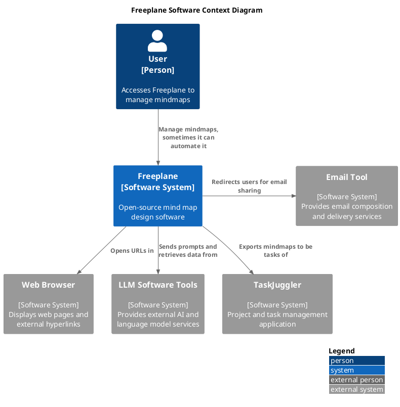
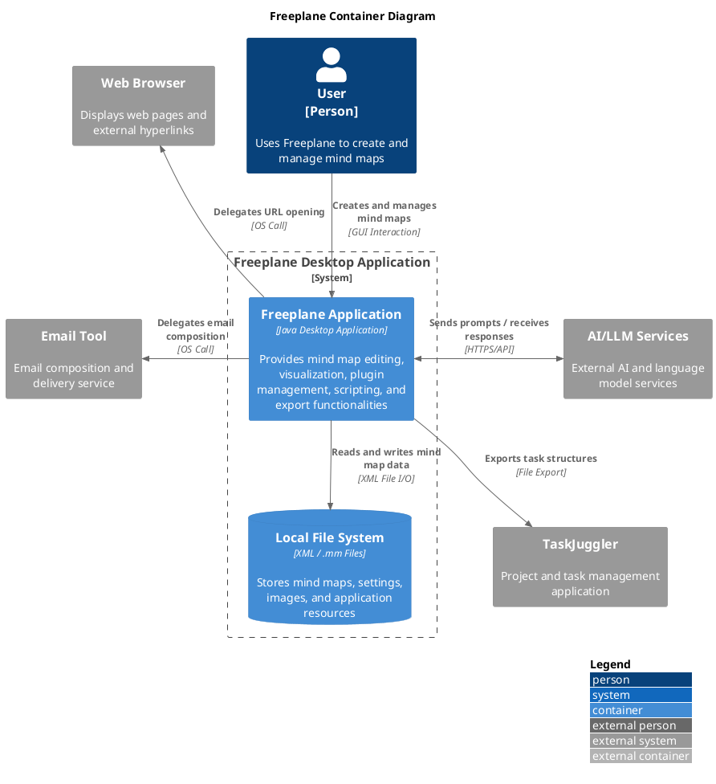
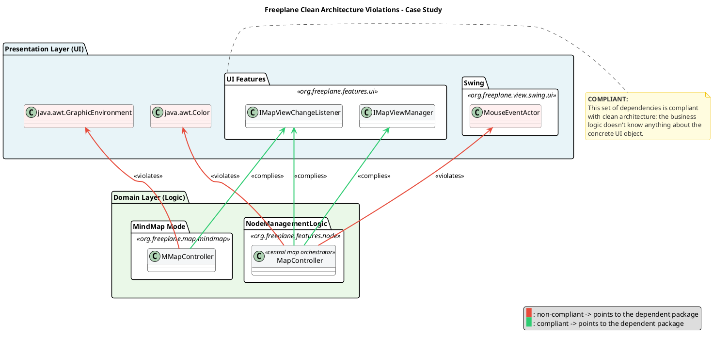
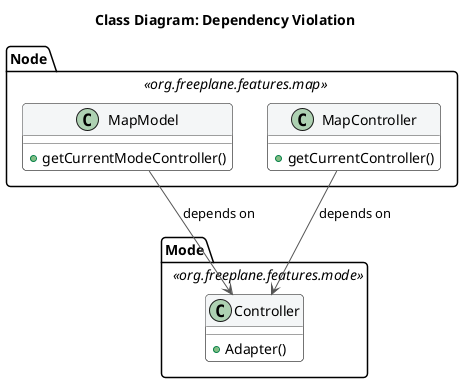
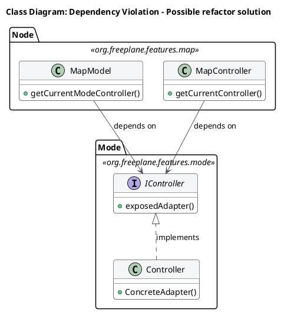
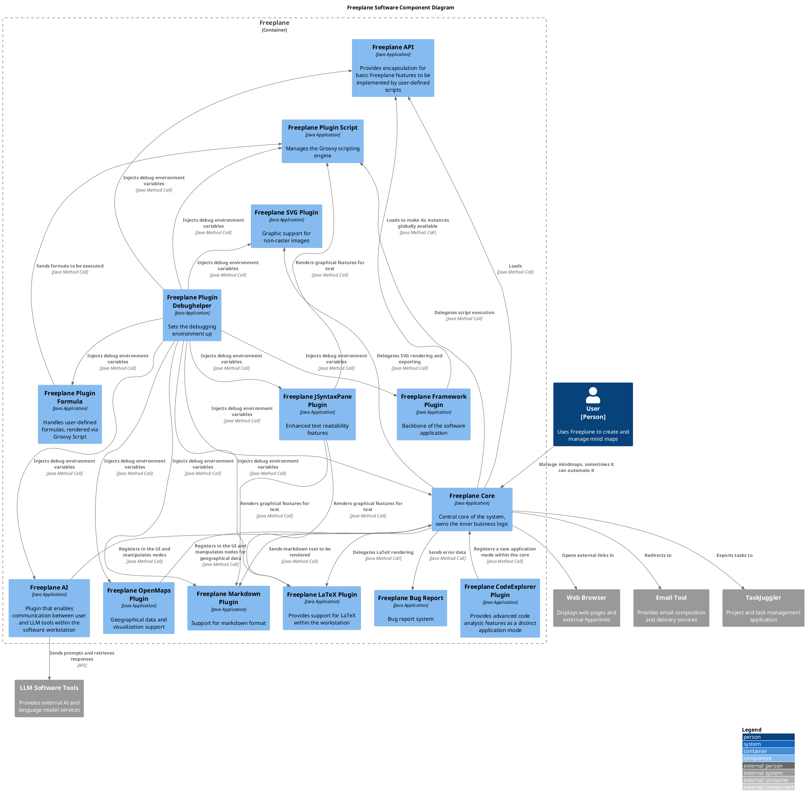
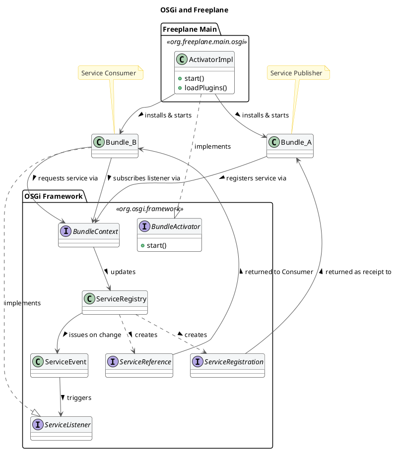

# Architectural Analysis of Freeplane – Reverse Engineering and Evaluation

## Introduction and Analysis Methodology
This report presents an architectural analysis of the Freeplane mind-mapping software, reverse-engineered via static code analysis, documentation review, and repository statistics.
Architecturally, it is an imperfect micro-kernel monolith based on the OSGi framework. The core module implements business logic, while plugins extend functionalities. This design breaks strict micro-kernel principles, hence the imperfect definition.

## The System in its Ecosystem: C4 Context Model 

Freeplane was born as a fork of the well-known Freemind software. The official documentation reports that the decision was taken to improve software's design and to speed up its development and maintenance cycles. 

Although being represented as a single person, users can be distinguished in two groups: basic users, that exploit the software for basic mindmapping tools, and advanced, computer literate users that can write custom scripts to enhance Freeplane features. These groups have been merged in a single Actor since they share the same GUI and potentially all basic users can also use advanced features.

The persistence layer is managed internally by the software: users can define their preferred path and the software interacts with the Operating System to save it with the desired format.

Two types of interaction with external systems can be identified:

- Task delegation: the system depends on external tools that are responsible for handling operations outside its own scope. The relationships with the Browser or with the Email tool fall into this category — clicking a URL or clicking an email address triggers actions that Freeplane delegates entirely to the appropriate external system.
- Data delegation: the dependency involves an active exchange of information. The integration with TaskJuggler requires Freeplane to transform and adapt the content of a mind map into a structured set of tasks before transferring it to the external system. This is a unidirectional relationship  
The interaction with LLM systems also falls into this category, but the relationship is bidirectional: sending a prompt transfers data to the LLM API, which in turn sends information back through its response.  

The tension between different kinds of dependencies reveals that the software has grown over the years to support different features to meet requirements that can be very different among users.

## Decomposition and Runtime: C4 Container Model 

The Container Model aims at showing how the software is built, from a lower, more detailed standpoint. 

Freeplane is represented as a single Container software. This choice can be explained by the nature of its technology stack. Freeplane has multiple plugins, that are connected to the core through the OSGi (the framework calls them _bundles_). This implementation ensures separation among plugins, making them independent from one another; theoretically, Freeplane plugins can be autonomously developed, tested and integrated in the environment. Moreover, they do not extend core software functionalities: plugins bring advanced features, both graphical and functional. The core software alone would work without plugins.  
However, the software has been represented as a single Container unit because OSGi bundles have not independent life. Even though they are developed separately, they all require the OSGi engine to be executed. Plugins such as `freeplane script` or `freeplane latex` cannot exist outside the core environment. That is because all plugins are designed to extend features in the core Freeplane application.
Furthermore, bundles cannot be run outside the launcher defined in the core `freeplane` package: the OSGi implementation require the framework to start plugins with a sequential process, managed by a kernel that is instantiated in the launcher implemented in the core package.
These considerations have led the analysis to consider the software as composed of a single container. In this situation, independent deployability cannot justify the definition of plugins as independent units.

The persistence layer is delegated to the Operating System. Freeplane stores information related to the single mind-map in a proprietary file format, that is the `.mm`. This is an XML-derived format that fits the definition of mindmaps as nested blocks of nodes. Users can independently decide which area of their File System save data to. The software leverages standard Java API to retrieve data from files. This choice avoids the overhead of an external database, simplifying the persistence model at the cost of limited query capabilities and concurrent access.

### Mapping to Clean Architecture: Theory vs. Reality
This section evaluates Freeplane's compliance with Clean Architecture principles by analyzing its core package, org.freeplane.features.map.
Repository mining reveals this package is highly unstable due to tight coupling with UI components. Specifically, almost 43% of its commits involve co-changes with the frontend—peaking at 61% for subpackages like `org.freeplane.features.map.filemode` and `org.freeplane.features.map.clipboard`.

Code analysis reveals that most classes in the package have dependencies on the frontend, involving both custom Freeplane UI classes and standard Java AWT ones. There is a mixed approach: in many cases classes import Interfaces from the `org.freeplane.features.ui` package, that represent the abstraction for the User Interface management. However, sometimes there is direct interaction with frontend classes: for instance, class `MapController` manages map view through the `IMapViewManager` interface, but it implements a concrete method for managing an external peripheral (the mouse, through `MouseEventActor`). Many concrete standard Java UI classes are imported as well. This mixed approach results in high-coupling between the business logic and external layers in the architecture, making it less isolated and more difficult to be tested and extended or modified.

There are other crucial violations of the Clean Architecture pattern: there is no clear definition of _entities_, _use cases_ and other layers. Some classes may look similar to one of these concepts: `MapModel` could be classified as an _entity_, `MapController` as a _use case_, `Controller` from `org.freeplane.features.mode` as an _adapter_. Most critical violations of the Clean Architecture pattern can be found in the dependency among these three classes: `MapModel` and `MapController` depend on the `Controller`; the flow of dependencies is broken and therefore inner business logic cannot be tested in isolation. 

Compliance with the principles from the Clean Architecture pattern can be found in the _persistence layer_: classes such as `MapReader` and `MapWriter` are at the outer layer of the architecture, and there are no dependency violations. They perform operations to save or read data from the mindmap directly in the `.mm` file. 
The `org.freeplane.features.filter` package suffers from the same set of problems: its `FilterController` has the same mixed approach at User Interface import dependencies, and it mixes business logic, application logic, and frontend concerns in the same class.. That's why architectural flaws from `org.freeplane.features.map` package can be fairly extended to the whole software structure.

Boundary analysis on the same packages confirm these architectural flaws: frequent Common Closure Principle (CCP) violations are evident. Classes often co-change unnecessarily, primarily involving `MapController` and the `Swing` library. This indicates loose boundaries and problematic coupling between business entities and UI components.
Conversely, core business classes like `MapModel` and `NodeModel` lack static dependencies and rarely co-change, showing good isolation at the entity level. Consequently, `org.freeplane.features.map` acts as a generic, low-cohesion container. While violating strict Clean Architecture principles, a looser, pragmatic separation of concerns still exists within the package.

To sum up, the software does not fully comply with Clean Architecture principles. There are many violations that mainly concern architectural boundaries: the most serious violation is the lack of clear division between entities and use cases, and the broken dependency flow. Dependency on concrete User Interface methods makes the software more difficult to be tested in isolation.
These violations have an explanation: as reported in the Official Documentation, core classes were designed to be extensible, and to follow the Extension-Object Design Pattern defined by Erich Gamma. This architectural choice aims at building extensions to well-defined objects. The lack of compliance with the Clean Architecture can be explained by the need to have both entities and use cases in the same set of classes to make them easily extensible.
However, Extensible Object theory does not justify the direct implementation of UI elements in core entities. This remains a pure violation of the Separation of Concerns at an architectural level.

## Zooming into the Engine: C4 Component Model of the Core

The Component Model offers the deepest view of Freeplane's internal structure, detailing how the single container introduced in Section 3 decomposes into individually deployable OSGi bundles and the external libraries they depend upon.

The diagram reveals a layered hierarchy that governs how the system bootstraps and how data flows between components.

**Framework Plugin.** The Framework Plugin sits at the top of the dependency tree. It initializes the OSGi runtime, loads the API plugin, making its instances globally available to every downstream bundle, and wires the entire component graph together.

**Freeplane Core.** Directly below, the Core owns the inner business logic — map models, node structures, mode controllers, event dispatching — and delegates work (scripting, rendering, SVG export, error reporting) to downstream plugins. It also interacts with several external systems. The examples are: Opening URLs in the **Web Browser**, redirecting to the **Email Tool**, and exporting tasks to **TaskJuggler**. The MVC triad lives here: `MapModel` and `NodeModel` define the domain entities, while `MapController` and `ModeController` orchestrate user actions. However, controllers like `MapController` aggregate some concerns (I/O setup, action registration, navigation, folding) in a single class, pointing to **SRP** pressure. The same pattern recurs in `FilterController` and `ModeController`. The pervasive use of `Controller.getCurrentController()` — a concrete singleton — and similar patterns in `MapWriter` also indicate a **DIP** concern, coupling components to concrete implementations rather than abstractions.

**API and Lateral Plugins.** The API exposes core features for user-defined Groovy scripts. Alongside it sit four lateral plugins: AI, OpenMaps, CodeExplorer, and Bug Report. Notably, three of them also call _upward_ into the Core to register UI elements, creating bidirectional dependencies managed at runtime through OSGi. The AI plugin in turn relies on **LLM Software Tools** for prompt/response exchanges. In this layer, `NodeLevelConditionController.createASelectableCondition()` uses `if`-chains to select condition types — an **OCP** concern — while the `filter.condition` subpackage applies a Strategy/Decorator pattern that is fully OCP-compliant, showing inconsistent application of the principle.

**Script Engine and Dependent Plugins.** The Plugin Script component manages Groovy and resolves dependencies via Apache Ivy. Formula, Markdown, LaTeX, and JSyntaxPane all build on it. JSyntaxPane additionally cross-cuts Markdown and LaTeX by providing graphical text-rendering features to both. At this level, `SingleCopySource` extends `NodeModel` but throws `RuntimeException` for inherited methods, raising a **LSP** concern. `IMapSelection` bundles many responsibilities into a single interface (**ISP** concern), while `INodeChangeListener` offers a clean, minimal counterexample.

**SVG Plugin.** Handles image rendering via Apache Batik and PDF transcoding via Apache FOP.

**Cross-Cutting: Debug Helper.** The Debug Helper injects debug environment variables into every other component, touching all layers without belonging to any single one.

These SOLID concerns are not confined to `org.freeplane.features.map` — they recur across the Core, reinforcing the assessment from Section 4 that business logic, application logic, and UI concerns are insufficiently separated.

These SOLID issues also surface at the component level through the **Component Principles**. The Core mixes unrelated classes, so changes in one area ripple into others — breaking the **Common Closure Principle** (CCP). Interfaces like `IMapSelection` force plugins to depend on unused code, violating the **Common Reuse Principle** (CRP). Bidirectional plugin–Core dependencies create cycles against the **Acyclic Dependencies Principle** (ADP), and the Core's concrete, heavily-depended-upon nature clashes with the **Stable Abstractions Principle** (SAP). Adding abstraction interfaces — the same DIP fix — would address both class-level and component-level concerns together.

## Architectural Characteristics and Conclusions

### Boundaries: Core-Plugin interaction analysis
Freeplane is built on top of the OSGi framework, in the Knopflerfish implementation. This technology stack allowed developers to build a modular software, where different plugins can be attached to the core easily. The framework generates a three-layer hierarchy:
1. Module Layer: it is the declarative layer: it defines bundles identity and static dependencies. In Freeplane, the `org.freeplane.core` package plays this role. This piece of information can be easily undestood by reading its `MANIFEST.MF` file when compiled: it stores all settings and dependencies for building the application.
2. Activator: it is responsible for building the infrastructure to make plugins communicate. In Freeplane, it is the ActivatorImpl class in `org.freeplane.main.osgi`. It can be identified since it implements the `org.osgi.framework.BundleActivator` class.
3. Service Layer: bundles provide services, that are registered within the Framework exploiting mechanisms that are built in OSGi environment. Such services can be published or unpublished at anytime. They look like plain Java Objects.  

The OSGi bundles are built to be independent from one another: there is no shared knowledge, code or data, and all references to classes or methods in other plugins throw OSGi errors. Plugins and Core have therefore strict boundaries, that can be crossed by pointing to published services only.  
At the Module Layer, circular dependencies are critical and they can lead to deadlock: it can happen when thread 1 starts Bundle 1 which requires a Service from Bundle 2, and it stops until it is published. Thread 2 starts Bundle 2 which requires a service from Bundle 1. It stops. The application is locked permanently. This can be solved by implementing additional features provided by the framework.  
Freeplane resolves these dependencies at runtime, since it provides a single Activator that is responsible of building the application attaching different plugins.
On the other hand, on the Service Layer, a clear dependency tree cannot be drawn. That is because Bundles can both publish and exploit services published by other Bundles, that will likely require Service published by plugins that exploit their services. Dependencies are therefore resolved at run-time: bundles may or may not publish or request services. This pattern makes debugging more difficult, because sometimes it is difficult to track flow of information across bundles in Freeplane.

This structure provides both freedom and constraints to developers: new features can be added by creating a new dedicated plugin. Moreover, since bundles are independent and well separated, deployment and maintenance does not affect the overall system. Caveats of this architectural choice are the programming language and the complete compliance to the framework: developers must write all plugins in Java (the OSGi framework doesn't support other programming languages), and they must write plugins that implement the logic described above.

#### Conclusions
Freeplane balances extensibility and legacy constraints. Its OSGi plugin system and Extension Object Pattern provide robust, two-level extensibility. However, the core suffers from systemic architectural debt: God Object controllers, pervasive singleton dependencies, and over half the business logic layer coupled to AWT/Swing. These issues, rooted in the software's 2009 origins, make the core untestable in isolation and resistant to UI migration.

If an architectural refactoring were to be proposed based on Clean Architecture principles, the priority would be introducing abstraction interfaces for GUI dependencies (`Color`, `Font`, `Component`) in the domain layer, enabling independent testability without breaking existing functionality.

