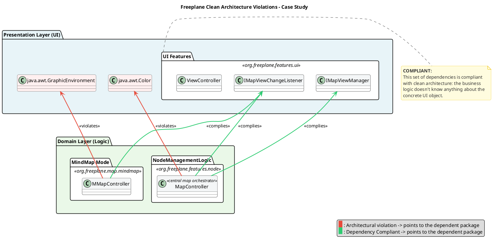
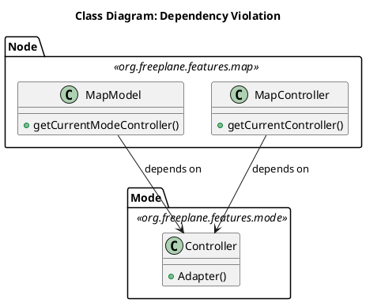
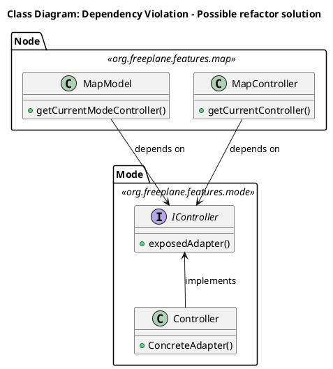

This section aims to clarify the architectural choices made to build the software. The official documentation describes Freeplane as an Extension-object-driven application: objects are built to be extensible from the outside while remaining independent from their extensions.  
The Extension-Object pattern is a Design Pattern defined by Erich Gamma in 1998. However, it provides a useful starting point to better understand how it fits in the broader architectural environment.  
The first step was to define _entities_, _use cases_ and _external layers_. To figure out a starting point, Freeplane developers were contacted, and they provided an AI tool, deepwiki.com, to ask questions to to gather information about the codebase. The chatbot gave us a hint: entites could be found in many packages. `org.freeplane.features.map` was among them. This package is responsible for the definition of basic business rules for managing nodes and maps.  
To double check, a statistical analysis was carried out: data from commits throughout the software's lifecycle was extracted, and metrics were calcuated: A stability measure was computed, considering average time between commits, number of commits and package age. This first analysis returned a strange result: `org.freeplane.features.map` is a very unstable component, with a commit every 3 days on average.  
This can be explained by the high coupling between the package and ui components. A deeper analysis reveals that almost 43% commit number shares changes with freeplane ui components, and this number grows if we look at subpackages such as `org.freeplane.features.map.filemode` or `org.freeplane.features.map.clipboard` (both at almost 61% of shared commit number with ui components).  
Code analysis reveals that most classes in the package have dependencies on ui components, both on custom Freeplane UI classes and standard Java awt ones. The approach is different: while dependencies towards `org.freeplane.ui` packages respect Clean Architecture rules, such as dependencies ruled by Interfaces, java ui standard classes are directly imported, thus violating the same principles developers tried to respect with custom packages.  

There are other crucial violations of the Clean Architecture pattern: there is no clear definition of _entities_, _use cases_ and other layers. Some classes may look similar to one of these concepts: `MapModel` could be classified as an _entity_, `MapController` as a _use case_, `Controller` from `org.freeplane.features.mode` as an _adapter_. Most critic violations of the Clean Architecture pattern can be found in the dependency among these three classes: `MapModel` and `MapController` depend on the `Controller`: flow of dependencies is broken and therefore inner business logic cannot be tested in isolation. 

Compliance with the principles from the Clean Architecture pattern can be found in the _persistence layer_: classes such as `MapReader` and `MapWriter` are at the outer layer of the architecture, and there are no dependency violations.
These architectural flaws can be extended to the application as a whole: the analysis of the `org.freeplane.features.map` package is a case study which can fairly represent the overall structure of the software. Freeplane does not comply with modern architectural patterns and particularly with the Clean Architecture one, and it can be explained by the age of the software, whose development started in 2009.
