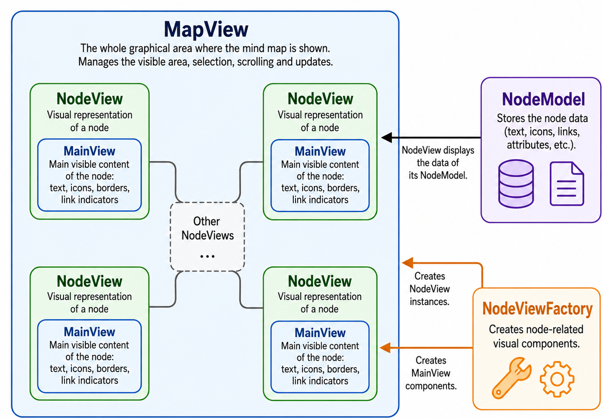
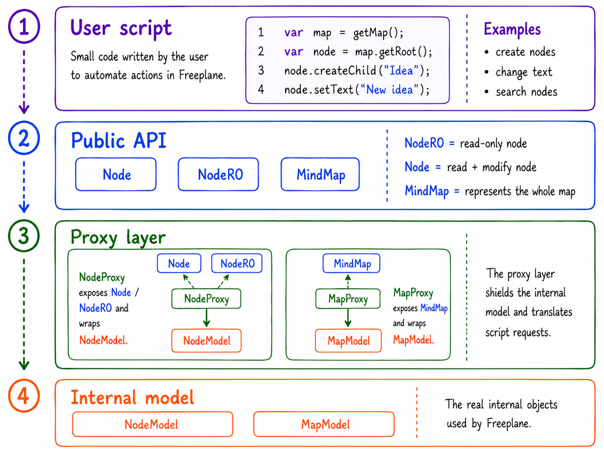

# Design Dependency Analysis Notes

## Purpose

This file collects the working notes for the dependency analysis of Freeplane.

The goal is not to list every dependency found in the project. Freeplane is too large, and a long list of file pairs, imports or class references would not be very useful. Instead, the idea is to use two complementary views:

- knowledge dependencies, estimated from the Git history through co-change analysis;
- code dependencies, checked later in the current source code.

The first part of the file focuses on knowledge dependencies. If two files are often modified in the same commits, this may mean that developers usually need to understand both of them when working on that part of the system. This is what we use as a sign of possible knowledge dependency.

A co-change does not automatically prove that there is a direct dependency in the code. For example, two files may change together even if one does not import the other. However, it is still useful because it shows where maintenance work tends to spread.

The second part of the file uses these results as a guide for the code dependency analysis. For the most relevant clusters, we check whether the historical relations are also visible in the source code, looking at packages, imports, interfaces, controllers, factories and module boundaries.

## Part 1 — Knowledge dependencies from co-change analysis

### Method

The co-change reports were generated automatically from the Git history of Freeplane.

We used three time windows:

- **last 5 years**, to see the most recent co-change relations;
- **last 10 years**, to check whether the same relations are also stable over a longer period;
- **full history**, to understand the long-term evolution of the project.

For each report, we looked at the file `top_pairs.csv`, which contains pairs of files and the number of times they changed together.

Instead of reading the pairs one by one, we grouped them by functional area. This is more useful because a single pair can be too specific, while a group of related pairs can show a real subsystem or feature area.

The idea is simple:

- if many classes in the same area change together, this may show normal cohesion;
- if classes from different modules change together, this may suggest a hidden or stronger dependency;
- if a cluster appears in all time windows, it is probably a stable maintenance concern;
- if it appears only in recent reports, it may be a newer feature or a recently modified area.

The full-history report was useful, but we read it carefully because it also includes older paths, such as:

`freeplane/src/org/freeplane/...`

while newer code uses paths such as:

`freeplane/src/main/java/org/freeplane/...`

So the full-history report is useful for historical context, but it is not always enough to describe the current design.


### Main knowledge dependency clusters found

The same main areas appear several times in the reports:

| Cluster | Main classes | First interpretation |
|---|---|---|
| Swing map view | `MapView`, `NodeView`, `MainView`, layout classes | strongest and most stable cluster |
| Outline subsystem | `ScrollableTreePanel`, `BreadcrumbPanel`, `OutlinePane`, `OutlineController` | strong recent UI feature |
| API and scripting | `Node`, `NodeRO`, `NodeProxy` | important cross-module dependency |
| Text rendering plugins | `FormulaTextTransformer`, `LatexRenderer`, `MarkdownRenderer` | separate plugins with similar maintenance concerns |
### 1. Swing map view

The clearest cluster is the Swing map view.

The main classes are:

- `freeplane/src/main/java/org/freeplane/view/swing/map/MapView.java`
- `freeplane/src/main/java/org/freeplane/view/swing/map/NodeView.java`
- `freeplane/src/main/java/org/freeplane/view/swing/map/MainView.java`
- `freeplane/src/main/java/org/freeplane/view/swing/map/NodeViewFactory.java`


Representative pairs:

| Pair | 5 years | 10 years | Full history |
|---|---:|---:|---:|
| `MapView` – `NodeView` | 68 | 75 | 89 |
| `MainView` – `NodeView` | 37 | 46 | 80 |
| `MainView` – `MapView` | 21 | 28 | 55 |
| `NodeView` – `NodeViewFactory` | 10 | 13 | 53 |

This is the strongest result of the analysis. `MapView` and `NodeView` are always among the top pairs, in all three time windows.

This makes sense because Freeplane is mainly a visual mind-mapping application. The map view and the node view are central parts of the system. If the way nodes are drawn, arranged or updated changes, several UI classes probably need to change together.

At this stage, this looks like a normal and expected knowledge dependency inside the main UI subsystem. However, because the cluster is very strong, it is still worth checking in the code. The important question is whether these classes are well grouped in the same subsystem, or whether the map view depends on too many unrelated parts of the application.


### 2. Outline subsystem

Another clear cluster is the outline subsystem.

Main classes:

- `freeplane/src/main/java/org/freeplane/view/swing/map/outline/ScrollableTreePanel.java`
- `freeplane/src/main/java/org/freeplane/view/swing/map/outline/BreadcrumbPanel.java`
- `freeplane/src/main/java/org/freeplane/view/swing/map/outline/BlockPanel.java`
- `freeplane/src/main/java/org/freeplane/view/swing/map/outline/OutlinePane.java`
- `freeplane/src/main/java/org/freeplane/view/swing/map/outline/MapAwareOutlinePane.java`
- `freeplane/src/main/java/org/freeplane/view/swing/map/outline/OutlineController.java`
- `freeplane/src/main/java/org/freeplane/view/swing/map/outline/OutlineViewport.java`

Representative pairs:

| Pair | 5 years | 10 years | Full history |
|---|---:|---:|---:|
| `BreadcrumbPanel` – `ScrollableTreePanel` | 47 | 47 | 47 |
| `BlockPanel` – `ScrollableTreePanel` | 34 | 34 | 34 |
| `MapAwareOutlinePane` – `ScrollableTreePanel` | 33 | 33 | 33 |
| `OutlinePane` – `ScrollableTreePanel` | 30 | 30 | 30 |
| `OutlineController` – `ScrollableTreePanel` | 24 | 24 | not in top 200 |
| `OutlineViewport` – `ScrollableTreePanel` | 21 | 21 | not in top 200 |

The outline cluster is very visible in the 5-year report, and the values remain the same in the 10-year and full-history reports. This suggests that most of this co-change activity is recent.

Many pairs are centered around `ScrollableTreePanel`, so this class probably plays an important role in the outline view.

This does not necessarily mean bad design. The outline is a specific feature, and it is normal that its panels, controller and positioning classes change together. It may simply be a cohesive subsystem.

The interesting point is that the outline is another representation of the same map content. So it may need to stay aligned with the main map view, especially for selection, scrolling and node positioning.

### 3. API and scripting

This is probably the most interesting cluster from a design point of view.

Main classes:

- `freeplane_api/src/main/java/org/freeplane/api/Node.java`
- `freeplane_api/src/main/java/org/freeplane/api/NodeRO.java`
- `freeplane_plugin_script/src/main/java/org/freeplane/plugin/script/proxy/NodeProxy.java`
- `freeplane_plugin_script/src/main/java/org/freeplane/plugin/script/proxy/MapProxy.java`
- `freeplane_api/src/main/java/org/freeplane/api/MindMap.java`

Representative pairs:

| Pair | 5 years | 10 years | Full history |
|---|---:|---:|---:|
| `Node` – `NodeRO` | 19 | 25 | not in top 200 |
| `Node` – `NodeProxy` | 17 | 20 | not in top 200 |
| `NodeRO` – `NodeProxy` | 16 | 27 | 27 |
| `MindMap` – `MapProxy` | not in top 200 | 10 | not in top 200 |

This cluster crosses module boundaries. `Node` and `NodeRO` are part of `freeplane_api`, while `NodeProxy` and the other proxy classes belong to `freeplane_plugin_script`.

This suggests that the scripting plugin must stay aligned with the public API. Scripts need to access maps, nodes and controllers, but they do so through proxy classes. So, when the public API changes, the scripting proxies may need to change too.

This is a good example of knowledge dependency that is not just internal cohesion. The modules are separated in the repository, but the Git history shows that they evolve together.

This can be a good design if the scripting plugin depends only on public interfaces. It would be more problematic if it also depends on internal implementation details.

### 4. Text rendering plugins

Another useful case is the group of text rendering plugins.

Main classes:

- `freeplane_plugin_formula/src/main/java/org/freeplane/plugin/formula/FormulaTextTransformer.java`
- `freeplane_plugin_latex/src/main/java/org/freeplane/plugin/latex/LatexRenderer.java`
- `freeplane_plugin_markdown/src/main/java/org/freeplane/plugin/markdown/MarkdownRenderer.java`
- `freeplane/src/main/java/org/freeplane/features/text/mindmapmode/MTextController.java`

Representative pairs:

| Pair | 5 years | 10 years | Full history |
|---|---:|---:|---:|
| `LatexRenderer` – `MarkdownRenderer` | 17 | 17 | not in top 200 |
| `FormulaTextTransformer` – `LatexRenderer` | 14 | 16 | not in top 200 |
| `FormulaTextTransformer` – `MarkdownRenderer` | 13 | 13 | not in top 200 |
| `MTextController` – `FormulaTextTransformer` | 10 | 10 | not in top 200 |
| `MTextController` – `MarkdownRenderer` | 9 | not in top 200 | not in top 200 |
| `MTextController` – `LatexRenderer` | 9 | not in top 200 | not in top 200 |

Formula, LaTeX and Markdown are separate plugin areas, but their renderer or transformer classes appear together in the co-change reports.

A possible reason is that they all work on special text content inside nodes. So, if Freeplane changes how node text is transformed or rendered, several plugins may be affected at the same time.

This is useful because it shows that plugin separation does not always mean full maintenance independence. Different plugins can still share the same general concern.


## Part 2 — Code dependency analysis

After the co-change analysis, we inspected the source code of the main clusters found in the Git history. The goal is not to list all imports mechanically, but to understand whether the historical relations are also visible in the current code structure.

For each cluster, we check packages, class references, interfaces, construction points and module boundaries. Then we ask whether the dependency is expected cohesion inside one subsystem, or whether it suggests stronger coupling between different parts of Freeplane.

This follows the idea discussed in class: dependencies are not automatically bad. They become problematic when they are hidden, too strong, fragile, or when they force developers to understand too many other parts of the system before making a change.

The following sections analyse the main clusters found in the co-change reports, starting from the Swing map view.

### 1. Swing map view — code dependency analysis

<p align="center">
  
</p>

<p align="center"><em>Swing map view dependencies.</em></p>

The first code dependency case we analysed is the Swing map view cluster. It was the strongest cluster in the co-change analysis, so we used it as the first area to inspect in the source code.

The code confirms that this is not just an accidental historical relation. These classes really work together to show the mind map on the screen.

The basic structure is:

- `MapView` is the graphical area where the whole mind map is shown;
- `NodeView` is the graphical representation of one node inside that map;
- `MainView` is the visible content inside the node, such as text, icons, borders and link indicators;
- `NodeModel` contains the real data of the node;
- `NodeViewFactory` creates the visual objects needed to display nodes.

So, when the user sees a mind map, they are not looking directly at `NodeModel`. They are looking at visual objects created from the model. `NodeModel` stores the information, while `NodeView` and `MainView` show that information on screen.

This explains why these classes change together. If Freeplane changes how a node is displayed, the change may involve the data-to-view connection, the graphical node, the internal content, or the overall map view.

For example:

- if selection changes, `MapView` and `NodeView` may be affected;
- if node content changes, `MainView` may be affected;
- if node positioning changes, layout classes may be affected;
- if node creation in the view changes, `NodeViewFactory` may be affected.

This is mostly an expected UI dependency. It is strong, but it makes sense because all these classes work on the same responsibility: showing and updating the visual map. This fits the Common Closure Principle: classes that change for the same reason should be grouped together.

The design is also reasonably organised because the main classes are in the same package area:

```text
org.freeplane.view.swing.map
```

So the co-change does not reveal a strange hidden dependency between distant parts of the system. It mostly confirms that the Swing map view is a cohesive subsystem.

The delicate point is that the map view needs information from many other parts of Freeplane. A visual node is not just plain text. It can have style, icons, links, folding state, filtering state, selection state, text formatting and UI listeners. For this reason, the Swing map view has many outgoing dependencies, also called **high fan-out**.

This is understandable, because the visual map is central and needs to coordinate many features. However, it increases cognitive load. To modify this area, a developer cannot understand only `MapView` or only `NodeView`: they may also need to understand styles, filters, text, icons, links and the node model.

A useful design choice is the presence of `NodeViewFactory.When `MapView` displays nodes, the program must create visual objects such as `NodeView`, `MainView` and other components. This is a construction dependency: the issue is not only using an object, but also where it is created. Freeplane concentrates this creation logic in `NodeViewFactory` instead of spreading it inside `MapView`, so the dependency is easier to locate.

### 2. Outline subsystem — code dependency analysis

<p align="center">
  
</p>

<p align="center"><em>Outline view.</em></p>

After the Swing map view, we analysed another visualisation domain: the outline subsystem. While the Swing map view shows the mind map graphically, the outline shows the same nodes in a more linear structure, similar to a tree or a list.

So the outline is not a completely separate feature. It is another representation of the same map content.

Starting from the co-change report, the main class to check was `ScrollableTreePanel`, because many outline pairs were centered around it. The code confirms this role: `ScrollableTreePanel` manages the tree-like list shown in the outline, including visible nodes, selection, navigation and scrolling.

`OutlinePane` has a more external role. It builds the outline area by creating and arranging the main components:

- `BreadcrumbPanel`;
- `ScrollableTreePanel`;
- `OutlineController`;
- toolbar;
- menu;
- scrollable container.

So we can think of it like this:
-  `OutlinePane` prepares the outline view
- `ScrollableTreePanel` manages the tree displayed inside it

The other classes manage smaller parts of the same view:

- `BlockPanel` shows groups of visible nodes and sends user actions back to `ScrollableTreePanel`;
- `BreadcrumbPanel` shows the path of the current node;
- `OutlineController` manages outline actions such as selection and expansion;
- `OutlineViewport` helps decide which part of the outline should be visible while scrolling.

This explains why the outline classes change together: they are all parts of the same feature.

This cluster mostly shows **internal cohesion**. The classes are grouped in the same package:

```text
org.freeplane.view.swing.map.outline
```

and they all work on the same responsibility: showing and managing the outline view.

This fits the Common Closure Principle. If the outline changes, it is normal that its panels, controller and viewport classes change together. So this is not a problematic hidden dependency. It is mostly a cohesive subsystem.

The most interesting class is `MapAwareOutlinePane`. The co-change reports mainly showed dependencies inside the outline package. They did not strongly show a direct relation between the outline cluster and the Swing map view cluster. However, the code shows that this connection exists.

This makes sense because the outline and the main map view show the same map. If the user selects a node in the map, the outline should stay aligned. If the map changes, the outline may need to update. If nodes are expanded, collapsed or selected, both views must remain consistent.

This dependency is expected, but it increases cognitive load. To modify the outline correctly, a developer may need to understand both the outline package and its connection with `MapView`, `NodeView`, `NodeModel` and map/node listeners.

Compared to the Swing map view, the outline looks more contained. It is still connected to the main map, but its main classes are clearly grouped around one specific feature.


### 3. API and scripting domain — code dependency analysis

The API and scripting domain is useful to explain because it is different from the UI clusters. In the Swing map view and outline subsystem, the classes mostly belong to the same visual area. They change together because they collaborate to show the map on screen.

Here the situation is different. The API and scripting cluster connects different layers of Freeplane: the public API, the scripting plugin and the internal model.

In simple words, scripts are small pieces of code that a user can write to automate actions in Freeplane. For example, instead of manually creating many nodes, changing text, searching nodes or applying filters, the user can write a script that performs these operations automatically.

However, scripts should not directly access the internal classes of Freeplane. If they did, every internal change in the application could easily break user scripts. For this reason, Freeplane exposes a public API. The API is like a safe public menu: it tells scripts which operations they are allowed to use.

In this cluster, the main API classes are `NodeRO`, `Node` and `MindMap`.

`NodeRO` means “read-only node”. It allows a script to read information from a node, such as its text, parent, children, notes or visibility. `Node` extends `NodeRO` and adds operations that can modify the node, such as creating children, moving nodes or changing text. `MindMap` represents the map that the script can access and work on.

The important point is that these API classes are not the real internal objects used by Freeplane. The real internal node is `NodeModel`, and the real internal map is `MapModel`. These are the objects used by the core of Freeplane to store and manage the actual data of the map.

This is where the proxy classes become important. `NodeProxy` is the class that stands between the script and the real node. From the script point of view, it exposes the node API, so the script can work with something that behaves like a `Node`. Internally, however, `NodeProxy` works with `NodeModel`. In the same way, `MapProxy` exposes `MindMap` to scripts, but internally works with `MapModel`.

So, when a script asks Freeplane to do something, the request does not go directly to the internal model. It passes through the API and then through the proxy classes. The proxy classes translate the script request into real operations on the internal model.

This explains the co-change relation found in the Git history. The public API and the scripting plugin often changed together because they belong to the same access path. If the API changes what scripts can do, the proxy classes may also need to change, because they are responsible for making those API operations work on the real Freeplane model.

From a design point of view, this is a real dependency, but it is not an uncontrolled one. At a general level, the design is well organised because the API remains a stable access layer. Scripts do not directly touch `NodeModel` or `MapModel`, and this protects the internal model.

The delicate point is the proxy layer. The proxies protect the internal model, but they also need to know both sides: the public API used by scripts and the internal model used by Freeplane. This means that if the API changes, or if the internal model changes significantly, the proxy layer may need to be updated.

For this reason, the API and scripting cluster is not just internal cohesion. It is a controlled integration dependency between scripting and the Freeplane core. This makes the feature powerful and well structured, but also important to maintain carefully.

<p align="center">
  
</p>

<p align="center"><em>API and scripting access path.</em></p>


### 4. Text rendering plugins — code dependency analysis

After the API and scripting cluster, we analysed the text rendering plugins cluster. This case is smaller, but useful because it shows another type of dependency.

In the co-change reports, `FormulaTextTransformer`, `LatexRenderer` and `MarkdownRenderer` often change together. At first this may look strange, because they belong to three different plugins. `FormulaTextTransformer` handles formulas, `LatexRenderer` handles LaTeX, and `MarkdownRenderer` handles Markdown.

The first thing we checked in the code was whether these three classes directly depend on each other. They do not. There is no direct import or usage relation between them. So the co-change is not explained by direct coupling between the plugins.

The real connection is more indirect. All three classes work on the same kind of problem: special text inside nodes. In Freeplane, a node can contain normal text, but also text that needs to be interpreted in a special way before it is displayed or edited. For example, a node text can represent a formula, a LaTeX expression or Markdown content.

This is why the three plugins are connected from a maintenance point of view. If Freeplane changes the way node text is recognised, transformed, edited or displayed, more than one of these plugins may need to be adapted. In other words, they do not depend on each other directly, but they depend on the same text-handling mechanism.

The code confirms this interpretation. The three classes follow the same transformation idea: they extend `AbstractContentTransformer` and are based on the `IContentTransformer` mechanism. This mechanism defines how a piece of node content can be transformed before being shown or used. `MTextController` is the central class that uses these transformers when Freeplane needs a content-specific transformation or editor.

So, compared to the co-change report, the dependency is only partially confirmed. The co-change suggested that the three plugins were related. The code shows that they are related, but not through direct plugin-to-plugin calls. The relation is a shared maintenance concern around the text transformation pipeline.

From a design point of view, this is mostly positive. The plugins remain separated, so Markdown, LaTeX and formulas are not mixed together in one large class. However, the central text mechanism is still a sensitive point: if it changes, several plugins may need to change together. This explains why the cluster appears in the co-change analysis.
