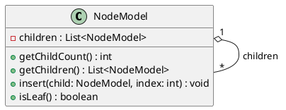
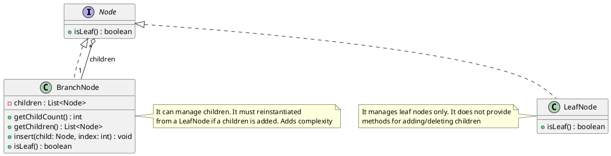
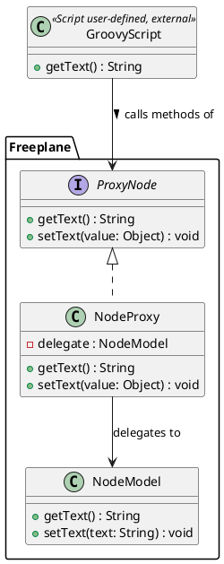
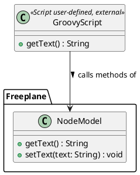
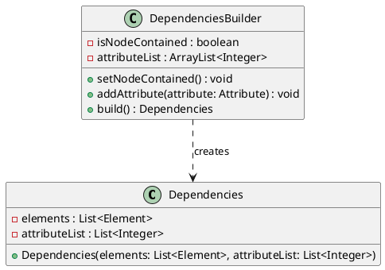
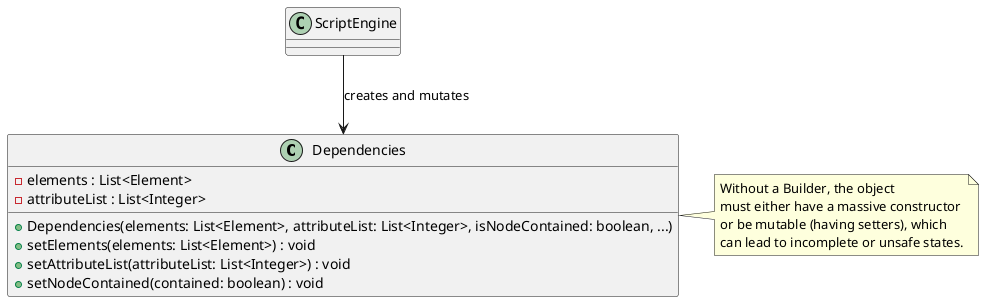
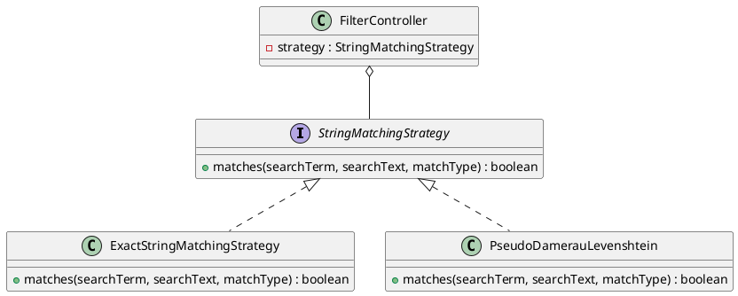
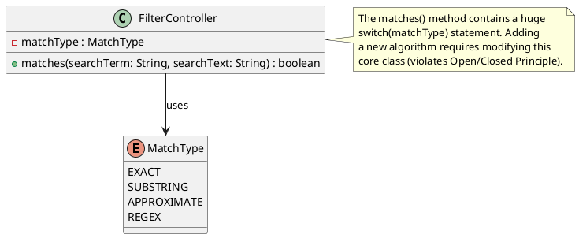

# Design Report

## Introduction

This report analyses the design of Freeplane from two complementary points of view.

The first part focuses on dependencies. Since Freeplane is a large system, we first used Git history to identify possible **knowledge dependencies**, based on files that often changed together. Then, for the main domains found, we inspected the related source files to check the **code dependencies**, such as package relations, class usage, object creation and interfaces. The goal is to compare these two levels and understand which parts of the system are central, which relations are justified by cohesion, and where maintenance may require knowledge of multiple modules.

The second part focuses on design patterns. We selected four relevant GoF pattern instances found in the system: **Composite**, **Proxy**, **Builder** and **Strategy**. For each one, we identify the involved classes, explain why that structure can be considered an actual pattern, describe the problem it solves in Freeplane and briefly discuss a possible alternative.

Overall, the report connects structural evidence with design interpretation. Dependencies and patterns are not considered only as isolated technical details, but as signs of how Freeplane manages complexity in a large and mature codebase.

---

## Dependency Analysis

### Knowledge Dependencies

Knowledge dependencies describe how much knowledge of one part of the system may be needed to modify another part. To estimate them, we generated co-change reports from Git history using three time windows: last 5 years, last 10 years and full history. Frequent co-change does not prove a direct code dependency: two files may not import or use each other, but they can still be linked by the same maintenance reason if developers often need to understand both when making a change.

Starting from these reports, we grouped related pairs into functional domains, based on the feature, responsibility or integration point they seemed to share. This is related to the **Common Closure Principle**: classes that tend to change for the same reason should usually be grouped and managed together. Therefore, co-change is not automatically a problem: it may show good cohesion, or it may reveal a hidden dependency worth checking.

The main domains identified are:

1. **Swing map view domain**: `MapView`, `NodeView`, `MainView`, `NodeViewFactory` and layout classes.
2. **Outline subsystem domain**: `ScrollableTreePanel`, `BreadcrumbPanel`, `BlockPanel`, `OutlinePane`, `MapAwareOutlinePane`, `OutlineController` and `OutlineViewport`.
3. **API and scripting domain**: `Node`, `NodeRO`, `MindMap`, `NodeProxy` and `MapProxy`.
4. **Text rendering plugins domain**: `FormulaTextTransformer`, `LatexRenderer`, `MarkdownRenderer` and `MTextController`.

  

<em>Figure 1: Co-change domain evolution.</em>

### Code Dependencies

Code dependencies are visible directly in the source code, for example through class usage, object creation, interfaces and package structure. We used them to check the domains identified through co-change and to understand whether the knowledge dependencies were caused by direct structural relations, internal cohesion or shared maintenance concerns.

#### 1. Swing Map View Domain

The strongest co-change relations are in the Swing map view domain. The code confirms that this is not only a historical relation: `MapView`, `NodeView` and `MainView` form the main visual structure of the map. `MapView` manages the overall graphical view, `NodeView` represents a single visual node linked to its `NodeModel`, and `MainView` shows the visible content of the node.

  

<em>Figure 2: Swing map view.</em>

This explains why these classes often changed together. Changes in selection, folding, layout or style can affect more than one level of the visual structure. The dependency is strong, but mostly justified, because these classes share the same responsibility: showing and updating the visual map. This also fits the Common Closure Principle, because the main classes are located in the same package area, `org.freeplane.view.swing.map`.

However, this domain is also one of the most central parts of the system. The map view needs information from styles, filters, text, links, icons, UI listeners and the map model. This creates high fan-out, meaning many outgoing dependencies toward other packages. This is understandable, because a visual node is not a simple element: it combines content, graphical representation, interaction and state. Still, it increases cognitive load, because modifying this area requires understanding several connected subsystems.

The code also shows an important design choice: `NodeViewFactory`. When `MapView` displays nodes, the program must create visual objects such as `NodeView`, `MainView` and other components. This is a construction dependency, and Freeplane concentrates this creation logic in `NodeViewFactory` instead of spreading it across the map view classes.

  

<em>Figure 3: Swing map view dependencies.</em>

#### 2. Outline Subsystem Domain

The outline subsystem is another visualisation domain. While the Swing map view shows the mind map graphically, the outline shows the same nodes in a more linear tree structure.

  

<em>Figure 4: Outline view.</em>

Starting from the co-change report, the main class to check was `ScrollableTreePanel`, because many outline pairs were centred around it. The code confirms this role: it manages the tree-like list shown in the outline, including visible nodes, selection, navigation and scrolling.

`OutlinePane` builds the outline area by creating `BreadcrumbPanel`, `ScrollableTreePanel`, `OutlineController`, the toolbar and the menu. Other classes manage smaller parts of the same view: `BlockPanel` shows visible node groups and sends actions back to `ScrollableTreePanel`, `BreadcrumbPanel` shows the current path, and `OutlineViewport` helps with scrolling.

This again fits the Common Closure Principle. The classes that often changed together are grouped in the same package, `org.freeplane.view.swing.map.outline`, and work on the same feature. In this case, the co-change mainly indicates internal cohesion.

The most interesting point is `MapAwareOutlinePane`. The co-change reports mainly showed internal relations in the outline domain; no direct pair with the Swing map view domain was very evident. However, the code shows that the outline is connected to the main map view through `MapAwareOutlinePane`. This dependency is expected, because the outline shows the same map and must stay aligned with `MapView`, `NodeView`, `NodeModel` and map/node listeners. Still, it increases cognitive load: modifying the outline may also require understanding its interaction with the main graphical view.

  

<em>Figure 5: Outline subsystem dependencies.</em>

#### 3. API and Scripting Domain

The API and scripting domain is different from the UI domains because it connects different parts of Freeplane: the public API, the scripting plugin and the internal model.

Scripts automate actions on mind maps. To support them, Freeplane exposes a public API: `NodeRO` gives read-only access to a node, `Node` adds modification operations, and `MindMap` represents the map available to scripts.

The co-change relation suggested that the public API and the scripting plugin evolve together. The code confirms this relation, but in a controlled way. Scripts do not access the internal model directly; they pass through proxy classes. `NodeProxy` exposes the node API while internally working with `NodeModel`. Similarly, `MapProxy` exposes `MindMap` while working with `MapModel`.

Therefore, this is not just internal cohesion. It is a real dependency between scripting and the Freeplane core, but the proxy layer keeps it organised. The design is good because the API remains a stable access layer. However, the proxies are still delicate: they protect the internal model, but they must know both the public API and the internal model. For this reason, they are a clear example of code and knowledge dependencies meeting at an integration boundary.

  

<em>Figure 6: API and scripting dependencies.</em>

#### 4. Text Rendering Plugins Domain

The text rendering plugins domain is smaller, but useful because it shows a different kind of dependency. `FormulaTextTransformer`, `LatexRenderer` and `MarkdownRenderer` belong to three different plugins: formulas, LaTeX and Markdown.

In the co-change reports, these classes often changed together. However, in the code they do not directly import or use each other. Therefore, this is not direct coupling between plugins.

The reason for their connection is that they all handle special text inside nodes. When Freeplane displays or edits a node, its content may require a specific transformation before being shown to the user. These transformations pass through the same content-transformer mechanism used by `MTextController`.

So, the co-change is confirmed as a shared maintenance concern, not as direct code dependency. The design is mostly good: the plugins remain separated, but changes in the central text mechanism can still affect more than one plugin.

  

<em>Figure 7: Text rendering plugins dependencies.</em>

---

## Design Pattern Analysis

Freeplane is a large and mature codebase that uses several design patterns and custom variants to manage its complexity. While many structural, behavioural and creational patterns can be found throughout the application, this section focuses on four relevant Gang of Four pattern instances: **Composite**, **Proxy**, **Builder** and **Strategy**.

For each pattern, we identify the concrete classes involved, explain how the pattern works in Freeplane, describe the problem it solves and discuss a possible alternative.

### 1. Composite Pattern

* **Pattern instance:** Node tree structure.

* **Classes involved:**  
  * `NodeModel` (`org.freeplane.features.map.NodeModel`, in `freeplane/src/main/java/org/freeplane/features/map/NodeModel.java`) acts as both the Component and the Composite.

* **How it works:**  
  `NodeModel` represents a node in the mind map. It contains a list of children (`private List<NodeModel> children;`). Both leaf nodes and branch nodes are represented by the same class. A leaf node is simply a `NodeModel` with an empty child list. Freeplane uses a simplified version of the pattern: the original theoretical implementation from the Gang of Four includes an abstract `Component` class, from which nodes and branches inherit. In the Freeplane implementation, everything is collapsed into the concrete `NodeModel` class.

* **Problem solved:**  
  Mind maps are inherently hierarchical tree structures. When a user performs an action such as folding a node or applying a style to an entire branch, the core controllers, such as `MapController`, must traverse these structures. The Composite pattern allows clients to treat individual objects, such as leaf nodes, and compositions of objects, such as branches or subtrees, uniformly. The controller does not need to check if a child is a leaf or a complex subtree; it simply iterates over the `children` list of a `NodeModel`, treating every node uniformly and cascading operations down the hierarchy. This simplifies recursive tasks such as rendering the map, searching for text, saving to XML and applying filters.

#### Structure Diagram

* **Alternative:** Separate `LeafNode` and `BranchNode` classes implementing a common `Node` interface.

  * *Pros:* Stricter type safety, because a `LeafNode` cannot have children added to it by definition; less coupling; easier testability.
  * *Cons:* Much more complex codebase. Mind map nodes frequently switch between being leaves and branches as users add or delete children. With separate classes, the object would need to be re-instantiated and replaced in the tree every time this happens, which would be inefficient and harder to manage.

---

### 2. Proxy Pattern

* **Pattern instance:** Scripting API node protection.

* **Classes involved:**

  * `NodeProxy` (`org.freeplane.plugin.script.proxy.NodeProxy`, in `freeplane_plugin_script/src/main/java/org/freeplane/plugin/script/proxy/NodeProxy.java`) acts as the Proxy.
  * `Proxy.Node` (`org.freeplane.plugin.script.proxy.Proxy`, in `freeplane_plugin_script/src/main/java/org/freeplane/plugin/script/proxy/Proxy.java`) is the common interface.
  * `NodeModel` (`org.freeplane.features.map.NodeModel`, in `freeplane/src/main/java/org/freeplane/features/map/NodeModel.java`) is the Real Subject.

* **How it works:**  
  `NodeProxy` wraps a `NodeModel` delegate. When a user writes a Groovy script in Freeplane, they interact with `NodeProxy` objects instead of raw `NodeModel` objects.

* **Problem solved:**  
  When a user writes a custom Groovy script to interact with a node, for example `node.text = "New Title"`, exposing the internal engine directly would be dangerous. The Proxy pattern solves two main problems here.

  First, it provides **access control**. The script engine interacts with `NodeProxy` rather than with the raw `NodeModel`. The proxy intercepts assignments and routes them through proper controllers, such as `MTextController`. This ensures that an undoable action is created in the history and that the UI is notified to re-render. In this way, scripts are prevented from calling internal methods that could break invariants, and the core model is protected from unmanaged modifications.

  Second, it provides **API simplification**. It hides the complex internal structure of `NodeModel` and exposes a cleaner, more scripting-friendly API to the user.

#### Structure Diagram

* **Alternative:** Expose `NodeModel` directly to the scripting engine.

  * *Pros:* Less overhead and fewer classes.
  * *Cons:* Extremely dangerous. User scripts could easily break the application state, bypass the undo mechanism or invoke internal methods, leading to instability and difficult-to-debug errors.

---

### 3. Builder Pattern

* **Pattern instance:** Dependency construction.

* **Classes involved:**

  * `DependenciesBuilder` (`org.freeplane.plugin.script.dependencies.DependenciesBuilder`, in `freeplane_plugin_script/src/main/java/org/freeplane/plugin/script/dependencies/DependenciesBuilder.java`) acts as the Builder.
  * `Dependencies` (`org.freeplane.api.Dependencies`, in `freeplane_api/src/main/java/org/freeplane/api/Dependencies.java`) is the Product.

* **How it works:**  
  The `DependenciesBuilder` class provides methods to incrementally accumulate state before building the final object. Specifically, it collects:

  1. a boolean flag (`isNodeContained`) that tracks if the formula or script depends on the node itself;
  2. a list of integer indices (`attributeList`) representing specific node attributes that the script relies on.

  As the script environment evaluates dependencies, it calls `setNodeContained()` or `addAttribute()`. Once all necessary configuration is provided, the `build()` method is called to instantiate the final `Dependencies` object using this accumulated data.

* **Problem solved:**  
  When evaluating complex scripting functions, such as determining node dependencies for formulas, the system needs to precisely configure which node attributes are involved to create a `Dependencies` object. Because this configuration is discovered dynamically as the script is parsed, creating the object in a single step using a large telescoping constructor would be unreadable, while exposing setters on `Dependencies` would make it mutable and unsafe. The Builder pattern solves this by encapsulating the construction logic: `DependenciesBuilder` collects attributes incrementally, and once the configuration is fully gathered, `build()` locks the data into a final `Dependencies` object that is safe to pass around the execution engine without risk of accidental modification.

#### Structure Diagram

* **Alternative:** Telescoping constructors or a mutable object with setters.

  * *Pros:* Avoids creating an extra Builder class.
  * *Cons:* Telescoping constructors, such as `new Dependencies(true, attrs, ...)`, are unreadable. Setters make the `Dependencies` object mutable, which can lead to bugs if the object is shared across different parts of the system or threads.

---

### 4. Strategy Pattern

* **Pattern instance:** Text filtering and search algorithms.

* **Classes involved:**

  * `StringMatchingStrategy` (`org.freeplane.features.filter.StringMatchingStrategy`, in `freeplane/src/main/java/org/freeplane/features/filter/StringMatchingStrategy.java`) is the Strategy interface.
  * `ExactStringMatchingStrategy` (`org.freeplane.features.filter.ExactStringMatchingStrategy`, in `freeplane/src/main/java/org/freeplane/features/filter/ExactStringMatchingStrategy.java`) is a Concrete Strategy.
  * `PseudoDamerauLevenshtein` (`org.freeplane.features.filter.PseudoDamerauLevenshtein`, in `freeplane/src/main/java/org/freeplane/features/filter/PseudoDamerauLevenshtein.java`) is a Concrete Strategy.

* **How it works:**  
  The `StringMatchingStrategy` interface defines a single method: `matches(searchTerm, searchText, type)`. Different implementations of this interface provide different algorithms for matching text.

* **Problem solved:**  
  When a user opens the Find dialog to search the mind map, they can select different matching behaviours such as Match Case, Regular Expression or Approximate Matching. To support this without hardcoding a large set of `if/else` conditions inside traversal logic, the Strategy pattern encapsulates these different matching algorithms into separate classes. The `FilterController` reads the user's choice, instantiates or selects the corresponding `StringMatchingStrategy`, and the core search engine delegates the text comparison to it. This allows the algorithm to vary independently from the clients that use it, keeping the filtering engine clean and extensible.

#### Structure Diagram

* **Alternative:** A single `StringMatcher` class with a large `switch` statement based on an enum, for example `MATCH_EXACT` or `MATCH_APPROXIMATE`.

  * *Pros:* Marginally fewer files.
  * *Cons:* Violates the Open/Closed Principle. Every time a new matching algorithm is added, for example Regex matching, the core `StringMatcher` class must be modified, increasing the risk of introducing bugs into existing functionality.

---

## Overall Design Considerations

The dependency analysis and the pattern analysis show a coherent picture of Freeplane’s design. The system is modular, but some parts are necessarily central because of the nature of the application.

In the dependency analysis, co-change was not always a symptom of bad design. In the Swing map view and outline domains, knowledge dependencies mostly match code dependencies inside cohesive UI subsystems. These classes change together because they implement the same feature, not because the design is accidentally tangled. This is especially clear in the outline subsystem, where the related classes are grouped in the same package and collaborate around a well-defined view.

At the same time, the visual map remains one of the most delicate areas. `MapView`, `NodeView`, `MainView` and related classes have justified dependencies, but they also connect to many other concerns: style, text, icons, links, listeners and the model. This makes the area powerful but cognitively expensive. A change in this part may require knowledge of several mechanisms at the same time.

The API and scripting domain shows a different design pressure. Here the dependency crosses module boundaries, because scripts need access to the map model. Freeplane handles this through proxies, which are also one of the patterns identified in the second part of the report. This connection is important: the Proxy pattern is not only a theoretical pattern instance, but a practical solution to one of the main dependency problems found in the system. It allows scripting features to exist without exposing the internal model directly.

The text rendering domain gives another useful lesson. Co-change can reveal a maintenance relation even when there is no direct code dependency. The plugins remain separated in the code, but they are connected by a shared transformation mechanism. This means the design is modular, but changes to central text handling can still affect multiple plugins.

The selected patterns confirm that Freeplane often uses pragmatic variants rather than textbook structures. The Composite pattern in `NodeModel` is simplified, because using separate leaf and branch classes would be less convenient for editable mind maps. The Builder pattern keeps dynamic construction readable and safer. The Strategy pattern separates matching algorithms and supports extensibility. The Proxy pattern protects the core model while exposing a scripting interface.

Overall, Freeplane’s design is generally coherent for a large desktop application. Its strongest dependencies are mostly explainable by feature cohesion or by controlled integration points. The main risks are not isolated bad dependencies, but central areas that require broad system knowledge: especially the graphical map view, the outline-to-map synchronisation and the scripting proxy layer. These are the parts where future maintenance should be done most carefully.
