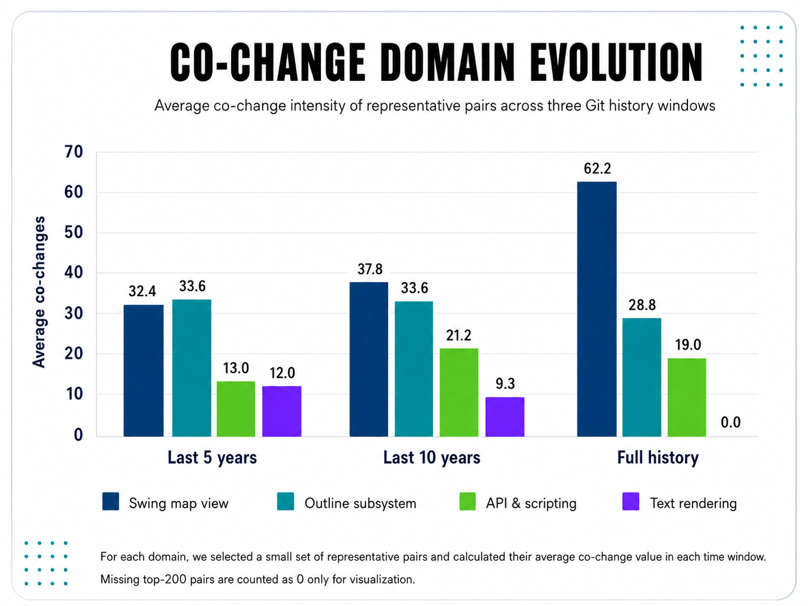
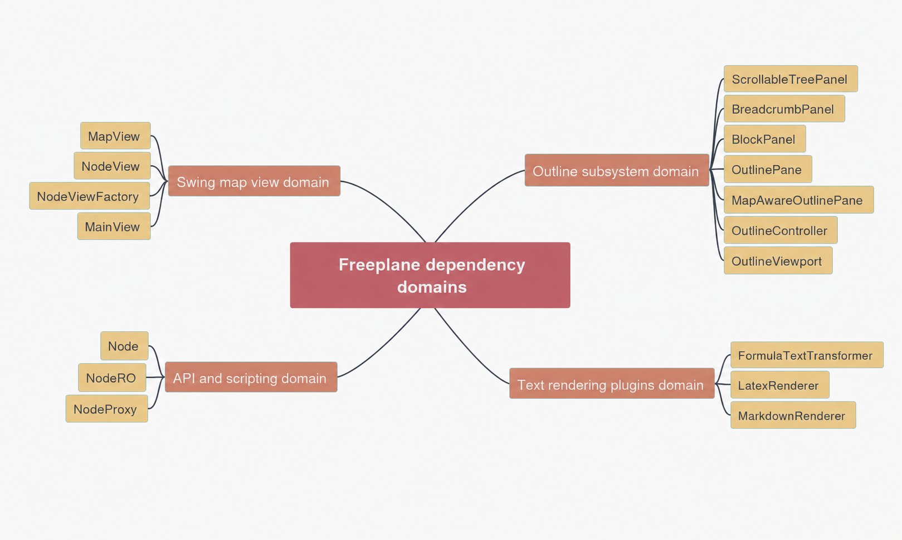
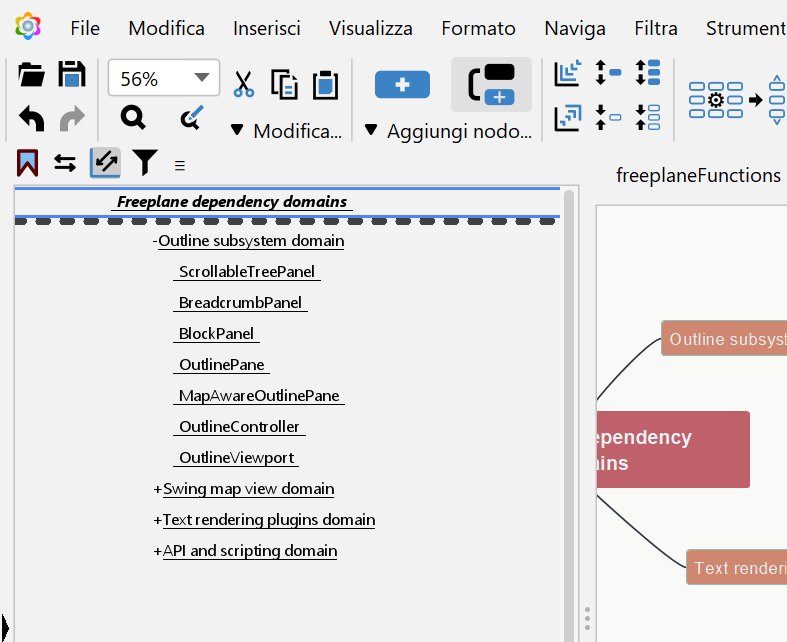
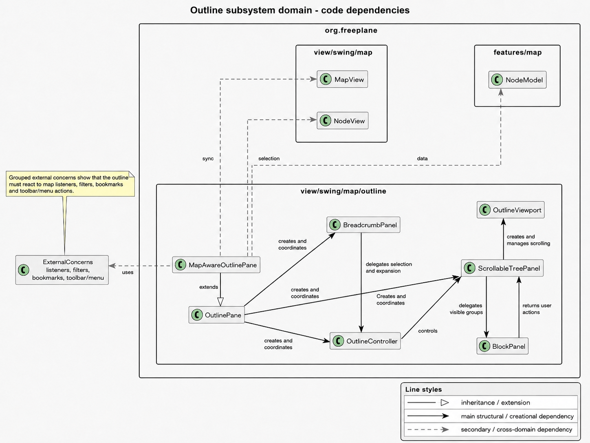
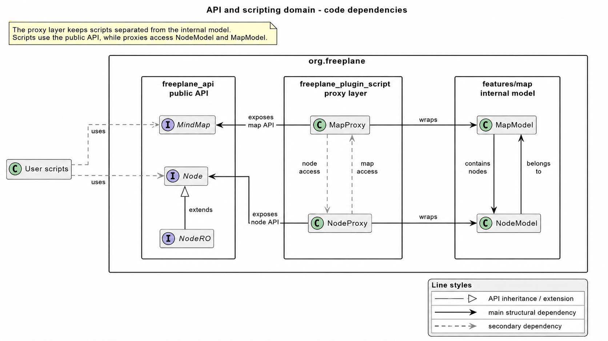
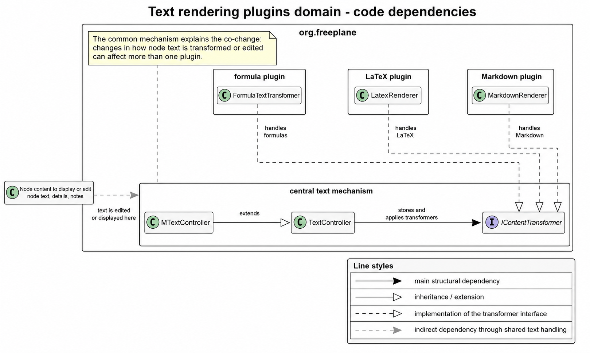
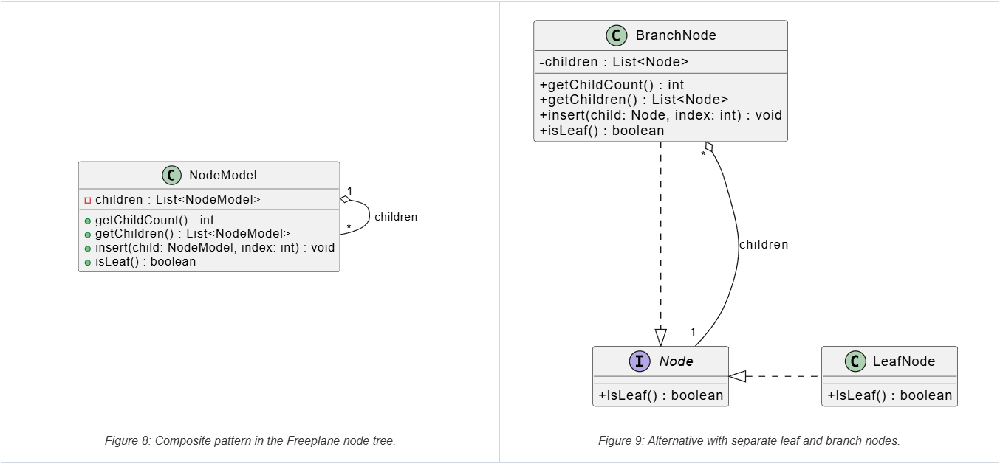
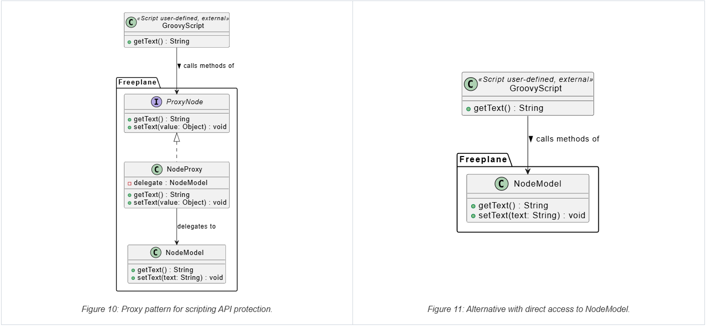
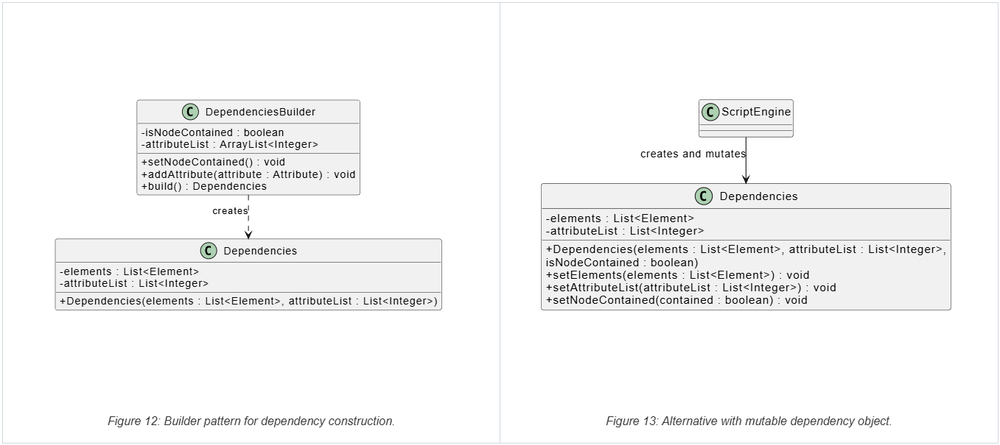
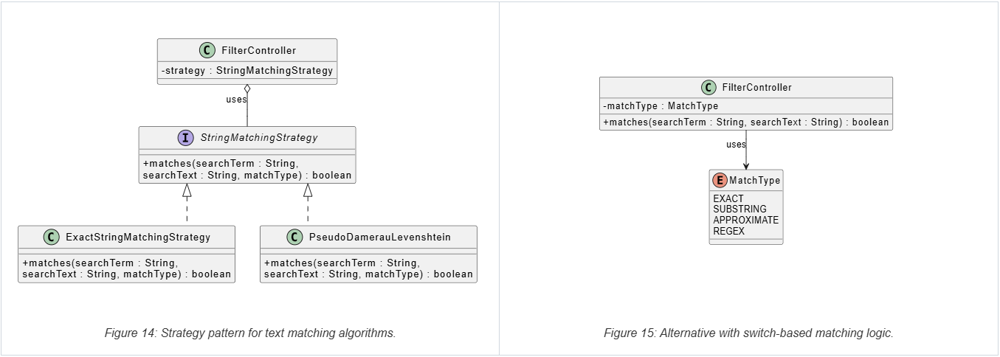

# Design Report

## Introduction

This report analyses the design of Freeplane from two complementary points of view.

The first part focuses on dependencies. Since Freeplane is a large system, we first used Git history to identify possible **knowledge dependencies**, based on files that often changed together. Then, for the main domains found, we inspected the related source files to check the **code dependencies**, such as package relations, class usage, object creation and interfaces. The goal is to compare these two levels and understand which parts of the system are central, which relations are justified by cohesion, and where maintenance may require knowledge of multiple modules.

The second part focuses on design patterns. We selected four relevant GoF pattern instances found in the system: **Composite**, **Proxy**, **Builder** and **Strategy**. For each one, we identify the involved classes, explain why that structure can be considered an actual pattern, describe the problem it solves in Freeplane and briefly discuss a possible alternative.

## Dependency Analysis

### Knowledge Dependencies

Knowledge dependencies describe how much knowledge of one part of the system is needed to modify another part. To estimate them, we generated co-change reports from Git history, using three time windows: last 5 years, last 10 years and full history. Frequent co-change does not prove a direct code dependency: two files may not import or use each other, but they can still be linked by the same maintenance reason.

Starting from these reports, we grouped related pairs into functional domains, based on the feature, responsibility or integration point they seemed to share. This is related to the **Common Closure Principle**: classes that change for the same reason should usually be grouped and managed together. Therefore, co-change is not automatically a problem: it may show good cohesion, or it may reveal a hidden dependency worth checking.

The main domains are:

1. **Swing map view domain**: `MapView`, `NodeView`, `MainView`, `NodeViewFactory` and layout classes. It is the main graphical view and contains the strongest co-change pairs.
2. **Outline subsystem domain**: `ScrollableTreePanel`, `BreadcrumbPanel`, `BlockPanel`, `OutlinePane`, `MapAwareOutlinePane`, `OutlineController` and `OutlineViewport`. It shows the same map content as a tree.
3. **API and scripting domain**: `Node`, `NodeRO`, `MindMap`, `NodeProxy`, and `MapProxy`. This case crosses module boundaries between `freeplane_api` and `freeplane_plugin_script`.
4. **Text rendering plugins domain**: `FormulaTextTransformer`, `LatexRenderer`, `MarkdownRenderer` and `MTextController`. They are different plugins, but all work on special text inside nodes.

  

<em>Figure 1: Average co-change intensity of the selected domains across time windows.</em>

### Code Dependencies

Code dependencies are visible in the source code, for example through class usage, object creation, interfaces and package structure. We use them to check the domains identified through co-change.

#### 1. Swing map view domain

The code confirms that the Swing map view domain is not only a historical relation. `MapView`, `NodeView` and `MainView` form the main visual structure of the map: `MapView` manages the overall graphical view, `NodeView` represents a single node linked to its `NodeModel`, and `MainView` shows the visible content of the node.

  

<em>Figure 2: Swing view representation of mind maps.</em>

This explains why these classes often changed together. Changes in selection, folding or style can affect more than one level of the visual structure. The dependency is strong, but mostly justified, because these classes share the same responsibility: showing and updating the visual map. This also fits the Common Closure Principle, because the main classes are located in the same package area, `org.freeplane.view.swing.map`.

However, this domain is also one of the most central parts of the system. The map view needs information from styles, filters, text, links, icons, UI listeners and the map model. This creates high fan-out, meaning many outgoing links to other packages. It is understandable, because a visual node contains many elements, but it also increases cognitive load: modifying this area requires understanding several connected classes and subsystems.

The code also shows an important design choice: `NodeViewFactory`. When `MapView` displays nodes, the program must create visual objects such as `NodeView`, `MainView` and other components. This is a construction dependency, and Freeplane concentrates this creation logic in `NodeViewFactory` instead of spreading it across the map view classes.

  

<em>Figure 3: Code dependencies inside and around Swing map view domain.</em>

#### 2. Outline subsystem domain

The outline subsystem is another visualisation domain. While the Swing map view shows the mind map graphically, the outline shows the same nodes in a linear tree structure.

  

<em>Figure 4: Outline view representation of mind maps.</em>

Starting from co-change, the main class to check was `ScrollableTreePanel`, because many outline pairs were centred around it. The code confirms this role: it manages the tree-like list shown in the outline, including visible nodes, selection, navigation and scrolling.

`OutlinePane` builds the outline area by creating `BreadcrumbPanel`, `ScrollableTreePanel`, `OutlineController`, the toolbar and the menu. Other classes manage smaller parts of the same view: `BlockPanel` shows visible node groups and sends actions back to `ScrollableTreePanel`, `BreadcrumbPanel` shows the current path, and `OutlineViewport` helps with scrolling.

This again fits the Common Closure Principle. The classes that often changed together are grouped in `org.freeplane.view.swing.map.outline` and work on the same feature. In this case, co-change mainly indicates internal cohesion.

The most interesting point is `MapAwareOutlinePane`. The co-change reports mainly showed internal relations in the outline domain; no direct pair with the Swing map view domain was very evident. However, the code shows that the outline is connected to the main map view through `MapAwareOutlinePane`. This dependency is expected, because the outline shows the same map and must stay aligned with `MapView`, `NodeView`, `NodeModel` and map/node listeners. Still, it increases cognitive load.

  

<em>Figure 5: Code dependencies inside and around Outline subsystem domain.</em>

#### 3. API and scripting domain

The API and scripting domain is different from the UI domains because it connects different parts of Freeplane: the public API, the scripting plugin and the internal model.

Scripts automate actions on mind maps. To support them, Freeplane exposes a public API: `NodeRO` gives read-only access to a node, `Node` adds modification operations, and `MindMap` represents the map available to scripts.

The co-change relation suggested that the public API and the scripting plugin evolve together. The code confirms this relation, but in a controlled way. Scripts do not access the internal model directly; they pass through proxy classes. `NodeProxy` exposes the node API while internally working with `NodeModel`; similarly, `MapProxy` exposes `MindMap` while working with `MapModel`.

Therefore, this is not just internal cohesion. It is a real dependency between scripting and the Freeplane core, but the proxy layer keeps it organised. The design is good because the API remains a stable access layer. However, the proxies are still delicate: they protect the internal model, but they must know both the public API and the internal model.

  

<em>Figure 6: Code dependencies inside and around API and scripting domain.</em>

#### 4. Text rendering plugins domain

This smaller case shows a different kind of dependency. `FormulaTextTransformer`, `LatexRenderer` and `MarkdownRenderer` belong to three different plugins: formulas, LaTeX and Markdown.

In the co-change reports, these classes often changed together. However, in the code they do not directly import or use each other. Therefore, this is not direct coupling between plugins.

The reason is that they all handle special text inside nodes. When Freeplane displays or edits a node, its content may require a specific transformation before being shown. These transformations pass through the same content-transformer mechanism used by `MTextController`.

So, the co-change is confirmed as a shared maintenance concern, not as direct code dependency. The design is mostly good: the plugins remain separated, but changes in the central text mechanism can still affect more than one plugin.

  

<em>Figure 7: Code dependencies inside and around Text rendering plugins domain.</em>

## Pattern Analysis

### 1. Composite Pattern

* **Pattern instance:** Node tree structure.

* **Classes involved:**  
  * `NodeModel` (`org.freeplane.features.map.NodeModel`, in `freeplane/src/main/java/org/freeplane/features/map/NodeModel.java`) acts as both the Component and the Composite.

* **How it works:**  
  `NodeModel` represents a node in the mind map. It contains a list of children (`private List<NodeModel> children;`). Both leaf nodes and branch nodes are represented by the same class. A leaf node is simply a `NodeModel` with an empty child list. Freeplane uses a simplified version of the pattern: the original theoretical implementation from the Gang of Four includes an abstract `Component` class, from which nodes and branches inherit. In the Freeplane implementation, everything is collapsed into the concrete `NodeModel` class.

* **Problem solved:**  
 Mind maps are inherently hierarchical tree structures. When a user performs an action such as folding a node or applying a style to an entire branch, the core controllers (like `MapController`) must traverse these structures. The Composite pattern solves this by allowing clients to treat individual objects (leaf nodes) and compositions of objects (branches/subtrees) uniformly. The controller does not need to check if a child is a leaf or a complex subtree; it simply iterates over the `children` list of a `NodeModel`, treating every node uniformly and seamlessly cascading operations down the hierarchy. This drastically simplifies recursive tasks such as rendering the map, searching for text, saving to XML, or applying filters.

* **Alternative:** Separate `LeafNode` and `BranchNode` classes implementing a common `Node` interface.
  * *Pros:* Stricter type safety (a `LeafNode` cannot have children added to it by definition), less coupling, easier testability.
  * *Cons:* Much more complex codebase. Mind map nodes frequently switch between being leaves and branches as users add or delete children. With separate classes, the object would need to be re-instantiated and replaced in the tree every time this happens, which is highly inefficient.

### 2. Proxy Pattern

* **Pattern instance:** Scripting API node protection.

* **Classes involved:**
  * `NodeProxy` (`org.freeplane.plugin.script.proxy.NodeProxy`, in `freeplane_plugin_script/src/main/java/org/freeplane/plugin/script/proxy/NodeProxy.java`) acts as the Proxy.
  * `Proxy.Node` (`org.freeplane.plugin.script.proxy.Proxy`, in `freeplane_plugin_script/src/main/java/org/freeplane/plugin/script/proxy/Proxy.java`) is the common interface.
  * `NodeModel` (`org.freeplane.features.map.NodeModel`, in `freeplane/src/main/java/org/freeplane/features/map/NodeModel.java`) is the Real Subject.

* **How it works:**  
  `NodeProxy` wraps a `NodeModel` delegate. When a user writes a Groovy script in Freeplane, they interact with `NodeProxy` objects instead of raw `NodeModel` objects.

* **Problem solved:**  
  When a user writes a custom Groovy script to interact with a node (e.g., `node.text = "New Title"`), exposing the internal engine directly would be dangerous. The Proxy pattern solves two main problems here:
    1.  **access control (protection proxy):** The script engine interacts with `NodeProxy` rather than the raw `NodeModel`. The proxy intercepts assignments and routes them through proper controllers (e.g., `MTextController`). This ensures that an undoable action is created in the history and that the UI is notified to re-render, preventing scripts from calling internal methods that could break invariants, and the core model is protected from unmanaged modifications.
    2.  **API simplification:** It hides the complex internal structure of `NodeModel` and exposes a cleaner, more scripting-friendly API to the user.
* **Alternative:** Expose `NodeModel` directly to the scripting engine.
  * *Pros:* Less overhead and fewer classes.
  * *Cons:* Extremely dangerous. User scripts could break the application state, bypass the undo mechanism or invoke internal methods, leading to instability and difficult-to-debug errors.

### 3. Builder Pattern

* **Pattern instance:** Dependency construction.

* **Classes involved:**
  * `DependenciesBuilder` (`org.freeplane.plugin.script.dependencies.DependenciesBuilder`, in `freeplane_plugin_script/src/main/java/org/freeplane/plugin/script/dependencies/DependenciesBuilder.java`) acts as the Builder.
  * `Dependencies` (`org.freeplane.api.Dependencies`, in `freeplane_api/src/main/java/org/freeplane/api/Dependencies.java`) is the Product.

* **How it works:**  
  The `DependenciesBuilder` class provides methods to incrementally accumulate state before building the final object. Specifically, it collects:

    1. a boolean flag (`isNodeContained`) tracking if the formula/script depends on the node itself;
    2. a list of integer indices (`attributeList`) representing specific node attributes that the script relies on.

    As the script environment evaluates dependencies, it calls `setNodeContained()` or `addAttribute()`. Once all necessary configuration is provided, the `build()` method is called to instantiate the final `Dependencies` object using this accumulated data.
* **Problem solved:**
In Freeplane, `Dependencies` are used to remember which parts of a node are needed by a script or formula. This information is not always known at the beginning, because it is discovered while the script is being analysed. For this reason, creating the object immediately with one big constructor would be unclear. The Builder pattern makes the process simpler: `DependenciesBuilder` collects the needed information step by step and, at the end, creates the final `Dependencies` object with `build()`. This keeps `Dependencies` stable after creation and avoids accidental changes later.
* **Alternative:** Telescoping constructors or a mutable object with setters.
  * *Pros:* Avoids creating an extra Builder class.
  * *Cons:* Telescoping constructors, such as `new Dependencies(true, attrs, ...)`, are unreadable. Setters make the `Dependencies` object mutable, which can lead to bugs if the object is shared across different parts of the system or threads.

### 4. Strategy Pattern

* **Pattern instance:** Text filtering and search algorithms.

* **Classes involved:**
  * `StringMatchingStrategy` (`org.freeplane.features.filter.StringMatchingStrategy`, in `freeplane/src/main/java/org/freeplane/features/filter/StringMatchingStrategy.java`) is the Strategy interface.
  * `ExactStringMatchingStrategy` (`org.freeplane.features.filter.ExactStringMatchingStrategy`, in `freeplane/src/main/java/org/freeplane/features/filter/ExactStringMatchingStrategy.java`) is a Concrete Strategy.
  * `PseudoDamerauLevenshtein` (`org.freeplane.features.filter.PseudoDamerauLevenshtein`, in `freeplane/src/main/java/org/freeplane/features/filter/PseudoDamerauLevenshtein.java`) is a Concrete Strategy.

* **How it works:**  
  The `StringMatchingStrategy` interface defines a single method: `matches(searchTerm, searchText, type)`. Different implementations of this interface provide different algorithms for matching text.

* **Problem solved:** 
 When a user opens the "Find" dialog to search the mind map, they can select different matching behaviors like "Match Case", "Regular Expression", or "Approximate Matching". To support this without hardcoding massive `if/else` performance bottlenecks inside the traversal loops of thousands of nodes, the Strategy pattern is used. It encapsulates these different matching algorithms into separate classes. The `FilterController` simply reads the user's choice, instantiates the corresponding `StringMatchingStrategy`, and the core search engine delegates the text comparison to it. This allows the algorithm to vary independently from the clients that use it, keeping the filtering engine clean and extensible.
* **Alternative:** A single `StringMatcher` class with a large `switch` statement based on an enum (e.g., `MATCH_EXACT`, `MATCH_APPROXIMATE`).
  * *Pros:* Marginally fewer files.
  * *Cons:* Violates the Open/Closed Principle. Every time a new matching algorithm is added (e.g., Regex matching), the core `StringMatcher` class must be modified, increasing the risk of introducing bugs into existing functionality.

## Overall Design Considerations

The dependency and pattern analyses show that Freeplane has a mostly coherent design, but also some areas where changes require attention.

In the Swing map view domain and Outline subsystem domain, co-change mainly reflects feature cohesion. The classes change together because they work on the same UI responsibility: displaying the map either graphically or as an outline. This is not a bad dependency by itself. The main point is that the graphical map view is very central: it connects to styles, text, icons, links, listeners and the model, so changing it requires knowledge of several related parts.

The API and scripting domain shows another design pressure. Here the dependency crosses module boundaries because scripts need access to the map model. Freeplane handles this through proxies, which are also one of the patterns identified in the report. The Proxy pattern is therefore not only a formal pattern instance, but a practical solution to a real dependency problem: it exposes scripting features without exposing the internal model directly.

The Text rendering plugins domain confirms that co-change can reveal a maintenance relation even without direct code dependency. The plugins remain separated, but they share a central transformation mechanism, so changes to text handling can affect multiple plugins.

The selected patterns confirm that Freeplane often uses pragmatic variants rather than textbook structures. The Composite pattern in `NodeModel` is simplified, because using separate leaf and branch classes would be less convenient for editable mind maps. The Builder pattern keeps dynamic construction readable and safer. The Strategy pattern separates matching algorithms and supports extensibility. The Proxy pattern protects the core model while exposing a scripting interface.

Overall, the main risks are not isolated bad dependencies. They are central areas that are harder to modify without knowing the system well, especially the graphical map view, the synchronisation between outline and map, and the scripting proxy layer.