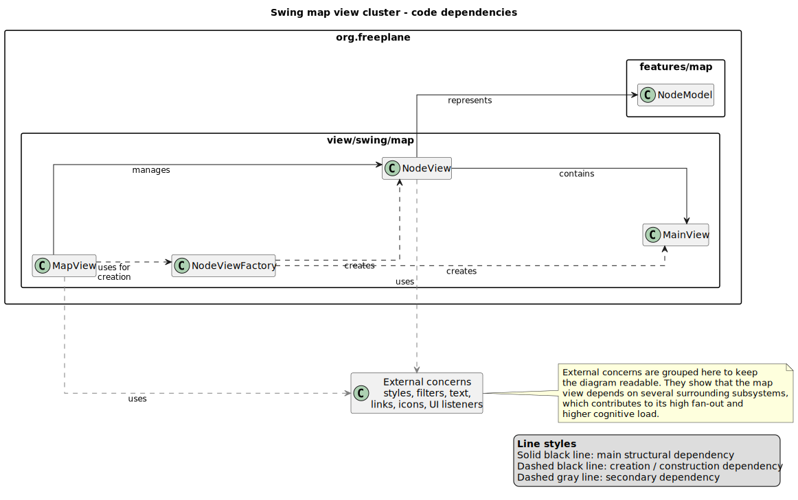

### Knowledge dependencies 

As a first step of the dependency analysis, we focused on the knowledge dependencies of Freeplane. Since the project is large, we did not start directly from the source code. Instead, we used the Git history to understand which parts of the system usually changed together.

We generated co-change reports from the commit history. These reports show which pairs of files were modified in the same commits, and how many times this happened. This does not automatically prove that there is a direct code dependency. However, it tells us something useful about maintenance work: if two files often change together, then a change in one file probably requires developers to check or understand the other one too.

This is connected to what we discussed in class about software complexity. Dependencies are not always wrong, but they become dangerous when they increase cognitive load, because developers need to know too many parts of the system, or when they cause change amplification, because a small change spreads to many files. In our case, the co-change analysis was used as a first map of the system and helped us choose the areas to inspect in the code.

The reports were generated for three time windows: the last 5 years, the last 10 years, and the full repository history. This helped us distinguish recent co-change from more stable relations. We read the full-history report more carefully, because it also includes older paths and older project structures.

Instead of reporting all the pairs one by one, we grouped them into functional areas. This follows the same reasoning behind the Common Closure Principle: if classes tend to change together, they may belong to the same responsibility or at least to the same maintenance concern. This does not mean that every co-change is a problem. Sometimes it simply shows good cohesion: files change together because they are part of the same feature; in other cases, especially when the files are in different modules, it may suggest a stronger hidden dependency.

The clearest cluster is the Swing map view. Classes such as `MapView`, `NodeView`, `MainView`, `NodeViewFactory` and the layout classes appear together in all three reports. (mettere una spuegazione sulla swing map view, come viene mostrata? cosi si capsice meglio dopo l'outilne view)This is not surprising: Freeplane is mainly a mind-mapping application, so the way maps and nodes are shown on screen is a central part of the system. Our first interpretation is that this is probably normal cohesion inside the main UI subsystem. Still, because this area is so central, the code analysis must check whether this cohesion remains local to the map view or whether it forces the map view to interact with many other parts of the application.

Another important cluster is the outline subsystem, with classes such as ScrollableTreePanel, BreadcrumbPanel, BlockPanel, OutlinePane, MapAwareOutlinePane, OutlineController and OutlineViewport. In the co-change reports, many pairs are centered around ScrollableTreePanel, suggesting that this class plays a central role in the outline view. The outline is another way of looking at the same map content, but in a more tree-like structure. For this reason, its panels, controller and viewport logic may naturally change together when the way the outline is displayed, navigated or synchronized with the map changes.

The most interesting case is the relation between the public API and the scripting plugin. The repository has a separate `freeplane_api` module and a separate `freeplane_plugin_script` module, but classes such as `Node`, `NodeRO` and `NodeProxy` still appear together in the co-change reports. In simple terms, scripts need a way to access Freeplane concepts such as nodes and maps. If the public node API changes, the proxy used by scripts may also need to change. This could be a good and controlled dependency if the scripting plugin uses only public interfaces. It would be more problematic if it also depended on internal implementation details.

Finally, the text rendering plugins show another useful case. `FormulaTextTransformer`, `LatexRenderer` and `MarkdownRenderer` belong to different plugin areas, but they all deal with the same general concern: transforming or rendering text inside nodes. Their co-change may therefore mean that, when Freeplane changes how node text is handled, more than one text-related plugin has to be updated.

This first analysis does not prove design problems by itself. It gives us a set of meaningful areas to inspect next in the code dependencies analysis.

### Code dependencies 
## 1. Swing map view cluster 

The code inspection confirms that the Swing map view cluster is not only a historical relation. `MapView`, `NodeView` and `MainView` form the main visual structure of the map: `MapView` manages the overall graphical view, `NodeView` represents a single node linked to its `NodeModel`, and `MainView` shows the visible content of the node, such as text, icons, borders and link indicators.

This explains why these classes often changed together in the co-change reports. A change in how nodes are displayed, selected, folded, styled or updated can affect more than one level of the visual structure. For this reason, the dependency seems mostly justified: it is strong, but linked to the same responsibility, namely showing and updating the visual map. This is consistent with the Common Closure Principle, because classes that change for the same reason are kept in the same subsystem.

At the same time, to display nodes correctly, the map view needs information from many other parts of the system, such as styles, filters, text, links, icons, UI listeners and the map model. This creates high fan-out, meaning many outgoing links to other packages. This is understandable, because a visual node contains many different elements, but it also increases cognitive load: modifying this area requires understanding several connected classes and subsystems.

The code also shows one useful choice to keep these dependencies more organised: `NodeViewFactory`. When `MapView` displays nodes, the program must create visual objects such as `NodeView`, `MainView` and other components. This is an example of construction dependency, because the dependency is not only about using an object, but also about where that object is created. Freeplane does not remove this dependency, but concentrates the creation logic in `NodeViewFactory` instead of spreading it inside `MapView`. In this way, the dependency remains, but it is clearer where it is managed.

*Figure 1: simplified code dependencies in the Swing map view cluster. The diagram shows the main structural relations between `MapView`, `NodeView`, `MainView`, `NodeModel` and `NodeViewFactory`. Secondary dependencies are grouped as external concerns because they explain the high fan-out of this area.*

## 2. Outline subsystem cluster 
After the Swing map view, we analysed another visualisation cluster: the outline subsystem. While the Swing map view shows the mind map in its main graphical form, the outline shows the same nodes in a more linear structure, similar to a tree.

Starting from the co-change report, the main class to check was `ScrollableTreePanel`, because many outline pairs were centered around it. The code confirms this role: `ScrollableTreePanel` manages the tree-like list shown in the outline. It handles which nodes are visible, which node is selected, how the user moves between nodes and how the view is updated during scrolling. This explains why it often changes together with other classes in the same package.

`OutlinePane` has a more external role. It builds the outline area by creating the `BreadcrumbPanel`, the `ScrollableTreePanel`, the `OutlineController`, the toolbar and the menu. In simple terms, `OutlinePane` prepares the outline view, while `ScrollableTreePanel` manages the main tree displayed inside it.

The other classes manage smaller parts of the same view. `BlockPanel` shows groups of visible nodes and sends user actions back to `ScrollableTreePanel`, such as selecting a node or opening/closing a branch. `BreadcrumbPanel` shows the path of the current node and uses `OutlineController` for actions such as selection and expansion. `OutlineViewport` helps decide which part of the outline should be visible while scrolling.

This cluster fits the Common Closure Principle quite well: the classes that often changed together are grouped in the same package, `org.freeplane.view.swing.map.outline`, and work on the same feature. Therefore, the co-change mainly indicates internal cohesion.

The most interesting point is MapAwareOutlinePane. The co-change reports mainly showed internal relations in the outline cluster; no direct pair with the Swing map view cluster appeared. However, the code inspection shows something more: the outline is also strongly connected to the main map view, and this connection is handled by a specific class: MapAwareOutlinePane.
This dependency is expected, because the outline shows the same map in a tree-like form and must stay aligned with MapView, NodeView, NodeModel and map/node listeners. Still, it increases cognitive load: modifying the outline also requires understanding how it interacts with the map view and the node model.