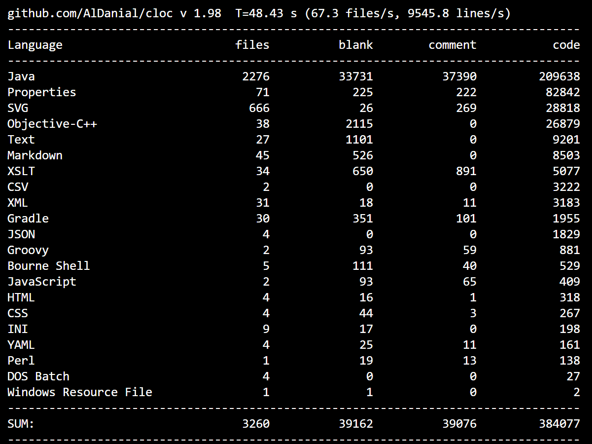

# System Overview Report – Freeplane

## System Purpose 
Freeplane is an open-source desktop application designed to support the creation and organization of ideas through mind maps. Its main purpose is to help users structure information visually, making it easier to understand relationships between concepts, plan activities, and manage knowledge. The system is flexible enough to be used in different contexts, such as studying, brainstorming, or project planning.
It started as a fork of another well-known open-source project, FreeMind. The software evolved throughout the 2010s from a mind map visualizer to become a more comprehensive working tool. It combines AI integration, support for standards such as LaTeX and Markdown, and advanced functionalities such as the Code Explorer, thus being a valuable asset for students and professionals.

## Main Stakeholders:      
**End users**: Two primary user groups can be identified:
- Beginners/Basic users: people who use the software to draft mindmaps to help themselves with their job, their studies or their daily routine
- Advanced users: usually IT literate, they are able leverage advanced software functionalities, such as scripting techniques, to automate their job.     
**Plugin developers**: People contributing to the growth of the software, developing side-plugins to be integrated with the core software.    
**Core maintainers of the project**: They are responsible for evolving the system, reviewing contributions, and ensuring its overall quality and stability.

## System Description
### System purpose

Freeplane is a cross-platform desktop application designed for creating and managing mind maps, allowing users to visually organize ideas and information in a structured way. It is implemented primarily in Java and provides a rich graphical interface built on top of the Swing toolkit, enabling users to construct hierarchical diagrams composed of interconnected nodes.  

By offering an interactive and flexible editing environment, the system supports a wide range of use cases, from simple note-taking to complex knowledge management and project planning. Users can manipulate the structure of their maps, apply formatting, and enrich content with links, images, and metadata, all within a unified interface that abstracts the underlying complexity of the system.

### Architecture and Technology
From an architectural perspective, Freeplane is built on top of a _Micro-Kernel architecture_. The core system manages vital software functionalities, whereas more advanced and graphical features are delegated to plugins. Rather than existing as external independent resources, plugins are bundled in the core system. They are typically written in Java and interact with the application through well-defined extension points.  
The software follows the OSGi framework: plugins exist as independent `.jar` bundles, and they are dynamically resolved and loaded by the `launcher` upon startup.  
Each plugin's `build.gradle` file is responsible of its own dependencies, from both internal and external libraries. For instance, the `build.gradle` for the formula plugin includes the path for the script plugin, since they are closely related. The `build.gradle` for the LaTeX support plugin includes the path for the `JLaTeXMath` library, since the it is just a wrapper for the external code that renders LaTeX.
The core logic is implemented in Java, while additional features support a combination of technologies including JavaScript, TypeScript and other Languages.  
The system stores mind maps using an XML-based `.mm` format, allowing structured data representation and eliminating the need for a database layer.

The scripting engine is of particular interest: it is built on top of Groovy, a simple Java-like syntax. Users can define a script (in Groovy or other supported scripting languages), and a complex structure of Factories, Facades and wrappers compiles, caches the bytecode and finally executes it.
Supporting technologies such as JSON, YAML, and XML are used for configuration and data exchange, while auxiliary scripts in languages like Python or Shell are used for tooling and build processes.

Freeplane interacts directly with the operating system for file management, and resource access, and it supports exporting mind maps into formats such as PDF, HTML, and images. This combination of technologies allows the system to remain both portable and extensible, while maintaining performance and usability expected from a desktop application.

Overall, Freeplane combines a Java-based architecture with a diverse supporting technology stack, enabling both ease of use for end users and extensibility for developers.

## Basic Code Statics

**Number of files:** 3260   
**Line of Code (LOC):** 384077   
**Number of packages:** ~2300 (including both core and auxiliary components)   
**Number of Developers:** 275 contributers in GitHub repository

