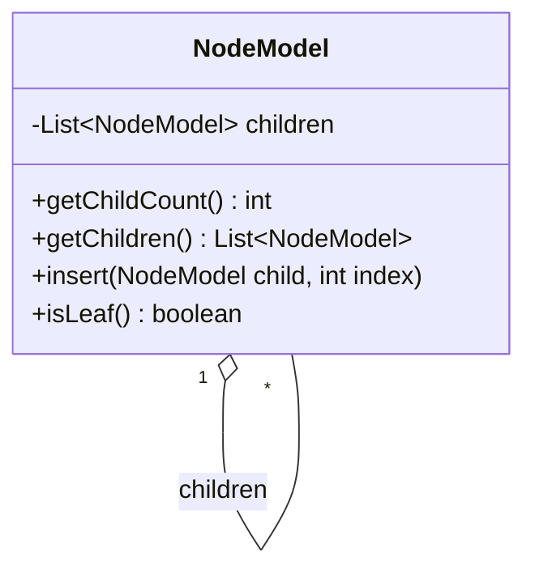
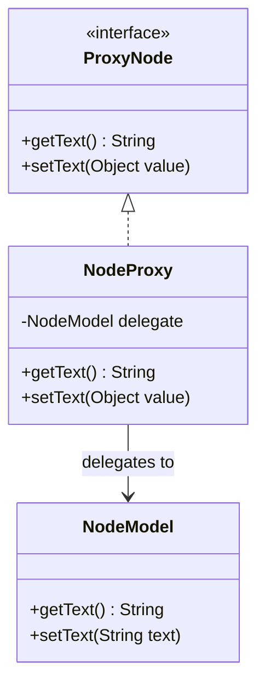
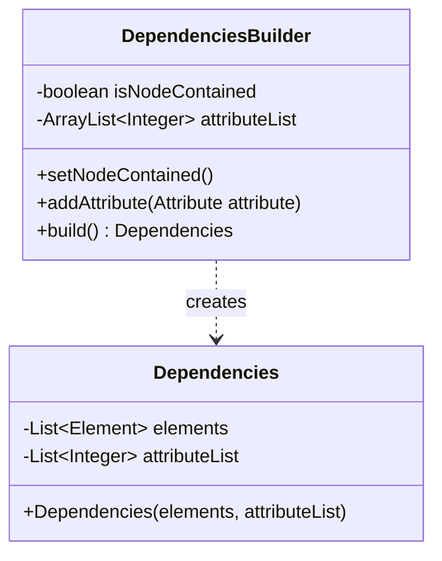
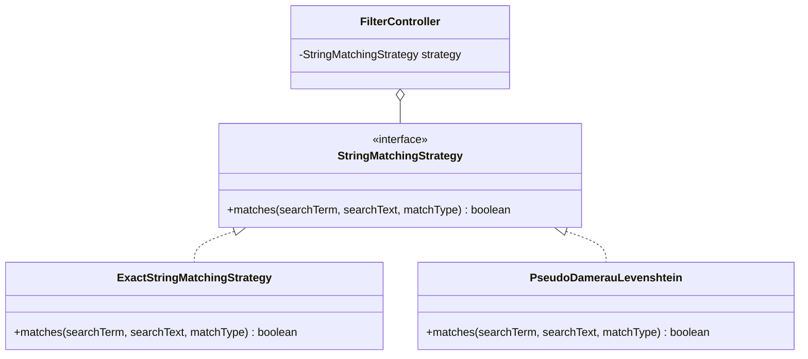

# Freeplane Design Pattern Analysis

**Overview:** The Freeplane project is a large and mature codebase that heavily relies on a wide variety of design patterns and their custom variants to manage its complex architecture. While many structural, behavioral, and creational patterns are utilized throughout the application to handle everything from user interfaces to data processing, this document focuses on an in-depth analysis of four of the most interesting and prominent Gang of Four (GoF) design patterns found within the system: Composite, Proxy, Builder, and Strategy.

## 1. Composite Pattern

*   **Pattern Instance:** Node Tree Structure
*   **Classes involved:** 
    *   `NodeModel` (`org.freeplane.features.map.NodeModel` in `freeplane/src/main/java/org/freeplane/features/map/NodeModel.java`) acts as both the Component and the Composite.
*   **How it works:** `NodeModel` represents a node in the mind map. It contains a list of children (`private List<NodeModel> children;`). Both leaf nodes and branch nodes are represented by the same class. A leaf node is simply a `NodeModel` with an empty child list.
*   **Problem Solved:** Mind maps are inherently hierarchical tree structures. The Composite pattern allows clients to treat individual objects (leaf nodes) and compositions of objects (branches/subtrees) uniformly. This drastically simplifies recursive operations over the tree, such as rendering the map, searching for text, saving the structure to XML, or applying filters, without needing to distinguish between "leaves" and "branches".

### Structure Diagram

*   **Alternative:** Separate `LeafNode` and `BranchNode` classes implementing a common `Node` interface. 
    *   *Pros:* Stricter type safety (a `LeafNode` cannot have children added to it by definition).
    *   *Cons:* Much more complex codebase. Mind map nodes frequently switch between being leaves and branches as users add or delete children. With separate classes, the object would need to be re-instantiated and replaced in the tree every time this happens, which is highly inefficient.

---

## 2. Proxy Pattern

*   **Pattern Instance:** Scripting API Node Protection
*   **Classes involved:** 
    *   `NodeProxy` (`org.freeplane.plugin.script.proxy.NodeProxy` in `freeplane_plugin_script/src/main/java/org/freeplane/plugin/script/proxy/NodeProxy.java`) acts as the Proxy.
    *   `Proxy.Node` (`org.freeplane.plugin.script.proxy.Proxy` in `freeplane_plugin_script/src/main/java/org/freeplane/plugin/script/proxy/Proxy.java`) is the common interface.
    *   `NodeModel` (`org.freeplane.features.map.NodeModel` in `freeplane/src/main/java/org/freeplane/features/map/NodeModel.java`) is the Real Subject.
*   **How it works:** `NodeProxy` wraps a `NodeModel` delegate. When a user writes a Groovy script in Freeplane, they interact with `NodeProxy` objects instead of raw `NodeModel` objects. 
*   **Problem Solved:** 
    1.  **Access Control (Protection Proxy):** It prevents scripts from calling internal `NodeModel` methods that could break invariants. For example, some proxy wrappers can restrict modifications entirely (ReadOnly views) or ensure that modifications are routed through the proper controller (e.g., `MTextController`) so that the Undo/Redo history and Event Listeners are triggered correctly.
    2.  **API Simplification:** It provides a cleaner, more scripting-friendly API that abstracts away the complex internal workings of `NodeModel`.

### Structure Diagram

*   **Alternative:** Expose `NodeModel` directly to the scripting engine.
    *   *Pros:* Less overhead and fewer classes.
    *   *Cons:* Extremely dangerous. User scripts could easily break the application state, bypass the undo mechanism, or invoke internal methods, leading to instability and difficult-to-debug errors.

---

## 3. Builder Pattern

*   **Pattern Instance:** Dependency Construction
*   **Classes involved:** 
    *   `DependenciesBuilder` (`org.freeplane.plugin.script.dependencies.DependenciesBuilder` in `freeplane_plugin_script/src/main/java/org/freeplane/plugin/script/dependencies/DependenciesBuilder.java`) acts as the Builder.
    *   `Dependencies` (`org.freeplane.api.Dependencies` in `freeplane_api/src/main/java/org/freeplane/api/Dependencies.java`) is the Product.
*   **How it works:** The `DependenciesBuilder` class provides methods to incrementally accumulate state (e.g., `setNodeContained()`, `addAttribute()`). Once all necessary configuration is provided, the `build()` method is called to instantiate the final `Dependencies` object.
*   **Problem Solved:** Creating a complex object like `Dependencies` might involve multiple steps and conditional logic based on the user's interaction or configuration. Instead of using a giant telescope constructor with many optional parameters (which is hard to read) or exposing setters on `Dependencies` (which makes it mutable), the Builder encapsulates the construction logic. It allows the final `Dependencies` object to be immutable after creation.

### Structure Diagram

*   **Alternative:** Telescoping constructors or a mutable object with setters.
    *   *Pros:* Avoids creating an extra Builder class.
    *   *Cons:* Telescoping constructors (`new Dependencies(true, attrs, ...)`) are unreadable. Setters make the `Dependencies` object mutable, which can lead to bugs if the object is shared across different parts of the system or threads.

---

## 4. Strategy Pattern

*   **Pattern Instance:** Text Filtering and Search Algorithms
*   **Classes involved:** 
    *   `StringMatchingStrategy` (`org.freeplane.features.filter.StringMatchingStrategy` in `freeplane/src/main/java/org/freeplane/features/filter/StringMatchingStrategy.java`) is the Strategy Interface.
    *   `ExactStringMatchingStrategy` (`org.freeplane.features.filter.ExactStringMatchingStrategy` in `freeplane/src/main/java/org/freeplane/features/filter/ExactStringMatchingStrategy.java`) is a Concrete Strategy.
    *   `PseudoDamerauLevenshtein` (`org.freeplane.features.filter.PseudoDamerauLevenshtein` in `freeplane/src/main/java/org/freeplane/features/filter/PseudoDamerauLevenshtein.java`) is a Concrete Strategy.
*   **How it works:** The `StringMatchingStrategy` interface defines a single method: `matches(searchTerm, searchText, type)`. Different implementations of this interface provide different algorithms for matching text.
*   **Problem Solved:** Freeplane allows users to filter nodes using different matching criteria (e.g., exact match, substring, approximate/fuzzy matching). The Strategy pattern encapsulates these different algorithms. The core filtering engine simply holds a reference to a `StringMatchingStrategy` and delegates the matching task to it. This allows the algorithm to vary independently from the clients that use it.

### Structure Diagram

*   **Alternative:** A single `StringMatcher` class with a large `switch` statement based on an enum (e.g., `MATCH_EXACT`, `MATCH_APPROXIMATE`).
    *   *Pros:* Marginally fewer files.
    *   *Cons:* Violates the Open/Closed Principle. Every time a new matching algorithm is added (e.g., Regex matching), the core `StringMatcher` class must be modified, increasing the risk of introducing bugs into existing functionality.
