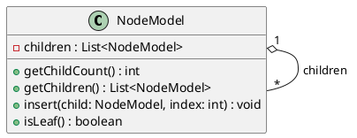
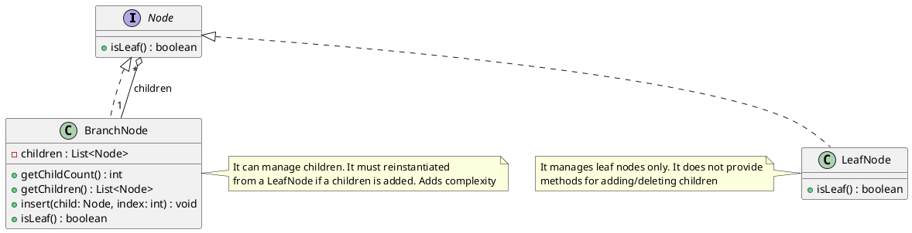
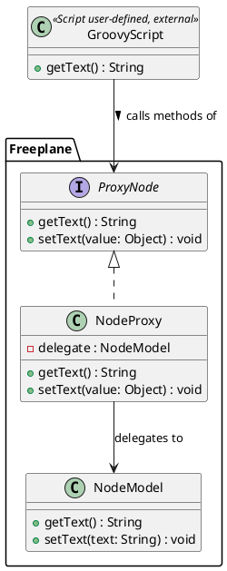
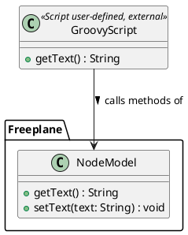
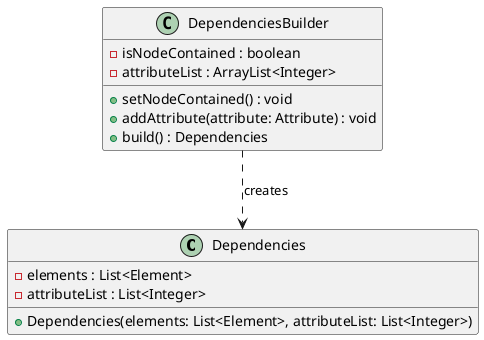
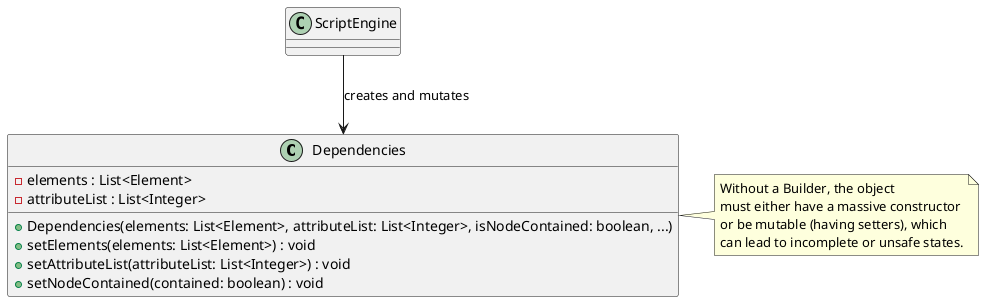
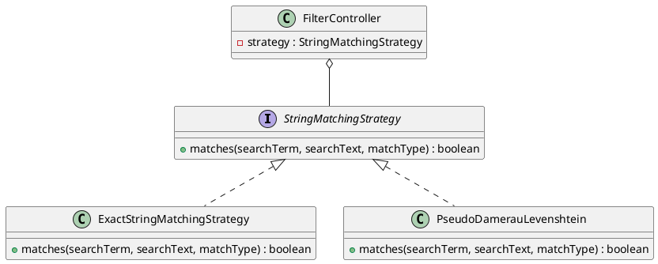
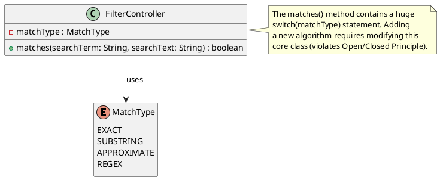

# Freeplane Design Pattern Analysis

**Overview:** The Freeplane project is a large and mature codebase that heavily relies on a wide variety of design patterns and their custom variants to manage its complex architecture. While many structural, behavioral, and creational patterns are utilized throughout the application to handle everything from user interfaces to data processing, this document focuses on an in-depth analysis of four of the most interesting and prominent Gang of Four (GoF) design patterns found within the system: Composite, Proxy, Builder, and Strategy.

## 1. Composite Pattern

*   **Pattern Instance:** Node Tree Structure
*   **Classes involved:** 
    *   `NodeModel` (`org.freeplane.features.map.NodeModel` in `freeplane/src/main/java/org/freeplane/features/map/NodeModel.java`) acts as both the Component and the Composite.
*   **How it works:** `NodeModel` represents a node in the mind map. It contains a list of children (`private List<NodeModel> children;`). Both leaf nodes and branch nodes are represented by the same class. A leaf node is simply a `NodeModel` with an empty child list. Freeplane uses a simplified version of the pattern: the original theoretical implementation from the gang of four includes an abstract `Component` class, from which nodes and branches inherit. In the Freeplane implementation, everything is collapsed in the `NodeModel` concrete class.   
*   **Problem Solved:** Mind maps are inherently hierarchical tree structures. When a user performs an action like folding a node or applying a style to an entire branch, the core controllers (like `MapController`) must traverse these structures. The Composite pattern solves this by allowing clients to treat individual objects (leaf nodes) and compositions of objects (branches/subtrees) uniformly. The controller doesn't need to check if a child is a leaf or a complex subtree; it simply iterates over the `children` list of a `NodeModel`, treating every node uniformly and seamlessly cascading operations down the hierarchy. This drastically simplifies recursive tasks such as rendering the map, searching for text, saving to XML, or applying filters.

### Structure Diagram

*   **Alternative:** Separate `LeafNode` and `BranchNode` classes implementing a common `Node` interface. 
    *   *Pros:* Stricter type safety (a `LeafNode` cannot have children added to it by definition), less coupling, easier testability.
    *   *Cons:* Much more complex codebase. Mind map nodes frequently switch between being leaves and branches as users add or delete children. With separate classes, the object would need to be re-instantiated and replaced in the tree every time this happens, which is highly inefficient.

---

## 2. Proxy Pattern

*   **Pattern Instance:** Scripting API Node Protection
*   **Classes involved:** 
    *   `NodeProxy` (`org.freeplane.plugin.script.proxy.NodeProxy` in `freeplane_plugin_script/src/main/java/org/freeplane/plugin/script/proxy/NodeProxy.java`) acts as the Proxy.
    *   `Proxy.Node` (`org.freeplane.plugin.script.proxy.Proxy` in `freeplane_plugin_script/src/main/java/org/freeplane/plugin/script/proxy/Proxy.java`) is the common interface.
    *   `NodeModel` (`org.freeplane.features.map.NodeModel` in `freeplane/src/main/java/org/freeplane/features/map/NodeModel.java`) is the Real Subject.
*   **How it works:** `NodeProxy` wraps a `NodeModel` delegate. When a user writes a Groovy script in Freeplane, they interact with `NodeProxy` objects instead of raw `NodeModel` objects. 
*   **Problem Solved:** When a user writes a custom Groovy script to interact with a node (e.g., `node.text = "New Title"`), exposing the internal engine directly would be dangerous. The Proxy pattern solves two main problems here:
    1.  **Access Control (Protection Proxy):** The script engine interacts with the `NodeProxy` rather than the raw `NodeModel`. The proxy intercepts assignments and routes them through proper controllers (e.g., `MTextController`). This ensures that an undoable action is created in the history and the UI is notified to re-render, preventing scripts from calling internal methods that could break invariants and safely shielding the core model from unmanaged modifications.
    2.  **API Simplification:** It abstracts away the complex internal workings of `NodeModel` to provide a cleaner, more scripting-friendly API for the end user.

### Structure Diagram

*   **Alternative:** Expose `NodeModel` directly to the scripting engine.
    *   *Pros:* Less overhead and fewer classes.
    *   *Cons:* Extremely dangerous. User scripts could easily break the application state, bypass the undo mechanism, or invoke internal methods, leading to instability and difficult-to-debug errors.

---

## 3. Builder Pattern

*   **Pattern Instance:** Dependency Construction
*   **Classes involved:** 
    *   `DependenciesBuilder` (`org.freeplane.plugin.script.dependencies.DependenciesBuilder` in `freeplane_plugin_script/src/main/java/org/freeplane/plugin/script/dependencies/DependenciesBuilder.java`) acts as the Builder.
    *   `Dependencies` (`org.freeplane.api.Dependencies` in `freeplane_api/src/main/java/org/freeplane/api/Dependencies.java`) is the Product.
*   **How it works:** The `DependenciesBuilder` class provides methods to incrementally accumulate state before building the final object. Specifically, it collects:
    1. A boolean flag (`isNodeContained`) tracking if the formula/script depends on the node itself.
    2. A list of integer indices (`attributeList`) representing specific node attributes that the script relies on.
    
    As the script environment evaluates dependencies, it calls `setNodeContained()` or `addAttribute()`. Once all necessary configuration is provided, the `build()` method is called to instantiate the final `Dependencies` object using this accumulated data.
*   **Problem Solved:** When evaluating complex scripting functions (like determining node dependencies for formulas), the system needs to precisely configure which node attributes are involved to create a `Dependencies` object. Because this configuration is discovered dynamically as the script is parsed, creating the object in a single step using a giant telescope constructor would be unreadable, while exposing setters on `Dependencies` would make it mutable and unsafe. The Builder pattern solves this by encapsulating the construction logic: the `DependenciesBuilder` collects attributes incrementally. Once the configuration is fully gathered, `build()` locks the data into a final, immutable `Dependencies` object that is safe to pass around the execution engine without risk of accidental modification.

### Structure Diagram

*   **Alternative:** Telescoping constructors or a mutable object with setters.
    *   *Pros:* Avoids creating an extra Builder class.
    *   *Cons:* Telescoping constructors (`new Dependencies(true, attrs, ...)`) are unreadable. Setters make the `Dependencies` object mutable, which can lead to bugs if the object is shared across different parts of the system or threads.

---

## 4. Strategy Pattern

*   **Pattern Instance:** Text Filtering and Search Algorithms
*   **Classes involved:** 
    *   `StringMatchingStrategy` (`org.freeplane.features.filter.StringMatchingStrategy` in `freeplane/src/main/java/org/freeplane/features/filter/StringMatchingStrategy.java`) is the Strategy Interface.
    *   `ExactStringMatchingStrategy` (`org.freeplane.features.filter.ExactStringMatchingStrategy` in `freeplane/src/main/java/org/freeplane/features/filter/ExactStringMatchingStrategy.java`) is a Concrete Strategy.
    *   `PseudoDamerauLevenshtein` (`org.freeplane.features.filter.PseudoDamerauLevenshtein` in `freeplane/src/main/java/org/freeplane/features/filter/PseudoDamerauLevenshtein.java`) is a Concrete Strategy.
*   **How it works:** The `StringMatchingStrategy` interface defines a single method: `matches(searchTerm, searchText, type)`. Different implementations of this interface provide different algorithms for matching text.
*   **Problem Solved:** When a user opens the "Find" dialog to search the mind map, they can select different matching behaviors like "Match Case", "Regular Expression", or "Approximate Matching". To support this without hardcoding massive `if/else` performance bottlenecks inside the traversal loops of thousands of nodes, the Strategy pattern is used. It encapsulates these different matching algorithms into separate classes. The `FilterController` simply reads the user's choice, instantiates the corresponding `StringMatchingStrategy`, and the core search engine delegates the text comparison to it. This allows the algorithm to vary independently from the clients that use it, keeping the filtering engine clean and extensible.

### Structure Diagram

*   **Alternative:** A single `StringMatcher` class with a large `switch` statement based on an enum (e.g., `MATCH_EXACT`, `MATCH_APPROXIMATE`).
    *   *Pros:* Marginally fewer files.
    *   *Cons:* Violates the Open/Closed Principle. Every time a new matching algorithm is added (e.g., Regex matching), the core `StringMatcher` class must be modified, increasing the risk of introducing bugs into existing functionality.

